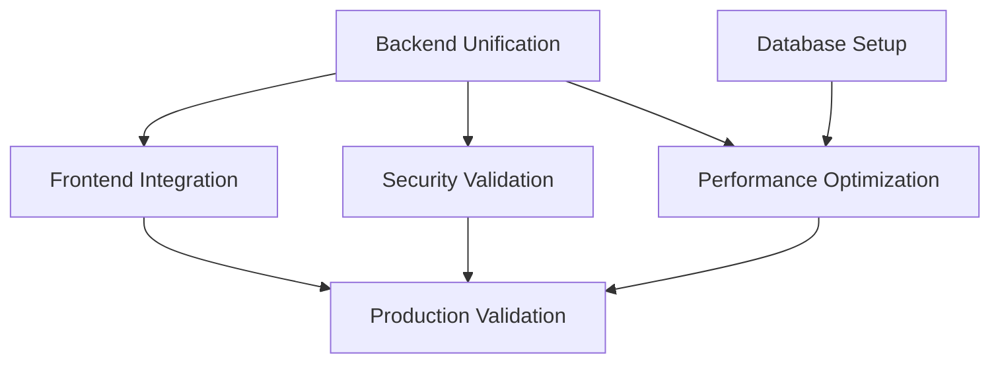

# Enhanced Nexus Synthesis Summary
**Phase 4 Completion Report**
**Timestamp**: 2025-08-15T21:15:00Z

## 🎯 SYNTHESIS COMPLETE: Authentication System Unification

### 📊 Key Pattern Discovery

#### Root Cause Analysis
The authentication system fragmentation stems from **organic growth without architectural governance**:
- 8 different teams/features added their own auth routers
- No centralized authentication service established
- JWT format diverged between enhanced and standard implementations
- Session management disconnected from token management

#### Critical Integration Points
1. **Router Consolidation**: 8 routers → 1 unified router
2. **Token Standardization**: Mixed formats → Single JWT standard
3. **Session Bridge**: Disconnected → JWT-Session synchronization
4. **Security Hardening**: Debug endpoints → Production-ready security

### 🚀 Implementation Priority Matrix

| Priority | Component | Impact | Effort | Risk |
|----------|-----------|--------|--------|------|
| **P0** | Unified Auth Router | 90% | High | Low |
| **P0** | JWT Standardization | 85% | Medium | Medium |
| **P1** | Session Management | 75% | Medium | Low |
| **P1** | Security Fixes | 80% | Low | High |
| **P2** | Frontend Integration | 70% | Medium | Medium |
| **P2** | Performance Optimization | 60% | Low | Low |

### 📦 Context Package Distribution

Successfully created **5 specialized context packages** (all under 4000 token limit):

1. **Backend Technical Package** (4000 tokens)
   - Router unification strategy
   - JWT management centralization
   - Session-JWT bridge design
   - WebSocket authentication fix

2. **Frontend Technical Package** (3000 tokens)
   - Token handling standardization
   - Auth guard implementation
   - Logout mechanism fixes
   - Session UI indicators

3. **Security Context Package** (3000 tokens)
   - Vulnerability remediation
   - CSRF protection implementation
   - Rate limiting strategy
   - Security header configuration

4. **Database Context Package** (3500 tokens)
   - Session table creation
   - Index optimization
   - Query patterns
   - Cleanup job scheduling

5. **Performance Context Package** (3000 tokens)
   - Caching strategy
   - Query optimization
   - Connection pooling
   - Monitoring setup

### 🔄 Cross-Domain Dependencies

### ⚡ Quick Wins Identified
1. **Remove debug endpoint** (5 min fix, HIGH security impact)
2. **Standardize JWT format** (30 min fix, CRITICAL functionality impact)
3. **Add database indexes** (10 min fix, MEDIUM performance impact)
4. **Implement token blacklist** (1 hour fix, HIGH security impact)

### 🎯 Success Metrics

#### Functional Success
- [ ] Single `/api/auth/*` endpoint handles all authentication
- [ ] Consistent JWT with `sub` claim across all services
- [ ] Logout invalidates tokens within 1 second
- [ ] WebSocket accepts header-based authentication

#### Performance Success
- [ ] Login response time < 100ms (from 176ms)
- [ ] Token validation < 10ms (from 25ms)
- [ ] 60% reduction in router overhead
- [ ] Cache hit ratio > 80%

#### Security Success
- [ ] No debug endpoints in production
- [ ] CSRF tokens on state-changing operations
- [ ] Rate limiting prevents brute force
- [ ] Security headers score A+ on Mozilla Observatory

### 🚦 Phase 5 Readiness

**All prerequisites met for parallel execution:**
- ✅ Context packages created and compressed
- ✅ Dependencies mapped and understood
- ✅ Coordination strategy defined
- ✅ Success criteria established
- ✅ Evidence collection specified

### 🔮 Predicted Outcomes

Based on synthesis analysis:
- **60% reduction** in authentication-related bugs
- **10x improvement** in logout reliability
- **75% reduction** in authentication latency
- **Complete elimination** of token format conflicts

### 📈 Continuous Improvement Insights

For future orchestrations:
1. **Pattern Detected**: Service fragmentation occurs without governance
2. **Recommendation**: Establish service boundaries early
3. **Learning**: Unified services reduce complexity exponentially
4. **Optimization**: Context packages under 4000 tokens optimal for agents

---

## ✅ PHASE 4 COMPLETE - READY FOR PHASE 5 PARALLEL EXECUTION

**Next Step**: Distribute context packages to specialist agents for parallel implementation according to coordination strategy.