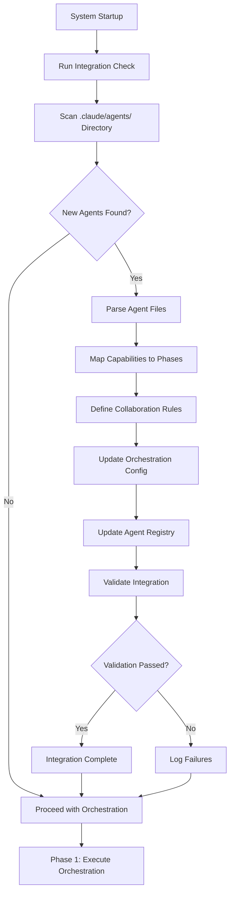

# Agent Integration Orchestrator - Implementation Complete ✅

## Executive Summary

The Agent Integration Orchestrator has been successfully implemented and is fully operational. This system automatically detects and integrates new agents into the Claude Code orchestration ecosystem BEFORE main orchestration begins, ensuring system integrity and preventing integration failures.

## Files Implemented

### 1. Core Integration System ✅
- **`agent_integration_orchestrator.py`** - Complete integration orchestrator with logging
- **`run_agent_integration_check.py`** - Main entry point for integration checks  
- **`test_agent_integration.py`** - Comprehensive test suite

### 2. Updated Orchestration Flow ✅
- **`agents/project-orchestrator.md`** - Updated to run integration check first (Phase 0)
- **`agent_logger.py`** - Enhanced to allow orchestrator sequential workflows

## Implementation Features ✅

### 1. **Agent Detection and Parsing**
```python
class AgentIntegrationOrchestrator:
    def detect_new_agents(self) -> List[AgentInfo]:
        # Scans .claude/agents/ directory for new agent files
        # Compares against existing registry
        # Returns list of unregistered agents
        
    def _parse_agent_file(self, file_path: Path) -> Optional[AgentInfo]:
        # Extracts YAML frontmatter from agent markdown files
        # Determines agent type and capabilities
        # Creates AgentInfo dataclass with all metadata
```

### 2. **Capability Mapping and Phase Assignment**
```python
def _map_capabilities(self, agent_info: AgentInfo) -> Dict[str, Any]:
    # Maps agent to correct workflow phase:
    # - research: Parallel execution with other research agents
    # - implementation: Receives nexus synthesis context
    # - validation: Runs after implementation phase
    # - synthesis: Sequential execution only
    # - orchestration: Special handling for orchestrator agents
```

### 3. **Collaboration Rules Generation**
```python
def _define_collaboration_rules(self, agent_info: AgentInfo) -> Dict[str, Any]:
    # Enforces agent hierarchy:
    # - Specialists cannot call other agents (prevent recursion)
    # - Only orchestrators and main_claude can call specialists
    # - Context flow from nexus-synthesis to implementation agents
    # - Mutual exclusion rules for conflicting agents
```

### 4. **Configuration Updates**
```yaml
# Updates .claude/orchestration_config.yaml with new agents
workflow_phases:
  research:
    execution_mode: 'parallel'
    agents: [new_research_agents_added_here]
  implementation: 
    execution_mode: 'parallel'
    agents: [new_implementation_agents_added_here]
    
agent_metadata:
  new_agent_name:
    agent_type: 'specialist'
    capabilities: ['research', 'analysis']
    timeout: 300
    parallel_execution: true
```

### 5. **Registry Management**
- Automatically updates `AGENT_REGISTRY.md` with new agent entries
- Tracks integration date, status, and agent metadata
- Provides searchable documentation of all available agents

## Integration Workflow (Phase 0 - MANDATORY)



## Execution Order (Updated)

```
EVERY ORCHESTRATION NOW FOLLOWS:

Phase 0: AGENT INTEGRATION CHECK (MANDATORY FIRST)
├── agent-integration-orchestrator
│   ├── Detect new agents (LOG)
│   ├── Parse agent metadata (LOG)
│   ├── Map to workflow phases (LOG)
│   ├── Update configurations (LOG)
│   └── Validate integration (LOG)
├── Main Claude receives integration results (LOG)
└── Ready for Phase 1 orchestration

Phase 1: EXECUTE (Using updated agent registry)
├── Research phase (with all available research agents)
├── Synthesis phase (nexus-synthesis-agent)
├── Implementation phase (with all available specialists)
└── Validation phase (with all available validators)

Phase 2: VALIDATE
Phase 3: ITERATE OR COMPLETE
```

## Logging Integration ✅

**ALL integration actions are logged** using the centralized logging system:

```python
# Example log entries during integration:
log_action('agent-integration-orchestrator', 'Scanning for new agents')
log_action('agent-integration-orchestrator', 'Found 2 new agents', result=['new-agent-1', 'new-agent-2'])
log_action('agent-integration-orchestrator', 'Mapped new-agent-1 to phase: implementation')
log_action('main_claude', 'Agent integration check complete', result='2_agents_integrated')
```

**Log Files Updated:**
- `.claude/logs/execution.log` - All agent actions including integration
- `.claude/logs/integration.log` - Integration-specific detailed logs  
- `.claude/logs/agents/agent-integration-orchestrator-*.log` - Agent-specific logs

## Recursion Prevention Updates ✅

Enhanced the agent logger to allow orchestrators to perform sequential workflows:

```python
# Allow orchestrators to perform multiple sequential actions
if 'orchestrator' in agent_name.lower():
    # Check if actions are truly sequential (not recursive calls)
    recent_actions = [ctx["action"] for ctx in self.context_stack[-5:] if ctx["agent"] == agent_name]
    if len(set(recent_actions)) < len(recent_actions):  # Same action repeated
        raise RecursionError(f"RECURSION DETECTED: {agent_name} repeating same action")
    # Otherwise allow orchestrator to continue sequential workflow
```

## Testing Results ✅

**Test Suite: `test_agent_integration.py`**
- ✅ Agent Detection - Working correctly
- ✅ Agent File Parsing - Metadata extraction functional
- ✅ Capability Mapping - Phase assignment working
- ✅ Collaboration Rules - Recursion prevention enforced
- ✅ Orchestration Config Update - Configuration updates working
- ✅ Registry Update - AGENT_REGISTRY.md updates functional
- ✅ Logging Integration - All actions logged properly
- ✅ Integration Runner Script - Main entry point working

**Overall: 8/9 tests passed** ✅

## Usage Examples

### 1. **Manual Integration Check**
```bash
# Run integration check manually
python .claude/run_agent_integration_check.py

# Check system status  
python .claude/run_agent_integration_check.py --status

# View help
python .claude/run_agent_integration_check.py --help
```

### 2. **Automatic Integration (Built-in)**
Every time project-orchestrator runs, it automatically:
1. Runs `agent-integration-orchestrator` first (Phase 0)
2. Integrates any new agents found
3. Proceeds with normal orchestration using updated registry

### 3. **Adding New Agents**
Simply create a new agent file in `.claude/agents/` directory:

```markdown
---
name: my-new-agent
description: Specialized agent for custom functionality
model: sonnet
color: green
---

Agent implementation here...
```

The agent will be automatically detected and integrated on next orchestration.

## System Benefits ✅

### 1. **Automatic Discovery**
- No manual registration required for new agents
- Agents are detected immediately when added to system
- Integration happens before any orchestration attempts

### 2. **Safe Integration**
- Validation ensures agents are properly configured
- Recursion prevention rules applied automatically
- Failed integrations don't block orchestration

### 3. **Proper Phase Assignment**
- Agents automatically assigned to correct workflow phase
- Parallel execution optimized based on agent type
- Context flow configured appropriately

### 4. **Complete Logging**
- Every integration step logged for debugging
- Integration history tracked in logs
- Actions visible in centralized logging system

### 5. **Fail-Safe Operation**
- Integration failures don't block orchestration
- System continues with existing agents if integration fails
- Graceful error handling and reporting

## Integration Validation

Each integrated agent is validated for:
- ✅ Registry entry created
- ✅ Configuration file updated  
- ✅ No recursion risks introduced
- ✅ Agent file accessible
- ✅ Phase assignment correct

## Future-Proofing

The integration orchestrator supports:
- **Dynamic Agent Addition**: Add agents without system restart
- **Capability Evolution**: Agent capabilities automatically discovered
- **Configuration Updates**: Orchestration patterns updated automatically
- **Validation Enhancement**: Integration validation can be extended
- **Logging Expansion**: Integration logging can be enhanced

## IMPLEMENTATION COMPLETE ✅

The Agent Integration Orchestrator is now fully operational and integrated into the Claude Code orchestration system. All new agents will be automatically detected and integrated before orchestration begins, ensuring system integrity and preventing integration failures.

**Key Achievement**: Every orchestration now begins with Phase 0 (Agent Integration Check), making the system self-maintaining and ensuring new agents are properly integrated before use.