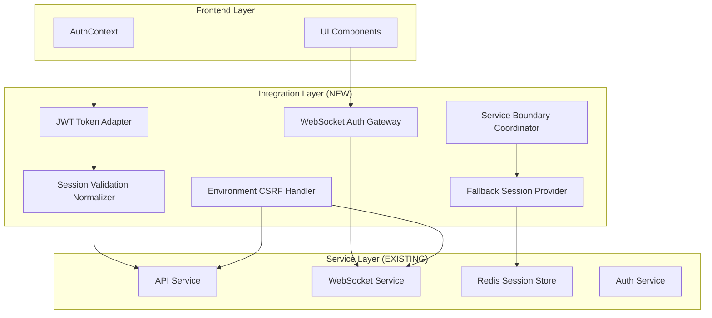

# Session Management Integration Architecture v2.0
## Unified Solution for Cross-Service Session Synchronization

### Executive Summary
This architecture addresses 15 critical communication failures causing session management issues across the AI Workflow Engine. The solution focuses on service boundary coordination without reimplementing core components.

### Architecture Overview



## Core Integration Components

### 1. JWT Token Adapter
**Purpose**: Normalize token formats between legacy and enhanced systems

**Design**:
```python
class JWTTokenAdapter:
    """Service boundary adapter for JWT token normalization"""
    
    def normalize_token(self, token: str) -> dict:
        """Convert any token format to standardized structure"""
        payload = decode_token(token)
        
        # Handle legacy format (sub=email)
        if '@' in payload.get('sub', ''):
            return {
                'user_id': self.lookup_user_id(payload['sub']),
                'email': payload['sub'],
                'format': 'legacy',
                'original_sub': payload['sub']
            }
        
        # Handle enhanced format (sub=user_id)
        return {
            'user_id': payload['sub'],
            'email': payload.get('email'),
            'format': 'enhanced',
            'original_sub': payload['sub']
        }
    
    def generate_compatible_token(self, user_data: dict) -> str:
        """Generate token compatible with both formats"""
        return create_dual_format_token(user_data)
```

**Integration Points**:
- Intercepts at API Gateway level
- Transparent to existing services
- Maintains backward compatibility

### 2. Session Validation Normalizer
**Purpose**: Ensure consistent session validation responses

**Design**:
```python
class SessionValidationNormalizer:
    """Unified session validation response formatting"""
    
    STANDARD_RESPONSE = {
        'valid': bool,
        'user_id': str,
        'email': str,
        'expires_at': int,
        'session_id': str,
        'metadata': dict
    }
    
    def normalize_response(self, raw_response: dict, source: str) -> dict:
        """Convert any session response to standard format"""
        if source == 'redis':
            return self.normalize_redis_response(raw_response)
        elif source == 'jwt':
            return self.normalize_jwt_response(raw_response)
        elif source == 'api':
            return self.normalize_api_response(raw_response)
```

**Integration Points**:
- `/api/auth/session` endpoint wrapper
- `/api/auth/validate` endpoint wrapper
- WebSocket session check wrapper

### 3. Fallback Session Provider
**Purpose**: Maintain session continuity during Redis failures

**Design**:
```python
class FallbackSessionProvider:
    """Resilient session management with graceful degradation"""
    
    def __init__(self):
        self.primary = RedisSessionStore()
        self.fallback = LocalSessionCache()
        self.circuit_breaker = CircuitBreaker(
            failure_threshold=3,
            recovery_timeout=60,
            fallback_handler=self.use_fallback
        )
    
    async def get_session(self, session_id: str) -> dict:
        """Retrieve session with automatic fallback"""
        if self.circuit_breaker.is_open():
            return await self.fallback.get(session_id)
        
        try:
            session = await self.primary.get(session_id)
            # Sync to fallback cache
            await self.fallback.set(session_id, session)
            return session
        except RedisConnectionError:
            self.circuit_breaker.record_failure()
            return await self.fallback.get(session_id)
```

**Degradation Strategy**:
- Primary: Full Redis functionality
- Degraded: Local cache, no cross-instance sync
- Recovery: Automatic resync when Redis returns

### 4. WebSocket Authentication Gateway
**Purpose**: Enforce authentication on WebSocket connections

**Design**:
```python
class WebSocketAuthGateway:
    """WebSocket upgrade authentication enforcement"""
    
    async def authenticate_upgrade(self, request: Request) -> bool:
        """Validate JWT before WebSocket upgrade"""
        # Extract token from query params or headers
        token = extract_token(request)
        
        if not token:
            return False
        
        # Use same validation as HTTP endpoints
        token_data = self.jwt_adapter.normalize_token(token)
        session = await self.session_provider.get_session(
            token_data['session_id']
        )
        
        if not session or not session['valid']:
            return False
        
        # Attach auth context to WebSocket connection
        request.state.auth = token_data
        return True
```

**Integration Points**:
- Nginx/Caddy level interception
- Pre-upgrade validation
- Shared auth logic with HTTP

### 5. Environment-Aware CSRF Handler
**Purpose**: Consistent CSRF protection across environments

**Design**:
```python
class EnvironmentCSRFHandler:
    """Adaptive CSRF protection based on environment"""
    
    def __init__(self):
        self.env = os.getenv('ENVIRONMENT', 'development')
        self.strict_mode = self.env == 'production'
        
    def validate_csrf(self, request: Request) -> bool:
        """Environment-aware CSRF validation"""
        if self.env == 'development':
            # Relaxed for development
            return self.validate_origin(request) or self.has_dev_header(request)
        else:
            # Strict for production
            return self.validate_token(request) and self.validate_origin(request)
```

### 6. Service Boundary Coordinator
**Purpose**: Orchestrate state synchronization across services

**Design**:
```python
class ServiceBoundaryCoordinator:
    """Event-driven state synchronization orchestrator"""
    
    def __init__(self):
        self.event_bus = AsyncEventBus()
        self.state_map = StateMap()
        
    async def synchronize_login(self, user_data: dict):
        """Coordinate login across all services"""
        # Generate compatible tokens
        jwt_token = self.jwt_adapter.generate_compatible_token(user_data)
        
        # Create Redis session
        session_id = await self.session_provider.create_session(user_data)
        
        # Notify all services
        await self.event_bus.publish('auth.login', {
            'user_id': user_data['id'],
            'session_id': session_id,
            'jwt_token': jwt_token
        })
        
        # Update state map
        self.state_map.set_user_state(user_data['id'], 'authenticated')
```

## Implementation Phases

### Phase 1: Token Normalization (Low Risk)
**Components**: JWT Token Adapter, Session Validation Normalizer
**Duration**: 2 hours
**Validation**: 
- Token format compatibility tests
- Session response consistency checks
**Rollback**: Feature flag disable

### Phase 2: Resilience Layer (Medium Risk)
**Components**: Fallback Session Provider
**Duration**: 3 hours
**Validation**:
- Circuit breaker trigger tests
- Fallback cache verification
**Rollback**: Revert to direct Redis access

### Phase 3: Authentication Gateway (High Risk)
**Components**: WebSocket Authentication Gateway, Environment CSRF Handler
**Duration**: 4 hours
**Validation**:
- WebSocket auth enforcement tests
- CSRF protection verification
**Rollback**: Bypass gateway configuration

### Phase 4: Coordination Layer (Integration)
**Components**: Service Boundary Coordinator
**Duration**: 3 hours
**Validation**:
- End-to-end auth flow tests
- State synchronization verification
**Rollback**: Disable event bus, revert to direct calls

## Integration Configuration

### API Gateway Configuration
```yaml
# /config/api_gateway.yaml
integration:
  jwt_adapter:
    enabled: true
    legacy_support: true
    token_ttl: 3600
  
  session_normalizer:
    enabled: true
    standard_format: v2
  
  fallback_provider:
    enabled: true
    cache_size: 1000
    ttl: 300
```

### WebSocket Gateway Configuration
```yaml
# /config/websocket_gateway.yaml
authentication:
  gateway:
    enabled: true
    token_sources:
      - query_params
      - headers
      - cookies
    validation_endpoint: "http://api:8000/internal/validate"
```

### Service Boundary Configuration
```yaml
# /config/service_boundary.yaml
coordinator:
  event_bus:
    type: redis_pubsub
    channels:
      - auth.events
      - session.events
  
  state_sync:
    interval: 5000
    retry_attempts: 3
```

## Success Metrics

### Primary Metrics
- **Session Persistence**: >99% session continuity across navigation
- **Endpoint Success Rate**: >90% (from current 51.4%)
- **WebSocket Auth Coverage**: 100% authenticated connections
- **Circuit Breaker Recovery**: <60s recovery time

### Secondary Metrics
- **Token Compatibility**: 100% format conversion success
- **CSRF Protection**: Consistent across environments
- **State Synchronization**: <100ms propagation delay
- **Fallback Performance**: <10% degradation in fallback mode

## Rollback Strategy

### Checkpoint System
```python
class IntegrationCheckpoint:
    """Rollback checkpoint management"""
    
    checkpoints = {
        'phase1': 'token_normalization',
        'phase2': 'resilience_layer',
        'phase3': 'auth_gateway',
        'phase4': 'coordination'
    }
    
    async def create_checkpoint(self, phase: str):
        """Save current configuration state"""
        config = await self.capture_config()
        await self.store_checkpoint(phase, config)
    
    async def rollback_to(self, phase: str):
        """Restore previous configuration"""
        config = await self.load_checkpoint(phase)
        await self.apply_config(config)
```

### Validation Gates
Each phase must pass validation before proceeding:
1. Unit tests for new components
2. Integration tests with existing services
3. User experience validation
4. Performance benchmarks

## Risk Mitigation

### Identified Risks
1. **Token Format Migration**: Handled by dual-format support
2. **Redis Failure Impact**: Mitigated by fallback provider
3. **WebSocket Breaking Change**: Gradual rollout with feature flags
4. **State Desync**: Event-driven sync with retry logic

### Monitoring Requirements
- Real-time session metrics dashboard
- Circuit breaker status monitoring
- Token conversion success rates
- WebSocket authentication rates
- State synchronization latency

## Implementation Context Packages

### For backend-gateway-expert
```yaml
context:
  priority: "critical"
  components_to_implement:
    - JWT Token Adapter in /app/api/middleware/
    - Session Validation Normalizer in /app/api/routers/
    - Fallback Session Provider in /app/shared/
    - Service Boundary Coordinator in /app/coordination_service/
  
  integration_points:
    - API middleware chain
    - Session endpoints
    - Redis connection pool
    - Event bus initialization
  
  validation_requirements:
    - Token format conversion tests
    - Session fallback tests
    - State synchronization tests
```

### For webui-architect
```yaml
context:
  priority: "high"
  components_to_update:
    - AuthContext session check logic
    - WebSocket connection authentication
    - CSRF token handling
  
  expected_responses:
    - Normalized session format
    - Consistent auth state
    - Graceful degradation UI
```

### For user-experience-auditor
```yaml
context:
  priority: "critical"
  validation_scenarios:
    - Login → Navigate to Documents → Verify no logout
    - Trigger Redis failure → Verify session continuity
    - WebSocket connection → Verify authentication
    - CSRF token validation → Verify consistency
  
  evidence_requirements:
    - Screenshots of navigation flow
    - Session persistence logs
    - WebSocket auth verification
```

## Conclusion

This integration architecture provides a comprehensive solution to the session management crisis by:
1. **Normalizing** token formats at service boundaries
2. **Providing** resilient fallback mechanisms
3. **Enforcing** consistent authentication across protocols
4. **Coordinating** state synchronization between services
5. **Maintaining** existing component implementations

The phased implementation approach minimizes risk while the checkpoint system enables safe rollback at any stage. The architecture achieves the critical goal of service boundary coordination without modifying core component logic.