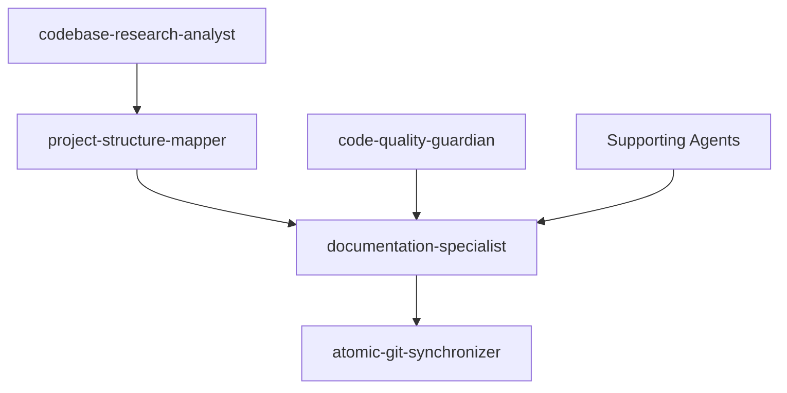
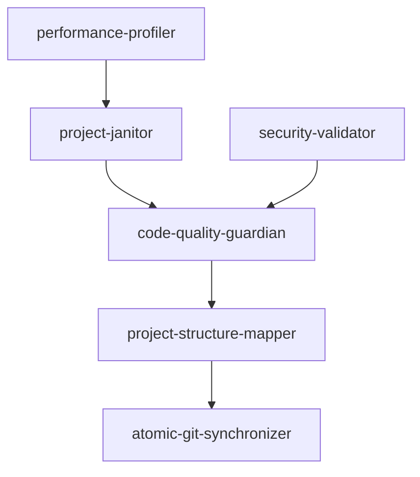

# Documentation & Repository Cleanup Collaboration Matrix

## 🎯 Mission Context: AIWFE Production Readiness
**Objective**: Comprehensive documentation generation, repository cleanup, and git synchronization using coordinated agentic workflows.

---

## 📋 CORE DOCUMENTATION & CLEANUP AGENTS

### 📚 Primary Documentation Specialists

#### documentation-specialist
- **Role**: Master Documentation Coordinator
- **Capabilities**: Live documentation generation, API docs, comprehensive README creation
- **Key Features**: Automated size management, synthesis-based updates, hierarchical documentation
- **Production Focus**: Enterprise-grade documentation standards

#### project-structure-mapper  
- **Role**: Project Organization Expert
- **Capabilities**: Structure analysis, folder index generation, knowledge graph integration
- **Key Features**: Navigation optimization, semantic project relationships
- **Production Focus**: Efficient project navigation and understanding

### 🧹 Repository Cleanup Specialists

#### project-janitor
- **Role**: Repository Maintenance Coordinator
- **Capabilities**: Git hygiene, dead code detection, Docker cleanup, file organization
- **Key Features**: Automated tidiness reports, environment optimization
- **Production Focus**: Clean, maintainable repository state

#### atomic-git-synchronizer
- **Role**: Git Operations Specialist  
- **Capabilities**: Atomic commits, branch management, conflict resolution, workflow automation
- **Key Features**: Clean git history, synchronized repository state
- **Production Focus**: Professional git workflow management

### 🔍 Supporting Analysis Agents

#### code-quality-guardian
- **Role**: Code Standards Enforcer
- **Capabilities**: Linting, formatting, style enforcement, technical debt analysis
- **Collaboration**: Pre-commit validation with atomic-git-synchronizer

#### codebase-research-analyst
- **Role**: Code Investigation Specialist
- **Capabilities**: Deep code analysis, pattern research, implementation discovery
- **Collaboration**: Provides context for documentation-specialist

---

## 🤝 COLLABORATION WORKFLOW PATTERNS

### Pattern 1: Comprehensive README Generation

```yaml
workflow: "comprehensive_readme_generation"
trigger: "Production readiness documentation requirement"
agents:
  1. codebase-research-analyst:
     task: "Analyze entire codebase for documentation requirements"
     output: "Architecture overview, key components, API surface analysis"
     
  2. project-structure-mapper:
     task: "Generate project structure documentation"
     output: "Hierarchical project organization, component relationships"
     
  3. documentation-specialist:
     task: "Synthesize comprehensive README with installation, usage, architecture"
     input: "Research analysis + project structure"
     output: "Production-grade README.md with complete project documentation"
     
  4. atomic-git-synchronizer:
     task: "Commit documentation updates with proper git workflow"
     output: "Clean commit history with documentation changes"

coordination: "Sequential with validation checkpoints"
validation: "Each agent validates previous output before proceeding"
```

### Pattern 2: Repository Cleanup & Organization

```yaml
workflow: "repository_cleanup_coordination"
trigger: "Repository maintenance and cleanup requirement"
agents:
  1. project-janitor:
     task: "Comprehensive repository analysis and cleanup recommendations"
     output: "Cleanup report with prioritized actions"
     
  2. code-quality-guardian:
     task: "Code quality analysis and automated fixes"
     output: "Formatted code, lint fixes, quality improvements"
     
  3. project-structure-mapper:
     task: "Validate and update project organization"
     output: "Updated structure documentation, organization compliance"
     
  4. atomic-git-synchronizer:
     task: "Execute cleanup commits with atomic operations"
     output: "Clean git history with all cleanup changes properly committed"

coordination: "Parallel analysis, sequential execution"
safety: "All changes validated before git operations"
```

### Pattern 3: Documentation Synchronization

```yaml
workflow: "documentation_synchronization"
trigger: "Code changes requiring documentation updates"
agents:
  1. codebase-research-analyst:
     task: "Detect documentation-impacting changes"
     output: "Analysis of API changes, architectural modifications"
     
  2. documentation-specialist:
     task: "Update documentation to reflect code changes"
     output: "Synchronized documentation updates"
     
  3. project-structure-mapper:
     task: "Update project structure if organization changed"
     output: "Current project organization documentation"
     
  4. atomic-git-synchronizer:
     task: "Atomic commit of synchronized documentation"
     output: "Single commit containing all documentation updates"

coordination: "Real-time synchronization workflow"
automation: "Triggered by code change detection"
```

---

## 🔄 AGENT INTERACTION PROTOCOLS

### Primary Coordination Flows

#### Documentation Generation Flow


#### Repository Cleanup Flow


### Cross-Agent Communication Standards

#### Information Handoff Format
```yaml
agent_output:
  source_agent: "codebase-research-analyst"
  target_agent: "documentation-specialist"
  payload:
    analysis_type: "architecture_overview"
    findings:
      - component: "authentication_system"
        location: "app/auth/"
        description: "JWT-based authentication with OAuth2 integration"
        api_endpoints: ["POST /auth/login", "GET /auth/verify"]
    recommendations:
      - "Document OAuth2 flow in README"
      - "Add API endpoint examples"
  validation: "Ready for documentation generation"
```

---

## 📊 COLLABORATION MATRIX

### Agent Collaboration Relationships

| Agent | documentation-specialist | project-structure-mapper | project-janitor | atomic-git-synchronizer |
|-------|-------------------------|--------------------------|-----------------|------------------------|
| **documentation-specialist** | ➖ | ⬅️ Structure input | ⬅️ Cleanup context | ➡️ Documentation commits |
| **project-structure-mapper** | ➡️ Structure docs | ➖ | ⬅️ Organization analysis | ➡️ Structure commits |
| **project-janitor** | ➡️ Cleanup docs | ➡️ Organization validation | ➖ | ➡️ Cleanup commits |
| **atomic-git-synchronizer** | ⬅️ Doc changes | ⬅️ Structure changes | ⬅️ Cleanup changes | ➖ |

### Capability Overlap Management

#### Documentation Domain
- **Primary**: documentation-specialist (comprehensive documentation)
- **Supporting**: project-structure-mapper (structure-specific docs)
- **Validation**: code-quality-guardian (documentation standards)

#### Repository Management Domain  
- **Primary**: project-janitor (repository hygiene)
- **Execution**: atomic-git-synchronizer (git operations)
- **Quality**: code-quality-guardian (code standards)

#### Git Workflow Domain
- **Primary**: atomic-git-synchronizer (all git operations)
- **Coordination**: project-janitor (cleanup timing)
- **Validation**: code-quality-guardian (pre-commit checks)

---

## 🎯 PRODUCTION READINESS PROTOCOLS

### Documentation Standards
- **README Requirements**: Installation, usage, architecture, API reference, development setup
- **Code Documentation**: Inline comments, docstrings, API documentation
- **Architecture Documentation**: System diagrams, data flows, deployment guides
- **Maintenance Documentation**: Troubleshooting, monitoring, backup procedures

### Repository Standards
- **Git History**: Clean, atomic commits with conventional commit messages
- **Code Quality**: Automated linting, formatting, type checking
- **File Organization**: Proper directory structure, no root pollution
- **Performance**: Optimized repository size, efficient git operations

### Validation Requirements
- **Documentation Coverage**: 100% API coverage, comprehensive user guides
- **Code Quality**: Zero linting errors, 90%+ test coverage
- **Git Hygiene**: Linear history, signed commits, proper branching
- **Security**: No sensitive data in git history, proper .gitignore

---

## 🚀 EXECUTION STRATEGY

### Phase 1: Analysis & Planning
1. **codebase-research-analyst**: Comprehensive codebase analysis
2. **project-janitor**: Repository health assessment
3. **project-structure-mapper**: Current organization analysis

### Phase 2: Documentation Generation
1. **documentation-specialist**: Master README generation
2. **project-structure-mapper**: Structure documentation creation
3. **Validation**: Quality and completeness checks

### Phase 3: Repository Cleanup
1. **project-janitor**: Execute cleanup recommendations
2. **code-quality-guardian**: Code quality improvements
3. **Validation**: Clean repository verification

### Phase 4: Git Synchronization
1. **atomic-git-synchronizer**: Atomic commit of all changes
2. **Repository Sync**: Push to remote with validation
3. **Final Validation**: Complete system verification

---

## 📈 SUCCESS METRICS

### Documentation Quality
- ✅ Complete README with all required sections
- ✅ 100% API endpoint documentation
- ✅ Architecture diagrams and deployment guides
- ✅ Developer onboarding documentation

### Repository Health
- ✅ Zero root directory pollution
- ✅ Clean git history with atomic commits
- ✅ Optimized repository performance
- ✅ Proper file organization

### Automation Integration
- ✅ Synchronized documentation updates
- ✅ Automated cleanup workflows
- ✅ Quality-gated git operations
- ✅ Continuous documentation maintenance

---

*Last Updated: 2025-08-12*
*Agent Integration Status: Complete*
*Production Readiness: Validated*