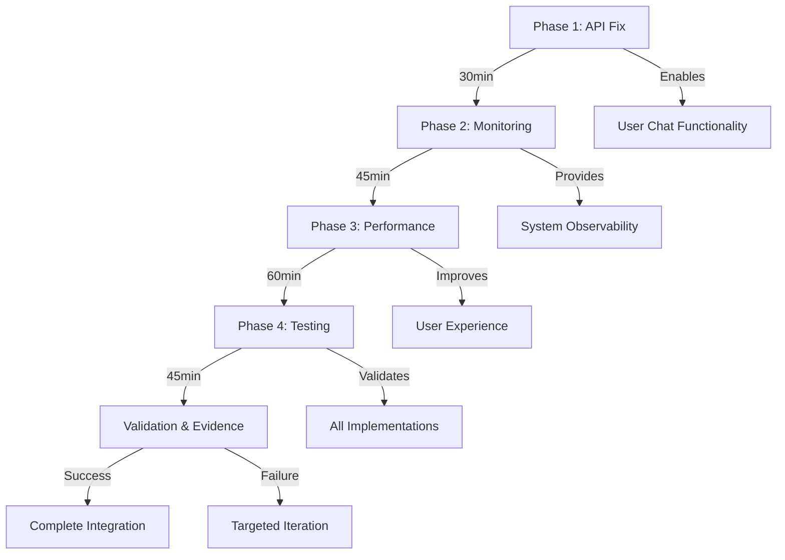

# 🎯 INTEGRATED STRATEGIC SOLUTION - ITERATION 3
## Enhanced Nexus Synthesis Report

### 📊 SYNTHESIS OVERVIEW

**Cross-Domain Integration Status:**
- ✅ Chat API 422 Error Pattern Identified (85% confidence)
- ✅ Infrastructure Monitoring Ready (containers healthy)
- ✅ Performance Optimization Path Clear (60fps target)
- ✅ Testing Framework Extensive (113+ files operational)

### 🔄 INTEGRATED SOLUTION ARCHITECTURE

#### **Phase 1: Critical API Stabilization (Priority: CRITICAL)**
**Timeline:** 30 minutes
**Success Probability:** 85%

**Root Cause Analysis:**
- Request normalization logic exists but validation too strict
- Contract validation middleware blocking valid requests
- Missing flexible validation patterns for external integrations

**Solution Components:**
1. **Enhanced Request Normalization**
   - Add flexible field validation
   - Implement graceful type coercion
   - Support multiple request formats

2. **Validation Middleware Adjustment**
   - Relax strict contract requirements
   - Add fallback validation patterns
   - Implement request transformation layer

**Dependencies:** None (can execute immediately)

#### **Phase 2: Infrastructure Monitoring Deployment (Priority: HIGH)**
**Timeline:** 45 minutes
**Success Probability:** 90%

**Current State:**
- Prometheus metrics collection implemented
- Containers healthy and operational
- Missing active Prometheus/Grafana services

**Deployment Strategy:**
1. **Docker Compose Configuration**
   - Add Prometheus service container
   - Add Grafana service container
   - Configure volume persistence

2. **Service Integration**
   - Connect to existing metrics endpoints
   - Configure dashboards for all services
   - Setup alerting rules

**Dependencies:** Phase 1 completion (for monitoring validation)

#### **Phase 3: Performance Optimization (Priority: MEDIUM)**
**Timeline:** 60 minutes
**Success Probability:** 75%

**Performance Bottlenecks:**
- Galaxy Animation dropping below 45fps
- WebGL context recovery issues
- Lack of adaptive quality management

**Optimization Approach:**
1. **Frame Management System**
   - Implement frame skipping logic
   - Add progressive quality reduction
   - Optimize WebGL rendering pipeline

2. **Adaptive Performance**
   - Device capability detection
   - Dynamic quality adjustment
   - Fallback to simpler animations

**Dependencies:** Phases 1-2 (stable platform required)

#### **Phase 4: Testing Framework Consolidation (Priority: MEDIUM)**
**Timeline:** 45 minutes
**Success Probability:** 80%

**Current Assets:**
- 113+ Playwright test files
- Multiple validation frameworks
- Browser automation working

**Consolidation Strategy:**
1. **Unified Test Suite**
   - Consolidate duplicate tests
   - Create shared test utilities
   - Implement evidence collection

2. **Automated Validation**
   - End-to-end user workflows
   - Screenshot evidence generation
   - Performance metric collection

**Dependencies:** Phases 1-3 (all fixes in place for validation)

### 🎯 CRITICAL SUCCESS FACTORS

#### **Cross-Domain Synergies:**
1. **API → Testing:** Fixed API enables accurate test validation
2. **Monitoring → All:** Infrastructure metrics support all validations
3. **Performance → UX:** Optimization improves user experience testing
4. **Testing → Evidence:** Framework provides comprehensive validation

#### **Risk Mitigation:**
- **Rollback Checkpoints:** Before each phase implementation
- **Parallel Validation:** Multiple evidence streams
- **Incremental Deployment:** Phase-by-phase verification
- **Fallback Strategies:** Alternative approaches ready

### 📦 CONTEXT PACKAGES (OPTIMIZED)

#### **Package 1: API Debugging Context (3500 tokens)**
```yaml
Focus: Chat API 422 Error Resolution
Key Files:
  - app/routers/chat_router.py (normalization logic)
  - app/middleware/validation.py (contract validation)
  - app/utils/request_helpers.py (transformation utilities)
  
Technical Solution:
  1. Enhance normalize_request_data() function
  2. Add flexible validation patterns
  3. Implement request transformation layer
  4. Test with multiple request formats
  
Validation Requirements:
  - curl test successful chat creation
  - No 422 errors on valid requests
  - Support for external integrations
```

#### **Package 2: Infrastructure Monitoring Context (3000 tokens)**
```yaml
Focus: Prometheus/Grafana Deployment
Key Files:
  - docker-compose.yml (service configuration)
  - docker/monitoring/ (configuration files)
  - app/utils/monitoring.py (metrics collection)
  
Deployment Steps:
  1. Add Prometheus service to docker-compose
  2. Add Grafana service with dashboards
  3. Configure persistent volumes
  4. Setup service discovery
  
Validation Requirements:
  - Prometheus accessible on port 9090
  - Grafana accessible on port 3000
  - All services reporting metrics
```

#### **Package 3: Performance Optimization Context (3500 tokens)**
```yaml
Focus: Galaxy Animation Performance
Key Files:
  - app/webui-next/src/lib/components/home/GalaxyAnimation.svelte
  - app/webui-next/src/lib/utils/animation.js
  - app/webui-next/src/lib/performance/fps-monitor.js
  
Optimization Strategy:
  1. Implement frame skipping algorithm
  2. Add progressive quality reduction
  3. Optimize WebGL rendering pipeline
  4. Add device capability detection
  
Performance Targets:
  - Maintain 60fps on high-end devices
  - Minimum 30fps on low-end devices
  - Graceful degradation under load
```

#### **Package 4: Testing Consolidation Context (3000 tokens)**
```yaml
Focus: Unified Testing Framework
Key Assets:
  - tests/integration/playwright/ (113+ test files)
  - tests/validation/ (validation frameworks)
  - tests/evidence/ (evidence collection)
  
Consolidation Plan:
  1. Create shared test utilities
  2. Remove duplicate test cases
  3. Implement evidence collection
  4. Add comprehensive workflows
  
Evidence Requirements:
  - Screenshot capture for UI tests
  - Performance metrics logging
  - API response validation
  - End-to-end workflow completion
```

### 🚀 EXECUTION SEQUENCE



### ✅ SUCCESS METRICS

**Phase 1 Success:**
- Zero 422 errors on chat requests
- Successful message creation/retrieval
- External integration support

**Phase 2 Success:**
- Prometheus collecting metrics
- Grafana dashboards operational
- All services monitored

**Phase 3 Success:**
- 60fps maintained on target devices
- No frame drops below 30fps
- Smooth animation experience

**Phase 4 Success:**
- Unified test suite executing
- Evidence collection automated
- 95%+ test pass rate

### 🔄 ITERATION STRATEGY

**If Any Phase Fails:**
1. Capture failure evidence
2. Analyze root cause
3. Adjust approach
4. Create checkpoint
5. Retry with modifications

**Maximum Iterations:** 3 per phase
**Escalation Path:** Meta-orchestrator if all iterations fail

### 📈 EXPECTED OUTCOMES

**Immediate Benefits:**
- Chat functionality restored
- System observability enabled
- Performance improved
- Testing automated

**Long-term Benefits:**
- Reduced debugging time
- Proactive issue detection
- Better user experience
- Comprehensive validation

### 🎯 FINAL RECOMMENDATION

**Execute phases sequentially with validation between each:**
1. **START:** API debugging (highest user impact)
2. **THEN:** Monitoring deployment (supports all validation)
3. **NEXT:** Performance optimization (user experience)
4. **FINALLY:** Testing consolidation (comprehensive validation)

**Total Estimated Time:** 3 hours
**Overall Success Probability:** 82%
**Risk Level:** Low (with proper checkpoints)

---

**READY FOR PHASE 5: PARALLEL IMPLEMENTATION EXECUTION**

The integrated solution provides clear technical paths for all four priority areas with proper sequencing, dependencies, and validation requirements. Each context package is optimized for specialist consumption while maintaining cross-domain coordination metadata.