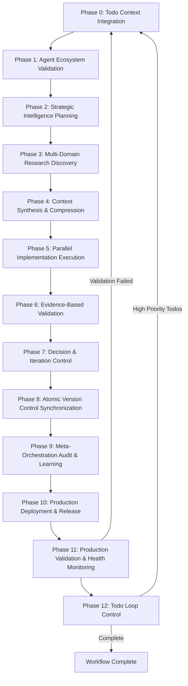

# 🤖 UnifiedWorkflow: Claude Code AI Orchestration System

> **A comprehensive, self-improving AI workflow engine for complex multi-domain software development projects**

[](./CLAUDE.md)
[](./agents/)
[](./workflows/)
[](./LICENSE)

## 📋 Table of Contents

- [Overview](#overview)
- [Key Features](#key-features)
- [12-Phase Workflow](#12-phase-workflow)
- [Quick Start](#quick-start)
- [Architecture](#architecture)
- [Agent Ecosystem](#agent-ecosystem)
- [Integration](#integration)
- [Usage Examples](#usage-examples)
- [Configuration](#configuration)
- [Monitoring](#monitoring)
- [Contributing](#contributing)

## 🌟 Overview

UnifiedWorkflow is a production-ready AI orchestration system that coordinates 35+ specialist AI agents across 12 distinct phases to handle complex software development projects. Built on proven patterns from the Claude Code AI Workflow Engine, it provides:

- **Self-Improving System**: Learns from each execution to optimize future workflows
- **Multi-Stream Parallelization**: Independent domain streams with coordinated integration
- **Evidence-Based Validation**: Concrete evidence collection and verification at every step
- **Container-Native Architecture**: Microservices isolation with graceful degradation
- **Cross-Session Continuity**: Persistent todo management and context preservation

## 🚀 Key Features

### 🔄 **12-Phase Orchestration Flow**
- **Phase 0**: Todo Context Integration - Cross-session continuity
- **Phase 1**: Agent Ecosystem Validation - System readiness verification
- **Phase 2**: Strategic Intelligence Planning - High-level coordination strategy
- **Phase 3**: Multi-Domain Research Discovery - Parallel research across domains
- **Phase 4**: Context Synthesis & Compression - Token-optimized information packaging
- **Phase 5**: Parallel Implementation Execution - Multi-stream development
- **Phase 6**: Evidence-Based Validation - Concrete proof collection
- **Phase 7**: Decision & Iteration Control - Evidence-driven continuation logic
- **Phase 8**: Atomic Version Control Synchronization - Git integration
- **Phase 9**: Meta-Orchestration Audit & Learning - Continuous improvement
- **Phase 10**: Production Deployment & Release - Blue-green deployment
- **Phase 11**: Production Validation & Health Monitoring - Live system verification
- **Phase 12**: Todo Loop Control - Intelligent workflow continuation

### 🌊 **Multi-Stream Parallel Architecture**
- **Backend Stream**: API gateway, database optimization, performance tuning
- **Frontend Stream**: UI architecture, component design, user experience
- **Security Stream**: Authentication, authorization, vulnerability assessment
- **Infrastructure Stream**: Container orchestration, monitoring, deployment
- **Quality Stream**: Testing automation, user experience validation, code quality
- **Documentation Stream**: Technical documentation, API specs, user guides

### 🧠 **ML-Enhanced Orchestration**
- **Predictive Coordination**: AI-driven resource allocation and dependency prediction
- **Adaptive Workflow Optimization**: Dynamic adjustment based on execution patterns
- **Intelligent Context Compression**: Semantic preservation with token optimization
- **Smart Integration Validation**: Automated conflict detection and resolution

## 📊 12-Phase Workflow



## 🚦 Quick Start

### Prerequisites
- **Claude Code AI** with MCP server support
- **Redis** (for agent coordination)
- **Git** (for version control integration)
- **Docker** (optional, for containerized deployment)

### Installation

1. **Clone the UnifiedWorkflow repository**:
   ```bash
   git clone <repository-url>
   cd UnifiedWorkflow
   ```

2. **Copy CLAUDE.md to your project**:
   ```bash
   cp CLAUDE.md /path/to/your/project/
   ```

3. **Set up MCP servers** (if needed):
   ```bash
   # Configure memory MCP
   cp mcps/memory/mcp-memory-config.json ~/.config/claude-mcp/
   
   # Configure Redis MCP
   cp mcps/redis/mcp-redis-config.json ~/.config/claude-mcp/
   ```

4. **Initialize orchestration directory**:
   ```bash
   mkdir -p .claude
   cp workflows/12-phase-workflow.yaml .claude/unified-orchestration-config.yaml
   echo "[]" > .claude/orchestration_todos.json
   ```

### Basic Usage

Trigger the orchestration workflow in Claude Code with any of these phrases:
- `"start flow"`
- `"orchestration"`
- `"agentic flow"`
- `"start agent(s)"`

The system will automatically:
1. Load persistent todos and assess priorities
2. Validate agent ecosystem and tool access
3. Create strategic implementation plan
4. Execute parallel development streams
5. Validate with concrete evidence
6. Deploy to production with health monitoring
7. Learn and optimize for future executions

## 🏗️ Architecture

### Agent Hierarchy
```
User → orchestration-todo-manager (Phase 0)
     → project-orchestrator (Phase 2) → Main Claude
                                    → Specialist Agents
```

### Context Package System
- **Strategic Context**: 3,000 tokens max - High-level architecture
- **Technical Context**: 4,000 tokens max - Implementation details
- **Frontend Context**: 3,000 tokens max - UI patterns and components
- **Security Context**: 3,000 tokens max - Auth patterns and vulnerabilities
- **Performance Context**: 3,000 tokens max - Bottlenecks and optimization
- **Database Context**: 3,500 tokens max - Schema and query patterns

### Tool Integration
```yaml
File Operations: Read, Write, Edit, MultiEdit, Glob, LS
Search & Analysis: Grep, Task, WebFetch, WebSearch  
Development: Bash, NotebookEdit, execution tools
Context & Memory: TodoWrite, MCP tools
Collaboration: Redis scratch pad, notifications, timeline
Specialized: Browser tools, Sequential Thinking
```

## 🤖 Agent Ecosystem

### Orchestration Agents (7)
- **orchestration-todo-manager**: Cross-session todo management
- **project-orchestrator**: Strategic planning and coordination
- **agent-integration-orchestrator**: Ecosystem validation
- **enhanced-nexus-synthesis**: Historical pattern analysis
- **atomic-git-synchronizer**: Version control management
- **orchestration-auditor**: Meta-analysis and learning
- **deployment-orchestrator**: Production deployment

### Backend Development (8)
- **backend-gateway-expert**: API gateway architecture
- **schema-database-expert**: Database design and optimization
- **performance-profiler**: Performance analysis and tuning
- **python-refactoring-architect**: Code refactoring and architecture
- **codebase-research-analyst**: Codebase analysis and documentation
- **monitoring-analyst**: System monitoring and alerting
- **dependency-analyzer**: Dependency management and security
- **container-architecture-specialist**: Containerization and orchestration

### Frontend/UX (4)
- **ui-architect**: Component architecture and design systems
- **ux-architect**: User experience design and optimization
- **ui-designer**: Visual design and interaction patterns
- **ui-debugger**: Frontend debugging and performance optimization

### Quality Assurance (4)
- **security-validator**: Security audit and vulnerability assessment
- **fullstack-communication-auditor**: API and integration testing
- **test-automation-engineer**: Automated testing framework
- **user-experience-auditor**: User perspective validation with evidence
- **code-quality-guardian**: Code quality and best practices

### Documentation/Knowledge (3)
- **documentation-specialist**: Technical documentation creation
- **project-structure-mapper**: Project organization and structure
- **project-janitor**: File organization and cleanup

### ML/AI Enhanced (8)
- **ml-enhanced-orchestrator**: AI-driven workflow optimization
- **predictive-coordination-ai**: Resource allocation prediction
- **adaptive-workflow-optimizer**: Dynamic workflow adjustment
- **intelligent-context-synthesizer**: Context optimization
- **predictive-quality-assessor**: Quality prediction and assessment
- **adaptive-research-coordinator**: Research optimization
- **smart-integration-validator**: Automated integration validation
- **intelligent-failure-predictor**: Failure prediction and prevention

### Integration/Context (5)
- **nexus-synthesis**: Cross-domain integration
- **context-compression**: Token management and optimization
- **execution-conflict-detector**: Conflict detection and resolution
- **execution-simulator**: Execution simulation and planning
- **external-services-integrator**: Third-party service integration
- **graph-framework-analyst**: Graph and visualization frameworks
- **collaborative-scratch-pad**: Real-time coordination

## 🔧 Integration

### MCP Server Configuration

The system integrates with multiple MCP servers:

#### Memory MCP
```json
{
  "capabilities": [
    "mcp__memory__create_entities",
    "mcp__memory__search_nodes",
    "mcp__memory__get_entities"
  ],
  "storage": "Persistent agent outputs and context packages",
  "entity_types": ["agent-output", "context-package", "documentation"]
}
```

#### Redis MCP
```json
{
  "capabilities": [
    "mcp__redis__hset", "mcp__redis__hget", "mcp__redis__hgetall",
    "mcp__redis__sadd", "mcp__redis__smembers",
    "mcp__redis__zadd", "mcp__redis__zrange"
  ],
  "usage": "Real-time agent coordination and scratch pad communication"
}
```

### Container Architecture Integration

Follow the **mandatory isolation rules**:

```yaml
✅ CORRECT Patterns:
  - New Service = New Container
  - Independent API endpoints (/health, /api/v1/...)
  - Graceful degradation ("Service offline" messages)
  - No cascading failures

❌ FORBIDDEN Patterns:
  - Modifying existing working containers
  - Tight coupling between components
  - Single points of failure
```

## 📈 Usage Examples

### Example 1: Full-Stack Application Development
```bash
# User request: "Build a real-time chat application with authentication"

Phase 0: Load todos, assess chat app requirements
Phase 1: Validate agent ecosystem for full-stack development  
Phase 2: Create strategic plan for real-time chat architecture
Phase 3: Parallel research on WebSocket, auth, and UI patterns
Phase 4: Compress context packages for each development stream
Phase 5: Parallel implementation:
  - Backend: WebSocket server, auth middleware, message persistence
  - Frontend: Chat UI, real-time message display, user management
  - Security: JWT implementation, input sanitization, rate limiting
  - Infrastructure: Redis for message queuing, database setup
Phase 6: Evidence collection with screenshots, API tests, performance metrics
Phase 7: Validation analysis and iteration decision
Phase 8: Atomic git commits and branch management
Phase 9: Workflow analysis and pattern learning
Phase 10: Blue-green deployment to production
Phase 11: Production health validation with real user testing
Phase 12: Check for remaining optimization todos
```

### Example 2: Performance Optimization Project
```bash
# User request: "Optimize database queries and API response times"

Phase 0: Load performance-related todos from previous sessions
Phase 1: Validate monitoring and profiling agent availability
Phase 2: Strategic performance optimization plan
Phase 3: Parallel research on query optimization, caching, indexing
Phase 4: Context packages with performance baselines and targets
Phase 5: Parallel optimization:
  - Backend: Query optimization, connection pooling, caching layers
  - Database: Index optimization, query plan analysis
  - Infrastructure: Load balancing, CDN setup, monitoring enhancement
Phase 6: Performance evidence with before/after metrics, load test results
Phase 7: Validate performance improvements meet targets
Phase 8: Commit optimizations with performance documentation
Phase 9: Learn optimization patterns for future projects
Phase 10: Deploy optimizations with rollback capability
Phase 11: Production performance validation with real traffic
Phase 12: Continue if additional performance todos identified
```

## ⚙️ Configuration

### Workflow Configuration
Edit `workflows/12-phase-workflow.yaml` to customize:
- Phase execution parameters
- Agent assignments and coordination
- Context package size limits
- Success criteria and validation requirements
- Loop control logic

### Context Package Templates
Modify `templates/context-package-templates.yaml` for:
- Package structure customization
- Token limit adjustments
- Agent targeting rules
- Quality validation criteria

### Monitoring Configuration
Configure `monitoring/orchestration-monitor.py` for:
- Performance threshold alerts
- Metrics collection intervals
- Dashboard integration
- Notification channels

## 📊 Monitoring

### Real-Time Monitoring
```python
from monitoring.orchestration_monitor import OrchestrationMonitor

monitor = OrchestrationMonitor()
monitor.start_workflow("project-optimization-001")

# Get real-time status
status = monitor.get_real_time_status()
print(f"Current phase: {status['current_phase']}")
print(f"Active agents: {status['active_agents']}")
```

### Performance Metrics
- **Phase Duration**: Track execution time per phase
- **Token Usage**: Monitor context package efficiency
- **Agent Performance**: Success rates and tool usage
- **Error Rates**: Track and analyze failure patterns
- **Evidence Quality**: Validation evidence completeness

### Dashboard Integration
The monitoring system provides JSON metrics for integration with:
- **Grafana**: Performance dashboards and alerting
- **Prometheus**: Metrics collection and time-series analysis
- **Custom Dashboards**: Real-time workflow visualization

## 🔒 Security & Best Practices

### Recursion Prevention
- **Strict Agent Hierarchy**: Prevents infinite loops and circular calls
- **Orchestrator Isolation**: Only user initiates orchestration
- **Specialist Boundaries**: Agents never call orchestrators directly

### Context Security
- **Token Limits**: Strict enforcement prevents context overflow
- **Package Validation**: Automatic validation of context package structure
- **Memory Management**: Efficient storage and cleanup of agent outputs

### Error Handling
- **Graceful Degradation**: Services fail independently without cascading
- **Retry Mechanisms**: Intelligent retry with exponential backoff
- **Rollback Capability**: Automatic rollback on critical failures

## 🤝 Contributing

### Agent Development
1. Follow the agent specification template in `agents/`
2. Include tool requirements and validation patterns
3. Define clear context package interfaces
4. Implement evidence-based validation

### Workflow Enhancement
1. Update `workflows/12-phase-workflow.yaml` for new phases
2. Maintain backward compatibility with existing agents
3. Include comprehensive testing and validation
4. Document integration patterns

### MCP Integration
1. Follow MCP server configuration patterns in `mcps/`
2. Include capability documentation and examples
3. Implement error handling and fallback mechanisms
4. Test integration with existing workflow phases

## 📝 License

This project is licensed under the MIT License - see the [LICENSE](LICENSE) file for details.

## 🙏 Acknowledgments

Built upon the Claude Code AI Workflow Engine patterns and inspired by production orchestration systems that handle complex multi-domain software development projects.

---

**For detailed implementation instructions and agent specifications, see [CLAUDE.md](./CLAUDE.md)**