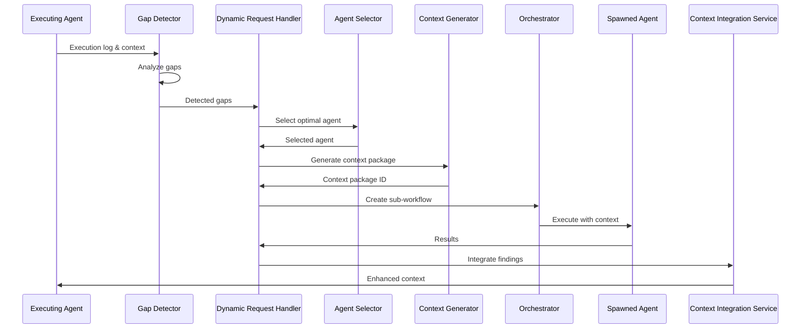

# Dynamic Information Gathering System (STREAM 6)

## Overview

The Dynamic Information Gathering System implements **STREAM 6** of the AI Workflow Engine orchestration capabilities, enabling agents to dynamically request additional specialist agents when they discover information gaps during execution. This system provides intelligent, adaptive orchestration that responds to real-time needs rather than pre-planned workflows.

## Key Features

### 🔍 **Information Gap Detection**
- **ML-Enhanced Analysis**: Automatically detects when agents need additional information
- **Pattern-Based Recognition**: Identifies common gap patterns in execution logs
- **Context Analysis**: Evaluates missing required contexts and dependencies
- **Priority Scoring**: Ranks gaps by severity and impact for optimal resource allocation

### 🤖 **Dynamic Agent Spawning**
- **Intelligent Agent Selection**: Matches gaps with optimal specialist agents
- **Runtime Workflow Creation**: Creates sub-workflows for spawned agents
- **Context Package Generation**: Provides spawned agents with relevant context
- **Resource Management**: Prevents infinite loops and manages system resources

### 🔄 **Context Integration**
- **Compatibility Analysis**: Evaluates how new findings integrate with existing context
- **Multiple Integration Strategies**: Merge, append, selective, prioritization strategies
- **Conflict Resolution**: Handles contradictory information intelligently
- **Confidence Improvement**: Measures and tracks context enhancement

### 📊 **Performance Monitoring**
- **Real-time Metrics**: Tracks request success rates, response times, and system health
- **Quality Assurance**: Monitors confidence scores and integration effectiveness
- **Resource Optimization**: Identifies bottlenecks and optimization opportunities

## Architecture

### Core Components

```
┌─────────────────────────────────────────────────────────────┐
│                    Coordination Service                     │
├─────────────────────────────────────────────────────────────┤
│  ┌─────────────────┐  ┌─────────────────┐  ┌──────────────┐ │
│  │ Dynamic Request │  │ Context Integr. │  │ Agent        │ │
│  │ Handler         │  │ Service         │  │ Registry     │ │
│  └─────────────────┘  └─────────────────┘  └──────────────┘ │
│                                                             │
│  ┌─────────────────┐  ┌─────────────────┐  ┌──────────────┐ │
│  │ Gap Detector    │  │ Agent Selector  │  │ Context      │ │
│  │                 │  │                 │  │ Generator    │ │
│  └─────────────────┘  └─────────────────┘  └──────────────┘ │
└─────────────────────────────────────────────────────────────┘
```

### Service Interactions



## Components Deep Dive

### 1. Information Gap Detector

**Purpose**: Automatically identifies when agents need additional information

**Key Features**:
- Pattern-based gap detection using regex matching
- Context gap analysis for missing required information
- ML-enhanced detection for subtle information needs
- Knowledge graph integration for domain-specific gaps

**Gap Types**:
- `missing_dependency`: Required dependency information not available
- `insufficient_expertise`: Agent lacks domain-specific knowledge
- `security_concern`: Security validation or audit needed
- `performance_impact`: Performance analysis required
- `missing_context`: Required context fields not present

**Example Usage**:
```python
detector = InformationGapDetector()
gaps = await detector.detect_gaps(
    agent_name="backend-gateway-expert",
    task_context={"workflow_id": "api-analysis"},
    execution_log=["Need security validation", "Performance unclear"],
    current_findings={"auth_method": "JWT"}
)
```

### 2. Dynamic Request Handler

**Purpose**: Manages the complete lifecycle of dynamic agent requests

**Key Features**:
- Request creation and prioritization
- Agent assignment and workflow spawning
- Status tracking and timeout handling
- Result collection and distribution

**Request Lifecycle**:
1. **PENDING**: Request created, waiting for processing
2. **ANALYZING**: Gap analysis and agent selection in progress
3. **AGENT_SELECTED**: Optimal agent identified
4. **CONTEXT_GENERATED**: Context package created
5. **EXECUTING**: Spawned agent running
6. **COMPLETED**: Results available
7. **FAILED**: Request failed or timed out

**Example Usage**:
```python
handler = DynamicRequestHandler(...)
request_id = await handler.create_agent_request(
    requesting_agent="backend-expert",
    workflow_id="main-workflow",
    request_type=RequestType.SECURITY_AUDIT,
    description="Need JWT security validation",
    urgency=RequestUrgency.HIGH
)
```

### 3. Agent Selector

**Purpose**: Intelligently selects the optimal agent for each request

**Selection Criteria**:
- Agent capabilities matching request requirements
- Current workload and availability
- Historical performance and success rates
- Specialization alignment with request type

**Capability Mapping**:
```python
capability_map = {
    RequestType.RESEARCH: ["codebase-research-analyst", "smart-search-agent"],
    RequestType.SECURITY_AUDIT: ["security-validator", "fullstack-communication-auditor"],
    RequestType.PERFORMANCE_ASSESSMENT: ["performance-profiler", "monitoring-analyst"]
}
```

### 4. Context Integration Service

**Purpose**: Merges new findings seamlessly into requesting agent's context

**Integration Strategies**:
- **MERGE**: Combines compatible information intelligently
- **APPEND**: Adds new findings as supplemental section
- **SELECTIVE**: Integrates only non-conflicting information
- **PRIORITIZE_NEW**: Favors new findings over original context
- **PRIORITIZE_ORIGINAL**: Preserves original context, adds supplements

**Compatibility Analysis**:
- Conflict detection between original and new information
- Supplement identification for enhancing existing data
- Overlap analysis to prevent redundancy
- Gap filling assessment for completeness

**Example Usage**:
```python
service = ContextIntegrationService(...)
integration_id = await service.create_integration(
    requesting_agent="backend-expert",
    workflow_id="main-workflow",
    original_context={"auth": "JWT"},
    new_findings={"security_score": 85, "vulnerabilities": []},
    integration_strategy="merge"
)
```

## API Reference

### Dynamic Request Endpoints

#### Create Dynamic Request
```http
POST /dynamic-requests/create
Content-Type: application/json

{
  "requesting_agent": "backend-gateway-expert",
  "workflow_id": "analysis-123",
  "request_type": "security_audit",
  "urgency": "high",
  "description": "Need security validation of JWT implementation",
  "specific_expertise_needed": ["authentication", "security"],
  "context_requirements": {"max_tokens": 4000},
  "timeout_minutes": 30
}
```

**Response**:
```json
{
  "request_id": "req-abc123",
  "status": "pending",
  "created_at": 1640995200,
  "requesting_agent": "backend-gateway-expert",
  "workflow_id": "analysis-123",
  "request_type": "security_audit",
  "urgency": "high",
  "description": "Need security validation of JWT implementation"
}
```

#### Detect Information Gaps
```http
POST /dynamic-requests/detect-gaps
Content-Type: application/json

{
  "agent_name": "backend-gateway-expert",
  "task_context": {"workflow_id": "analysis-123"},
  "execution_log": [
    "Starting JWT analysis",
    "Need security validation",
    "Performance implications unclear"
  ],
  "current_findings": {"auth_method": "JWT"}
}
```

**Response**:
```json
{
  "gaps_detected": [
    {
      "gap_id": "gap-123",
      "gap_type": "security_concern",
      "description": "Security validation needed",
      "severity": "high",
      "detected_by": "backend-gateway-expert",
      "suggested_expertise": ["security-validator"]
    }
  ],
  "gap_count": 1,
  "high_priority_gaps": 1,
  "auto_request_ids": ["req-auto-456"]
}
```

#### Get Request Status
```http
GET /dynamic-requests/{request_id}/status
```

**Response**:
```json
{
  "request_id": "req-abc123",
  "status": "executing",
  "assigned_agent": "security-validator",
  "progress_percentage": 75.0,
  "estimated_completion": 1640995800,
  "response_available": false
}
```

#### Get Request Results
```http
GET /dynamic-requests/{request_id}/results
```

**Response**:
```json
{
  "request_id": "req-abc123",
  "status": "completed",
  "response_data": {
    "analysis": {"security_score": 85},
    "findings": ["JWT validation issues"],
    "recommendations": ["Enable signature validation"],
    "confidence_metrics": {"overall": 0.9}
  },
  "confidence_score": 0.9,
  "processing_duration": 45.2,
  "assigned_agent": "security-validator"
}
```

### Context Integration Endpoints

#### Create Context Integration
```http
POST /context-integration/create
Content-Type: application/json

{
  "requesting_agent": "backend-gateway-expert",
  "workflow_id": "analysis-123",
  "request_id": "req-abc123",
  "original_context": {"auth_method": "JWT"},
  "new_findings": {"security_score": 85},
  "integration_strategy": "merge"
}
```

**Response**:
```json
{
  "integration_id": "int-xyz789",
  "integrated_context": {
    "auth_method": "JWT",
    "security_score": 85,
    "security_analysis": "completed"
  },
  "integration_summary": {
    "strategy_used": "merge",
    "changes_made": {"added": ["security_score"], "updated": []},
    "confidence_improvement": 0.25
  },
  "confidence_improvement": 0.25
}
```

#### Get Integration Status
```http
GET /context-integration/{integration_id}/status
```

**Response**:
```json
{
  "integration_id": "int-xyz789",
  "status": "completed",
  "requesting_agent": "backend-gateway-expert",
  "workflow_id": "analysis-123",
  "confidence_improvement": 0.25,
  "is_complete": true
}
```

## Usage Patterns

### Pattern 1: Reactive Gap Detection

```python
# Agent discovers it needs additional information
gaps = await gap_detector.detect_gaps(
    agent_name="my-agent",
    task_context=current_context,
    execution_log=my_execution_log,
    current_findings=my_findings
)

# System automatically creates requests for critical gaps
if gaps:
    request_ids = await request_handler.auto_create_requests_for_gaps(
        requesting_agent="my-agent",
        workflow_id=current_workflow_id,
        information_gaps=gaps
    )
```

### Pattern 2: Proactive Request Creation

```python
# Agent proactively requests specific expertise
request_id = await request_handler.create_agent_request(
    requesting_agent="my-agent",
    workflow_id=current_workflow_id,
    request_type=RequestType.SECURITY_AUDIT,
    description="Need comprehensive security review",
    urgency=RequestUrgency.HIGH,
    specific_expertise=["authentication", "authorization"]
)

# Monitor request progress
status = await request_handler.get_request_status(request_id)
if status["response_available"]:
    results = await request_handler.get_request_response(request_id)
```

### Pattern 3: Context Enhancement

```python
# Integrate new findings into agent context
integration_id = await context_integration.create_integration(
    requesting_agent="my-agent",
    workflow_id=current_workflow_id,
    request_id=request_id,
    original_context=my_current_context,
    new_findings=received_findings,
    integration_strategy="merge"
)

# Get enhanced context
results = await context_integration.get_integration_result(integration_id)
enhanced_context = results["integrated_context"]
```

## Configuration

### Environment Variables

```bash
# Dynamic request system configuration
DYNAMIC_REQUEST_MAX_CONCURRENT=50
DYNAMIC_REQUEST_TIMEOUT_MINUTES=30
DYNAMIC_REQUEST_RETRY_ATTEMPTS=3

# Context integration configuration
CONTEXT_INTEGRATION_MAX_TOKENS=4000
CONTEXT_INTEGRATION_TIMEOUT_SECONDS=60

# Performance monitoring
METRICS_COLLECTION_INTERVAL=30
PERFORMANCE_ALERT_THRESHOLD=0.8
```

### Service Configuration

```yaml
dynamic_request_handler:
  max_concurrent_requests: 50
  default_timeout_minutes: 30
  priority_queue_size: 100
  metrics_enabled: true

context_integration:
  max_tokens_per_package: 4000
  default_strategy: "merge"
  conflict_resolution: "selective"
  confidence_threshold: 0.7

agent_selector:
  performance_weight: 0.4
  availability_weight: 0.3
  capability_weight: 0.3
  workload_penalty: 0.2
```

## Performance Metrics

### Request Handler Metrics

- **Total Requests**: Number of dynamic requests created
- **Completed Requests**: Successfully processed requests
- **Success Rate**: Percentage of successful completions
- **Average Response Time**: Mean time from request to completion
- **Active Requests**: Currently processing requests
- **Agent Spawn Rate**: Frequency of agent spawning

### Context Integration Metrics

- **Total Integrations**: Number of integration operations
- **Successful Integrations**: Successfully completed integrations
- **Success Rate**: Integration success percentage
- **Average Integration Time**: Mean processing time
- **Average Confidence Improvement**: Mean confidence boost
- **Strategy Distribution**: Usage frequency by strategy type

## Monitoring and Alerting

### Health Checks

```python
# Check system health
health = await request_handler.get_metrics()
if health["success_rate"] < 0.8:
    alert("Dynamic request success rate below threshold")

integration_health = await context_integration.get_metrics()
if integration_health["avg_confidence_improvement"] < 0.1:
    alert("Context integration not providing sufficient improvement")
```

### Performance Monitoring

```python
# Monitor request processing times
metrics = await request_handler.get_metrics()
if metrics["avg_response_time"] > 300:  # 5 minutes
    alert("Dynamic request response times elevated")

# Monitor resource utilization
if metrics["active_requests"] > 40:  # 80% of max
    alert("High dynamic request load")
```

## Best Practices

### For Agent Developers

1. **Log Information Needs**: Use clear, specific language when logging information gaps
2. **Provide Context**: Include relevant context when making dynamic requests
3. **Handle Timeouts**: Implement graceful handling for request timeouts
4. **Validate Integration**: Verify integrated context before using

### For System Administrators

1. **Monitor Resource Usage**: Track agent spawning rates and system load
2. **Configure Timeouts**: Set appropriate timeouts based on request complexity
3. **Regular Metrics Review**: Monitor success rates and performance trends
4. **Capacity Planning**: Scale resources based on request patterns

### For Request Types

1. **Security Audits**: Use high urgency, specific expertise requirements
2. **Performance Analysis**: Include current metrics in context requirements
3. **Research Requests**: Provide clear scope and expected output format
4. **Validation Requests**: Specify validation criteria and success metrics

## Troubleshooting

### Common Issues

#### Request Timeouts
```python
# Increase timeout for complex requests
request_id = await request_handler.create_agent_request(
    ...,
    timeout_minutes=60  # Increase from default 30
)
```

#### Agent Unavailability
```python
# Check agent availability before requesting
available = await agent_registry.is_agent_available("security-validator")
if not available:
    # Fall back to alternative agent or queue for later
```

#### Context Integration Conflicts
```python
# Use selective strategy for conflicting information
integration_id = await context_integration.create_integration(
    ...,
    integration_strategy="selective"  # Avoid conflicts
)
```

#### Poor Gap Detection
```python
# Provide more detailed execution logs
execution_log = [
    "Analyzing authentication system",
    "Found JWT implementation using jsonwebtoken library",
    "Need security expert to validate JWT signature verification",
    "Current implementation may have timing attack vulnerabilities"
]
```

## Testing

### Unit Tests

```bash
# Run dynamic information gathering tests
pytest app/coordination_service/tests/test_dynamic_information_gathering.py -v

# Run specific test categories
pytest -k "test_gap_detection" -v
pytest -k "test_context_integration" -v
pytest -k "test_agent_selection" -v
```

### Integration Tests

```bash
# Run end-to-end tests
pytest app/coordination_service/tests/test_dynamic_information_gathering.py::TestEndToEndDynamicInformationGathering -v
```

### Demo Script

```bash
# Run interactive demonstration
cd app/coordination_service/examples
python dynamic_information_gathering_demo.py
```

## Future Enhancements

### Planned Features

1. **ML-Enhanced Gap Detection**: Advanced machine learning models for gap detection
2. **Predictive Agent Selection**: Learning from historical performance for better selection
3. **Automated Context Optimization**: AI-driven context package optimization
4. **Cross-Workflow Learning**: Sharing knowledge across different workflow executions
5. **Real-time Adaptation**: Dynamic adjustment of strategies based on results

### Research Areas

1. **Federated Learning**: Distributed learning across agent instances
2. **Causal Inference**: Understanding cause-effect relationships in information gaps
3. **Multi-Modal Integration**: Handling diverse information types (text, code, metrics)
4. **Temporal Context**: Managing time-sensitive information and dependencies

## Contributing

### Development Setup

```bash
# Install dependencies
pip install -r requirements.txt

# Run tests
pytest app/coordination_service/tests/ -v

# Start development server
python app/coordination_service/main.py
```

### Code Guidelines

1. **Type Hints**: All functions must include comprehensive type hints
2. **Documentation**: Use detailed docstrings for all classes and methods
3. **Testing**: Minimum 90% test coverage for new features
4. **Logging**: Use structured logging with appropriate levels
5. **Error Handling**: Implement graceful error handling and recovery

## Conclusion

The Dynamic Information Gathering System (STREAM 6) represents a significant advancement in AI agent orchestration, enabling intelligent, adaptive workflows that respond to real-time information needs. By combining sophisticated gap detection, intelligent agent selection, and seamless context integration, the system delivers more comprehensive and accurate results while maintaining high performance and reliability.

The system's modular architecture, comprehensive API, and robust monitoring capabilities make it suitable for production deployments while providing the flexibility needed for future enhancements and research directions.