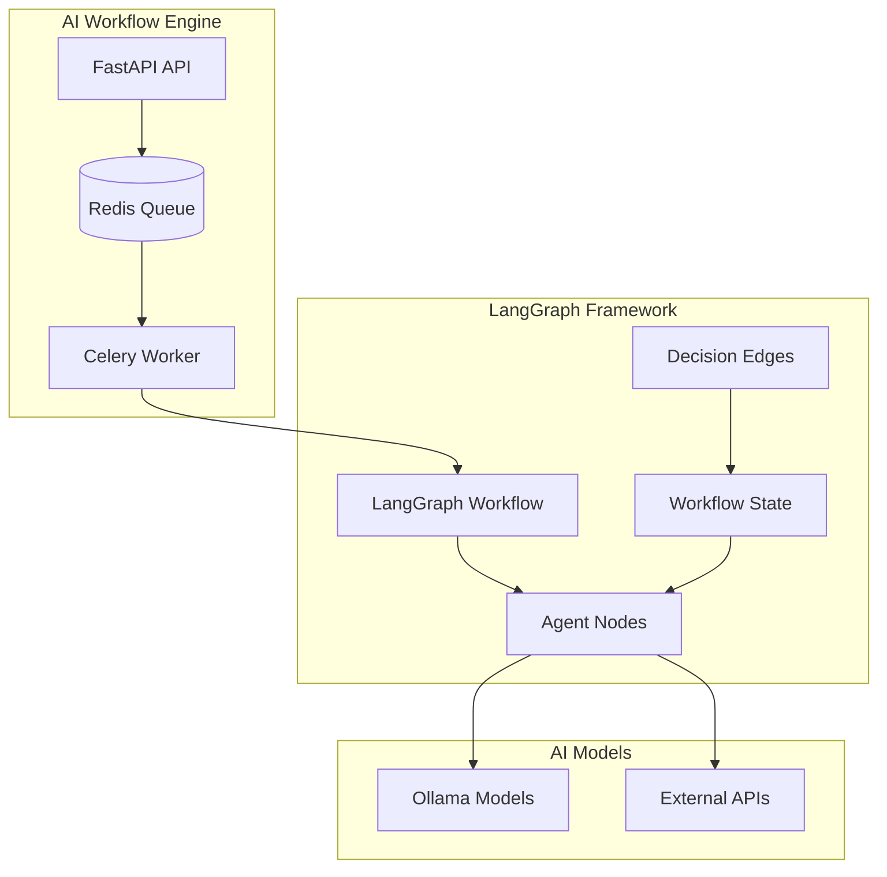

# AI Workflow Engine - Complete Integration Guides

## 🌐 Integration Overview

The AI Workflow Engine provides comprehensive integration capabilities with external services and AI frameworks. This guide covers setup, configuration, and usage of Google Services, LangGraph workflows, and Ollama AI models.

**Supported Integrations**:
- **🔗 Google Services**: OAuth, Calendar, Drive, Gmail, Workspace APIs
- **🧠 LangGraph**: Workflow orchestration and agent collaboration  
- **🤖 Ollama**: Local AI model hosting and inference
- **📊 External APIs**: Custom integrations and webhooks

---

## 🔐 Google Services Integration

### Overview

The AI Workflow Engine integrates with Google's ecosystem through OAuth 2.0 authentication and various Google APIs, providing seamless access to Calendar, Drive, Gmail, and Workspace services.

### Prerequisites

**Google Cloud Setup**:
1. **Google Cloud Project**: Active GCP project with billing enabled
2. **API Credentials**: OAuth 2.0 client credentials configured
3. **API Services**: Required Google APIs enabled
4. **Domain Verification**: For production deployments

### 1. Google Cloud Console Configuration

#### Step 1: Create Google Cloud Project

```bash
# Using gcloud CLI (optional)
gcloud projects create ai-workflow-engine-prod --name="AI Workflow Engine"
gcloud config set project ai-workflow-engine-prod

# Enable billing (required for API access)
gcloud billing projects link ai-workflow-engine-prod --billing-account=BILLING_ACCOUNT_ID
```

#### Step 2: Enable Required APIs

```bash
# Enable Google APIs
gcloud services enable calendar.googleapis.com
gcloud services enable drive.googleapis.com
gcloud services enable gmail.googleapis.com
gcloud services enable oauth2.googleapis.com
gcloud services enable admin.googleapis.com
gcloud services enable people.googleapis.com

# Verify enabled services
gcloud services list --enabled
```

#### Step 3: Create OAuth 2.0 Credentials

**Via Google Cloud Console**:
1. Navigate to **APIs & Services > Credentials**
2. Click **+ CREATE CREDENTIALS > OAuth client ID**
3. Select **Web application**
4. Configure:
   ```
   Name: AI Workflow Engine
   Authorized JavaScript origins:
   - https://yourdomain.com
   - https://localhost (for development)
   
   Authorized redirect URIs:
   - https://yourdomain.com/api/v1/oauth/google/callback
   - https://localhost/api/v1/oauth/google/callback
   ```
5. Save **Client ID** and **Client Secret**

#### Step 4: Configure OAuth Consent Screen

**OAuth Consent Configuration**:
```
Application name: AI Workflow Engine
User support email: support@yourdomain.com
Application home page: https://yourdomain.com
Application privacy policy: https://yourdomain.com/privacy
Application terms of service: https://yourdomain.com/terms

Scopes:
- openid
- email
- profile
- https://www.googleapis.com/auth/calendar
- https://www.googleapis.com/auth/drive.file
- https://www.googleapis.com/auth/gmail.readonly
```

### 2. Environment Configuration

#### Production Configuration

```bash
# .env (production)
# Google OAuth Configuration
GOOGLE_CLIENT_ID=your_google_client_id.apps.googleusercontent.com
GOOGLE_CLIENT_SECRET=your_google_client_secret
GOOGLE_REDIRECT_URI=https://yourdomain.com/api/v1/oauth/google/callback

# Google API Configuration
GOOGLE_API_KEY=your_google_api_key
GOOGLE_APPLICATION_CREDENTIALS=/path/to/service-account-key.json

# OAuth Scopes (space-separated)
GOOGLE_OAUTH_SCOPES="openid email profile https://www.googleapis.com/auth/calendar https://www.googleapis.com/auth/drive.file https://www.googleapis.com/auth/gmail.readonly"
```

#### Development Configuration

```bash
# .env.development
GOOGLE_CLIENT_ID=dev_client_id.apps.googleusercontent.com
GOOGLE_CLIENT_SECRET=dev_client_secret
GOOGLE_REDIRECT_URI=http://localhost:8000/api/v1/oauth/google/callback
GOOGLE_API_KEY=dev_api_key
```

#### Docker Secrets Setup (Production)

```bash
# Create secrets directory
mkdir -p ./secrets/google

# Store credentials securely
echo "your_google_client_id" > ./secrets/google/client_id.txt
echo "your_google_client_secret" > ./secrets/google/client_secret.txt
echo "your_google_api_key" > ./secrets/google/api_key.txt

# Copy service account key
cp /path/to/service-account-key.json ./secrets/google/credentials.json

# Set permissions
chmod 600 ./secrets/google/*.txt ./secrets/google/*.json
```

### 3. Google Services Implementation

#### OAuth Authentication Flow

**Backend Implementation** (`api/routers/oauth_router.py`):
```python
from fastapi import APIRouter, Depends, HTTPException, status
from google.auth.transport.requests import Request
from google.oauth2.credentials import Credentials
from google_auth_oauthlib.flow import Flow
import json

from shared.services.google_oauth_service import GoogleOAuthService
from shared.schemas.oauth_schemas import GoogleOAuthResponse
from api.dependencies import get_current_user

router = APIRouter()

@router.get("/google/authorize")
async def google_oauth_authorize():
    """Initiate Google OAuth flow."""
    oauth_service = GoogleOAuthService()
    
    # Create OAuth flow
    flow = Flow.from_client_config(
        oauth_service.get_client_config(),
        scopes=oauth_service.get_scopes()
    )
    flow.redirect_uri = oauth_service.get_redirect_uri()
    
    # Generate authorization URL
    authorization_url, state = flow.authorization_url(
        access_type='offline',
        include_granted_scopes='true',
        prompt='consent'
    )
    
    return {
        "authorization_url": authorization_url,
        "state": state
    }

@router.post("/google/callback")
async def google_oauth_callback(
    code: str,
    state: str,
    current_user: User = Depends(get_current_user)
):
    """Handle Google OAuth callback and store credentials."""
    oauth_service = GoogleOAuthService()
    
    try:
        # Exchange code for credentials
        credentials = await oauth_service.exchange_code_for_credentials(code, state)
        
        # Store user credentials
        await oauth_service.store_user_credentials(current_user.id, credentials)
        
        # Get user profile information
        profile = await oauth_service.get_user_profile(credentials)
        
        return GoogleOAuthResponse(
            success=True,
            google_id=profile.get('id'),
            email=profile.get('email'),
            name=profile.get('name'),
            connected_scopes=credentials.scopes
        )
        
    except Exception as e:
        raise HTTPException(
            status_code=status.HTTP_400_BAD_REQUEST,
            detail=f"OAuth callback failed: {str(e)}"
        )

@router.get("/status")
async def get_oauth_status(current_user: User = Depends(get_current_user)):
    """Get user's Google OAuth connection status."""
    oauth_service = GoogleOAuthService()
    
    credentials = await oauth_service.get_user_credentials(current_user.id)
    if not credentials:
        return {"google_connected": False}
    
    # Check if credentials are valid and refresh if needed
    if credentials.expired and credentials.refresh_token:
        credentials.refresh(Request())
        await oauth_service.store_user_credentials(current_user.id, credentials)
    
    return {
        "google_connected": True,
        "connected_at": credentials.token_uri,  # Placeholder
        "scopes": credentials.scopes,
        "expires_at": credentials.expiry.isoformat() if credentials.expiry else None
    }
```

#### Google Calendar Integration

**Calendar Service Implementation**:
```python
# shared/services/google_calendar_service.py
from googleapiclient.discovery import build
from google.oauth2.credentials import Credentials
from datetime import datetime, timedelta
from typing import List, Dict, Optional

class GoogleCalendarService:
    def __init__(self, credentials: Credentials):
        self.credentials = credentials
        self.service = build('calendar', 'v3', credentials=credentials)
    
    async def get_calendars(self) -> List[Dict]:
        """Get user's calendar list."""
        try:
            calendars_result = self.service.calendarList().list().execute()
            calendars = calendars_result.get('items', [])
            
            return [
                {
                    'id': cal['id'],
                    'name': cal['summary'],
                    'description': cal.get('description', ''),
                    'primary': cal.get('primary', False),
                    'access_role': cal.get('accessRole', 'reader')
                }
                for cal in calendars
            ]
        except Exception as e:
            raise Exception(f"Failed to fetch calendars: {str(e)}")
    
    async def get_events(
        self, 
        calendar_id: str = 'primary', 
        max_results: int = 10,
        time_min: Optional[datetime] = None,
        time_max: Optional[datetime] = None
    ) -> List[Dict]:
        """Get calendar events."""
        try:
            # Default time range: next 30 days
            if not time_min:
                time_min = datetime.utcnow()
            if not time_max:
                time_max = time_min + timedelta(days=30)
            
            events_result = self.service.events().list(
                calendarId=calendar_id,
                timeMin=time_min.isoformat() + 'Z',
                timeMax=time_max.isoformat() + 'Z',
                maxResults=max_results,
                singleEvents=True,
                orderBy='startTime'
            ).execute()
            
            events = events_result.get('items', [])
            
            return [
                {
                    'id': event['id'],
                    'title': event.get('summary', 'No Title'),
                    'description': event.get('description', ''),
                    'start': event['start'].get('dateTime', event['start'].get('date')),
                    'end': event['end'].get('dateTime', event['end'].get('date')),
                    'location': event.get('location', ''),
                    'attendees': [
                        {'email': attendee['email'], 'status': attendee.get('responseStatus')}
                        for attendee in event.get('attendees', [])
                    ]
                }
                for event in events
            ]
        except Exception as e:
            raise Exception(f"Failed to fetch events: {str(e)}")
    
    async def create_event(self, event_data: Dict) -> Dict:
        """Create a new calendar event."""
        try:
            event = {
                'summary': event_data['title'],
                'description': event_data.get('description', ''),
                'start': {
                    'dateTime': event_data['start_time'],
                    'timeZone': event_data.get('timezone', 'UTC'),
                },
                'end': {
                    'dateTime': event_data['end_time'],
                    'timeZone': event_data.get('timezone', 'UTC'),
                },
            }
            
            if 'location' in event_data:
                event['location'] = event_data['location']
            
            if 'attendees' in event_data:
                event['attendees'] = [
                    {'email': email} for email in event_data['attendees']
                ]
            
            created_event = self.service.events().insert(
                calendarId='primary',
                body=event
            ).execute()
            
            return {
                'id': created_event['id'],
                'html_link': created_event['htmlLink'],
                'created': created_event['created']
            }
        except Exception as e:
            raise Exception(f"Failed to create event: {str(e)}")
```

#### Google Drive Integration

**Drive Service Implementation**:
```python
# shared/services/google_drive_service.py
from googleapiclient.discovery import build
from google.oauth2.credentials import Credentials
from googleapiclient.http import MediaIoBaseDownload, MediaIoBaseUpload
import io
from typing import List, Dict, Optional

class GoogleDriveService:
    def __init__(self, credentials: Credentials):
        self.credentials = credentials
        self.service = build('drive', 'v3', credentials=credentials)
    
    async def list_files(
        self, 
        folder_id: Optional[str] = None,
        max_results: int = 100,
        file_types: Optional[List[str]] = None
    ) -> List[Dict]:
        """List files in Google Drive."""
        try:
            query = "trashed=false"
            
            if folder_id:
                query += f" and '{folder_id}' in parents"
            
            if file_types:
                mime_queries = [f"mimeType='{mime}'" for mime in file_types]
                query += f" and ({' or '.join(mime_queries)})"
            
            results = self.service.files().list(
                q=query,
                pageSize=max_results,
                fields="nextPageToken, files(id, name, mimeType, size, modifiedTime, webViewLink)"
            ).execute()
            
            files = results.get('files', [])
            
            return [
                {
                    'id': file['id'],
                    'name': file['name'],
                    'mime_type': file['mimeType'],
                    'size': int(file.get('size', 0)) if file.get('size') else None,
                    'modified_time': file['modifiedTime'],
                    'web_view_link': file['webViewLink']
                }
                for file in files
            ]
        except Exception as e:
            raise Exception(f"Failed to list files: {str(e)}")
    
    async def upload_file(self, file_name: str, file_content: bytes, mime_type: str) -> Dict:
        """Upload file to Google Drive."""
        try:
            file_metadata = {'name': file_name}
            media = MediaIoBaseUpload(
                io.BytesIO(file_content), 
                mimetype=mime_type,
                resumable=True
            )
            
            file = self.service.files().create(
                body=file_metadata,
                media_body=media,
                fields='id, name, webViewLink'
            ).execute()
            
            return {
                'id': file['id'],
                'name': file['name'],
                'web_view_link': file['webViewLink']
            }
        except Exception as e:
            raise Exception(f"Failed to upload file: {str(e)}")
    
    async def download_file(self, file_id: str) -> bytes:
        """Download file from Google Drive."""
        try:
            request = self.service.files().get_media(fileId=file_id)
            file_io = io.BytesIO()
            
            downloader = MediaIoBaseDownload(file_io, request)
            done = False
            while done is False:
                status, done = downloader.next_chunk()
            
            return file_io.getvalue()
        except Exception as e:
            raise Exception(f"Failed to download file: {str(e)}")
```

#### Frontend Integration

**Svelte Google OAuth Component**:
```svelte
<!-- GoogleOAuth.svelte -->
<script>
  import { onMount } from 'svelte';
  import { authStore } from '$lib/stores/auth.js';
  import ApiClient from '$lib/api_client/index.js';
  
  let loading = false;
  let connected = false;
  let connectionStatus = null;
  let error = null;
  
  onMount(async () => {
    await checkConnectionStatus();
  });
  
  async function checkConnectionStatus() {
    try {
      const apiClient = new ApiClient();
      connectionStatus = await apiClient.get('/oauth/status');
      connected = connectionStatus.google_connected;
    } catch (err) {
      console.error('Failed to check OAuth status:', err);
    }
  }
  
  async function connectGoogle() {
    loading = true;
    error = null;
    
    try {
      const apiClient = new ApiClient();
      const authResponse = await apiClient.get('/oauth/google/authorize');
      
      // Redirect to Google OAuth
      window.location.href = authResponse.authorization_url;
    } catch (err) {
      error = err.message;
      loading = false;
    }
  }
  
  async function disconnectGoogle() {
    if (!confirm('Are you sure you want to disconnect your Google account?')) {
      return;
    }
    
    loading = true;
    
    try {
      const apiClient = new ApiClient();
      await apiClient.delete('/oauth/google/disconnect');
      
      connected = false;
      connectionStatus = null;
    } catch (err) {
      error = err.message;
    } finally {
      loading = false;
    }
  }
</script>

<div class="google-oauth">
  <h3>Google Services</h3>
  
  {#if error}
    <div class="error">Error: {error}</div>
  {/if}
  
  {#if connected}
    <div class="connected">
      <div class="status">✅ Connected to Google</div>
      {#if connectionStatus}
        <div class="details">
          <p>Connected scopes:</p>
          <ul>
            {#each connectionStatus.scopes as scope}
              <li>{scope}</li>
            {/each}
          </ul>
          {#if connectionStatus.expires_at}
            <p>Token expires: {new Date(connectionStatus.expires_at).toLocaleString()}</p>
          {/if}
        </div>
      {/if}
      <button on:click={disconnectGoogle} disabled={loading} class="disconnect">
        {loading ? 'Disconnecting...' : 'Disconnect Google'}
      </button>
    </div>
  {:else}
    <div class="disconnected">
      <p>Connect your Google account to access Calendar, Drive, and Gmail features.</p>
      <button on:click={connectGoogle} disabled={loading} class="connect">
        {loading ? 'Connecting...' : 'Connect Google Account'}
      </button>
    </div>
  {/if}
</div>

<style>
  .google-oauth {
    padding: 1rem;
    border: 1px solid var(--border-color);
    border-radius: 8px;
    margin: 1rem 0;
  }
  
  .connected {
    color: var(--success-color);
  }
  
  .status {
    font-weight: bold;
    margin-bottom: 0.5rem;
  }
  
  .details {
    margin: 1rem 0;
    padding: 0.5rem;
    background: var(--background-light);
    border-radius: 4px;
  }
  
  .details ul {
    margin: 0.5rem 0;
    padding-left: 1rem;
  }
  
  button {
    padding: 0.5rem 1rem;
    border: none;
    border-radius: 4px;
    cursor: pointer;
    font-weight: bold;
  }
  
  .connect {
    background: var(--primary-color);
    color: white;
  }
  
  .disconnect {
    background: var(--danger-color);
    color: white;
  }
  
  button:disabled {
    opacity: 0.6;
    cursor: not-allowed;
  }
  
  .error {
    color: var(--error-color);
    background: var(--error-background);
    padding: 0.5rem;
    border-radius: 4px;
    margin-bottom: 1rem;
  }
</style>
```

---

## 🧠 LangGraph Integration

### Overview

LangGraph provides sophisticated workflow orchestration for AI agents, enabling complex multi-step reasoning, tool usage, and collaborative problem-solving. The AI Workflow Engine integrates LangGraph for advanced AI capabilities.

### LangGraph Architecture in AI Workflow Engine

**System Integration**:


### 1. LangGraph Setup and Configuration

#### Installation and Dependencies

**Python Dependencies** (`requirements.txt`):
```txt
# LangGraph and related
langgraph>=0.0.40
langchain>=0.1.0
langchain-community>=0.0.20
langchain-core>=0.1.0

# Additional dependencies for LangGraph
pydantic>=2.0.0
typing-extensions>=4.5.0
```

#### LangGraph Service Configuration

```python
# shared/services/langgraph_service.py
from langgraph.graph import StateGraph, END
from langgraph.prebuilt import ToolExecutor
from langchain.schema import BaseMessage
from langchain_community.llms import Ollama
from typing import List, Dict, Any, Optional
import json

from shared.schemas.langgraph_schemas import WorkflowState, AgentMessage
from shared.services.ollama_service import OllamaService

class LangGraphService:
    def __init__(self):
        self.ollama_service = OllamaService()
        self.workflows: Dict[str, StateGraph] = {}
        self.initialize_workflows()
    
    def initialize_workflows(self):
        """Initialize available LangGraph workflows."""
        # Expert Group Chat Workflow
        self.workflows['expert_group'] = self.create_expert_group_workflow()
        
        # Document Analysis Workflow  
        self.workflows['document_analysis'] = self.create_document_analysis_workflow()
        
        # Research Workflow
        self.workflows['research'] = self.create_research_workflow()
    
    def create_expert_group_workflow(self) -> StateGraph:
        """Create expert group collaboration workflow."""
        
        def project_manager_node(state: WorkflowState) -> WorkflowState:
            """Project manager coordinates the discussion."""
            pm_llm = self.ollama_service.get_llm_instance('llama2')
            
            # Analyze current state and decide next steps
            context = f"""
            Current discussion: {state.get('current_topic', 'Initial planning')}
            Messages so far: {len(state.get('messages', []))}
            Available experts: {', '.join(state.get('available_experts', []))}
            
            As project manager, decide what should happen next in this expert discussion.
            """
            
            response = pm_llm.invoke(context)
            
            state['messages'].append(AgentMessage(
                role='project_manager',
                content=response,
                timestamp=datetime.now(),
                metadata={'decision_point': True}
            ))
            
            # Decide next expert to involve
            state['next_expert'] = self.select_next_expert(state)
            
            return state
        
        def expert_node(expert_type: str):
            """Generic expert node factory."""
            def expert_response(state: WorkflowState) -> WorkflowState:
                expert_llm = self.ollama_service.get_llm_instance('llama2')
                
                # Get expert's specialized prompt
                expert_prompt = self.get_expert_prompt(expert_type)
                
                context = f"""
                {expert_prompt}
                
                Discussion topic: {state.get('current_topic')}
                Previous messages: {self.format_messages(state.get('messages', [])[-3:])}
                
                Provide your expert analysis and recommendations.
                """
                
                response = expert_llm.invoke(context)
                
                state['messages'].append(AgentMessage(
                    role=expert_type,
                    content=response,
                    timestamp=datetime.now(),
                    metadata={'expert_domain': expert_type}
                ))
                
                return state
            
            return expert_response
        
        def should_continue(state: WorkflowState) -> str:
            """Determine if workflow should continue."""
            messages = state.get('messages', [])
            max_rounds = state.get('max_rounds', 10)
            
            if len(messages) >= max_rounds:
                return "end"
            
            last_message = messages[-1] if messages else None
            if last_message and 'conclusion' in last_message.content.lower():
                return "end"
            
            return "continue"
        
        # Build the workflow graph
        workflow = StateGraph(WorkflowState)
        
        # Add nodes
        workflow.add_node("project_manager", project_manager_node)
        workflow.add_node("backend_expert", expert_node("backend_expert"))
        workflow.add_node("frontend_expert", expert_node("frontend_expert"))
        workflow.add_node("security_expert", expert_node("security_expert"))
        workflow.add_node("data_expert", expert_node("data_expert"))
        
        # Add edges
        workflow.set_entry_point("project_manager")
        workflow.add_conditional_edges(
            "project_manager",
            should_continue,
            {
                "continue": "backend_expert",
                "end": END
            }
        )
        
        # Connect experts in a cycle back to project manager
        for expert in ["backend_expert", "frontend_expert", "security_expert", "data_expert"]:
            workflow.add_edge(expert, "project_manager")
        
        return workflow.compile()
    
    def create_document_analysis_workflow(self) -> StateGraph:
        """Create document analysis workflow."""
        
        def extract_content_node(state: WorkflowState) -> WorkflowState:
            """Extract and preprocess document content."""
            document_path = state.get('document_path')
            
            # Extract content based on file type
            content = self.extract_document_content(document_path)
            
            state['document_content'] = content
            state['processing_stage'] = 'content_extracted'
            
            return state
        
        def analyze_content_node(state: WorkflowState) -> WorkflowState:
            """Analyze document content using LLM."""
            content = state.get('document_content')
            analysis_type = state.get('analysis_type', 'general')
            
            analyst_llm = self.ollama_service.get_llm_instance('llama2')
            
            prompt = f"""
            Analyze the following document content:
            
            {content[:2000]}...
            
            Analysis type: {analysis_type}
            
            Provide:
            1. Key themes and topics
            2. Important insights
            3. Action items or recommendations
            4. Summary of main points
            """
            
            analysis = analyst_llm.invoke(prompt)
            
            state['analysis_result'] = analysis
            state['processing_stage'] = 'analysis_complete'
            
            return state
        
        def generate_summary_node(state: WorkflowState) -> WorkflowState:
            """Generate final summary and recommendations."""
            analysis = state.get('analysis_result')
            
            summary_llm = self.ollama_service.get_llm_instance('llama2')
            
            prompt = f"""
            Based on the following analysis, create a concise executive summary:
            
            {analysis}
            
            Include:
            - Key findings (3-5 bullet points)
            - Recommendations (3-5 actions)
            - Priority level (High/Medium/Low)
            """
            
            summary = summary_llm.invoke(prompt)
            
            state['final_summary'] = summary
            state['processing_stage'] = 'complete'
            
            return state
        
        # Build workflow
        workflow = StateGraph(WorkflowState)
        
        workflow.add_node("extract_content", extract_content_node)
        workflow.add_node("analyze_content", analyze_content_node)
        workflow.add_node("generate_summary", generate_summary_node)
        
        workflow.set_entry_point("extract_content")
        workflow.add_edge("extract_content", "analyze_content")
        workflow.add_edge("analyze_content", "generate_summary")
        workflow.add_edge("generate_summary", END)
        
        return workflow.compile()
    
    async def execute_workflow(
        self, 
        workflow_name: str, 
        initial_state: Dict[str, Any],
        user_id: str
    ) -> Dict[str, Any]:
        """Execute a LangGraph workflow."""
        if workflow_name not in self.workflows:
            raise ValueError(f"Unknown workflow: {workflow_name}")
        
        workflow = self.workflows[workflow_name]
        
        # Add metadata to state
        initial_state.update({
            'workflow_id': f"{workflow_name}_{user_id}_{datetime.now().isoformat()}",
            'user_id': user_id,
            'started_at': datetime.now(),
            'messages': initial_state.get('messages', [])
        })
        
        try:
            # Execute workflow
            final_state = await workflow.ainvoke(initial_state)
            
            # Log workflow completion
            await self.log_workflow_execution(workflow_name, initial_state, final_state)
            
            return {
                'success': True,
                'workflow_id': final_state.get('workflow_id'),
                'result': final_state,
                'execution_time': (datetime.now() - initial_state['started_at']).total_seconds()
            }
        
        except Exception as e:
            return {
                'success': False,
                'error': str(e),
                'workflow_id': initial_state.get('workflow_id')
            }
    
    def get_expert_prompt(self, expert_type: str) -> str:
        """Get specialized prompt for expert type."""
        prompts = {
            'backend_expert': """
            You are a senior backend developer and architect with expertise in:
            - API design and microservices architecture
            - Database design and optimization
            - Performance and scalability
            - Security best practices
            - System integration patterns
            """,
            'frontend_expert': """
            You are a senior frontend developer with expertise in:
            - User experience and interface design
            - Modern JavaScript frameworks (React, Vue, Svelte)
            - Performance optimization
            - Accessibility and responsive design
            - Browser compatibility
            """,
            'security_expert': """
            You are a cybersecurity expert with expertise in:
            - Application security and OWASP guidelines
            - Authentication and authorization patterns
            - Data protection and privacy compliance
            - Threat modeling and risk assessment
            - Security testing and vulnerability assessment
            """,
            'data_expert': """
            You are a data engineer and analyst with expertise in:
            - Database design and optimization
            - Data modeling and warehousing
            - ETL processes and data pipelines
            - Analytics and reporting
            - Data governance and quality
            """
        }
        return prompts.get(expert_type, "You are a general expert.")
    
    def select_next_expert(self, state: WorkflowState) -> str:
        """Select the next expert based on current discussion."""
        current_topic = state.get('current_topic', '').lower()
        messages = state.get('messages', [])
        
        # Simple selection logic (can be enhanced)
        if 'security' in current_topic or 'auth' in current_topic:
            return 'security_expert'
        elif 'database' in current_topic or 'data' in current_topic:
            return 'data_expert'
        elif 'ui' in current_topic or 'frontend' in current_topic:
            return 'frontend_expert'
        else:
            return 'backend_expert'
```

### 2. LangGraph Workflow Implementation

#### Expert Group Chat System

**Celery Task for Expert Group Chat**:
```python
# app/worker/tasks/langgraph_tasks.py
from celery import current_app
from shared.services.langgraph_service import LangGraphService
from shared.schemas.langgraph_schemas import WorkflowState
import logging

logger = logging.getLogger(__name__)

@current_app.task(bind=True, max_retries=3)
def execute_expert_group_chat(self, topic: str, user_id: str, experts: List[str] = None):
    """Execute expert group chat workflow."""
    try:
        langgraph_service = LangGraphService()
        
        # Initialize workflow state
        initial_state = {
            'current_topic': topic,
            'available_experts': experts or ['backend_expert', 'frontend_expert', 'security_expert'],
            'max_rounds': 8,
            'messages': [],
            'user_preferences': {}
        }
        
        # Execute workflow
        result = await langgraph_service.execute_workflow(
            'expert_group',
            initial_state,
            user_id
        )
        
        if result['success']:
            logger.info(f"Expert group chat completed for user {user_id}")
            return {
                'status': 'completed',
                'workflow_id': result['workflow_id'],
                'messages': result['result']['messages'],
                'execution_time': result['execution_time']
            }
        else:
            logger.error(f"Expert group chat failed: {result['error']}")
            raise Exception(result['error'])
    
    except Exception as exc:
        logger.error(f"Expert group chat error: {exc}")
        retry_delay = 60 * (2 ** self.request.retries)
        raise self.retry(exc=exc, countdown=retry_delay)

@current_app.task(bind=True)
def analyze_document_with_langgraph(self, document_id: str, user_id: str, analysis_type: str = 'general'):
    """Analyze document using LangGraph workflow."""
    try:
        langgraph_service = LangGraphService()
        
        # Get document path
        document_path = f"/app/documents/{document_id}_processed.txt"
        
        initial_state = {
            'document_path': document_path,
            'document_id': document_id,
            'analysis_type': analysis_type,
            'user_id': user_id
        }
        
        # Execute document analysis workflow
        result = await langgraph_service.execute_workflow(
            'document_analysis',
            initial_state,
            user_id
        )
        
        if result['success']:
            return {
                'status': 'completed',
                'analysis': result['result']['final_summary'],
                'detailed_analysis': result['result']['analysis_result'],
                'workflow_id': result['workflow_id']
            }
        else:
            raise Exception(result['error'])
    
    except Exception as exc:
        logger.error(f"Document analysis error: {exc}")
        raise
```

#### API Endpoints for LangGraph

**FastAPI Router for LangGraph** (`api/routers/langgraph_router.py`):
```python
from fastapi import APIRouter, Depends, HTTPException, status, BackgroundTasks
from sqlalchemy.orm import Session
from typing import List, Optional

from shared.schemas.langgraph_schemas import (
    ExpertGroupRequest, ExpertGroupResponse,
    DocumentAnalysisRequest, DocumentAnalysisResponse,
    WorkflowStatus
)
from shared.database.models import User
from api.dependencies import get_current_user, get_db
from worker.tasks.langgraph_tasks import execute_expert_group_chat, analyze_document_with_langgraph

router = APIRouter()

@router.post("/expert-group/start", response_model=ExpertGroupResponse)
async def start_expert_group_chat(
    request: ExpertGroupRequest,
    background_tasks: BackgroundTasks,
    current_user: User = Depends(get_current_user)
):
    """Start an expert group chat session."""
    try:
        # Queue the expert group chat task
        task = execute_expert_group_chat.delay(
            topic=request.topic,
            user_id=str(current_user.id),
            experts=request.experts
        )
        
        return ExpertGroupResponse(
            task_id=task.id,
            status="started",
            topic=request.topic,
            experts=request.experts,
            message="Expert group chat started successfully"
        )
    
    except Exception as e:
        raise HTTPException(
            status_code=status.HTTP_500_INTERNAL_SERVER_ERROR,
            detail=f"Failed to start expert group chat: {str(e)}"
        )

@router.get("/workflow/{task_id}/status", response_model=WorkflowStatus)
async def get_workflow_status(
    task_id: str,
    current_user: User = Depends(get_current_user)
):
    """Get status of a running workflow."""
    from worker.celery_app import app
    
    task_result = app.AsyncResult(task_id)
    
    if task_result.state == 'PENDING':
        return WorkflowStatus(
            task_id=task_id,
            status="running",
            progress=0,
            message="Workflow is starting..."
        )
    elif task_result.state == 'SUCCESS':
        result = task_result.result
        return WorkflowStatus(
            task_id=task_id,
            status="completed",
            progress=100,
            result=result,
            message="Workflow completed successfully"
        )
    elif task_result.state == 'FAILURE':
        return WorkflowStatus(
            task_id=task_id,
            status="failed",
            progress=0,
            error=str(task_result.result),
            message="Workflow failed"
        )
    else:
        return WorkflowStatus(
            task_id=task_id,
            status="running",
            progress=50,
            message=f"Workflow in progress: {task_result.state}"
        )

@router.post("/document/analyze", response_model=DocumentAnalysisResponse)
async def analyze_document(
    request: DocumentAnalysisRequest,
    background_tasks: BackgroundTasks,
    current_user: User = Depends(get_current_user)
):
    """Analyze a document using LangGraph workflow."""
    try:
        # Queue the document analysis task
        task = analyze_document_with_langgraph.delay(
            document_id=request.document_id,
            user_id=str(current_user.id),
            analysis_type=request.analysis_type
        )
        
        return DocumentAnalysisResponse(
            task_id=task.id,
            status="started",
            document_id=request.document_id,
            analysis_type=request.analysis_type,
            message="Document analysis started"
        )
    
    except Exception as e:
        raise HTTPException(
            status_code=status.HTTP_500_INTERNAL_SERVER_ERROR,
            detail=f"Failed to start document analysis: {str(e)}"
        )
```

### 3. Frontend LangGraph Integration

**Svelte Expert Group Chat Component**:
```svelte
<!-- ExpertGroupChat.svelte -->
<script>
  import { onMount, onDestroy } from 'svelte';
  import { writable } from 'svelte/store';
  import ApiClient from '$lib/api_client/index.js';
  
  export let initialTopic = '';
  
  let topic = initialTopic;
  let experts = ['backend_expert', 'frontend_expert', 'security_expert'];
  let chatMessages = [];
  let isRunning = false;
  let currentTaskId = null;
  let progress = 0;
  let statusMessage = '';
  let pollingInterval;
  
  const apiClient = new ApiClient();
  
  async function startExpertChat() {
    if (!topic.trim()) {
      alert('Please enter a discussion topic');
      return;
    }
    
    isRunning = true;
    chatMessages = [];
    progress = 0;
    
    try {
      const response = await apiClient.post('/langgraph/expert-group/start', {
        topic: topic.trim(),
        experts: experts
      });
      
      currentTaskId = response.task_id;
      statusMessage = 'Expert group chat started...';
      
      // Start polling for updates
      startPolling();
    } catch (error) {
      console.error('Failed to start expert chat:', error);
      isRunning = false;
      statusMessage = `Error: ${error.message}`;
    }
  }
  
  function startPolling() {
    pollingInterval = setInterval(async () => {
      if (!currentTaskId) return;
      
      try {
        const status = await apiClient.get(`/langgraph/workflow/${currentTaskId}/status`);
        
        progress = status.progress;
        statusMessage = status.message;
        
        if (status.status === 'completed') {
          isRunning = false;
          chatMessages = status.result.messages || [];
          clearInterval(pollingInterval);
        } else if (status.status === 'failed') {
          isRunning = false;
          statusMessage = `Error: ${status.error}`;
          clearInterval(pollingInterval);
        }
      } catch (error) {
        console.error('Failed to get status:', error);
      }
    }, 2000);
  }
  
  function stopChat() {
    isRunning = false;
    if (pollingInterval) {
      clearInterval(pollingInterval);
    }
    currentTaskId = null;
  }
  
  onDestroy(() => {
    if (pollingInterval) {
      clearInterval(pollingInterval);
    }
  });
</script>

<div class="expert-group-chat">
  <div class="chat-setup">
    <h2>Expert Group Chat</h2>
    
    <div class="topic-input">
      <label for="topic">Discussion Topic:</label>
      <input
        id="topic"
        bind:value={topic}
        placeholder="Enter the topic you want experts to discuss..."
        disabled={isRunning}
      />
    </div>
    
    <div class="experts-selection">
      <label>Select Experts:</label>
      <div class="expert-checkboxes">
        <label>
          <input type="checkbox" bind:group={experts} value="backend_expert" disabled={isRunning} />
          Backend Expert
        </label>
        <label>
          <input type="checkbox" bind:group={experts} value="frontend_expert" disabled={isRunning} />
          Frontend Expert
        </label>
        <label>
          <input type="checkbox" bind:group={experts} value="security_expert" disabled={isRunning} />
          Security Expert
        </label>
        <label>
          <input type="checkbox" bind:group={experts} value="data_expert" disabled={isRunning} />
          Data Expert
        </label>
      </div>
    </div>
    
    <div class="chat-controls">
      {#if !isRunning}
        <button on:click={startExpertChat} class="start-button">
          Start Expert Discussion
        </button>
      {:else}
        <button on:click={stopChat} class="stop-button">
          Stop Discussion
        </button>
      {/if}
    </div>
  </div>
  
  {#if isRunning || chatMessages.length > 0}
    <div class="chat-area">
      <div class="status-bar">
        <div class="progress-bar">
          <div class="progress" style="width: {progress}%"></div>
        </div>
        <div class="status-message">{statusMessage}</div>
      </div>
      
      <div class="messages-container">
        {#each chatMessages as message}
          <div class="message {message.role}">
            <div class="role">{message.role.replace('_', ' ').toUpperCase()}</div>
            <div class="content">{message.content}</div>
            <div class="timestamp">
              {new Date(message.timestamp).toLocaleTimeString()}
            </div>
          </div>
        {/each}
        
        {#if isRunning && chatMessages.length === 0}
          <div class="thinking">
            <div class="spinner"></div>
            <p>Experts are analyzing and discussing...</p>
          </div>
        {/if}
      </div>
    </div>
  {/if}
</div>

<style>
  .expert-group-chat {
    max-width: 900px;
    margin: 0 auto;
    padding: 1rem;
  }
  
  .chat-setup {
    background: white;
    padding: 1.5rem;
    border-radius: 8px;
    box-shadow: 0 2px 4px rgba(0, 0, 0, 0.1);
    margin-bottom: 1rem;
  }
  
  .topic-input {
    margin-bottom: 1rem;
  }
  
  .topic-input label {
    display: block;
    font-weight: bold;
    margin-bottom: 0.5rem;
  }
  
  .topic-input input {
    width: 100%;
    padding: 0.75rem;
    border: 1px solid #ddd;
    border-radius: 4px;
    font-size: 1rem;
  }
  
  .experts-selection {
    margin-bottom: 1.5rem;
  }
  
  .experts-selection > label {
    display: block;
    font-weight: bold;
    margin-bottom: 0.5rem;
  }
  
  .expert-checkboxes {
    display: grid;
    grid-template-columns: repeat(auto-fit, minmax(150px, 1fr));
    gap: 0.5rem;
  }
  
  .expert-checkboxes label {
    display: flex;
    align-items: center;
    gap: 0.5rem;
    font-weight: normal;
  }
  
  .chat-controls button {
    padding: 0.75rem 1.5rem;
    border: none;
    border-radius: 4px;
    font-weight: bold;
    cursor: pointer;
    transition: background-color 0.2s;
  }
  
  .start-button {
    background: #007bff;
    color: white;
  }
  
  .start-button:hover {
    background: #0056b3;
  }
  
  .stop-button {
    background: #dc3545;
    color: white;
  }
  
  .stop-button:hover {
    background: #c82333;
  }
  
  .chat-area {
    background: white;
    border-radius: 8px;
    box-shadow: 0 2px 4px rgba(0, 0, 0, 0.1);
    overflow: hidden;
  }
  
  .status-bar {
    background: #f8f9fa;
    padding: 1rem;
    border-bottom: 1px solid #dee2e6;
  }
  
  .progress-bar {
    width: 100%;
    height: 8px;
    background: #e9ecef;
    border-radius: 4px;
    overflow: hidden;
    margin-bottom: 0.5rem;
  }
  
  .progress {
    height: 100%;
    background: #28a745;
    transition: width 0.3s ease;
  }
  
  .status-message {
    font-size: 0.9rem;
    color: #6c757d;
  }
  
  .messages-container {
    max-height: 600px;
    overflow-y: auto;
    padding: 1rem;
  }
  
  .message {
    margin-bottom: 1.5rem;
    padding: 1rem;
    border-radius: 8px;
    border-left: 4px solid #007bff;
  }
  
  .message.project_manager {
    border-left-color: #6f42c1;
    background: #f8f7ff;
  }
  
  .message.backend_expert {
    border-left-color: #28a745;
    background: #f1f8e9;
  }
  
  .message.frontend_expert {
    border-left-color: #17a2b8;
    background: #e1f7fa;
  }
  
  .message.security_expert {
    border-left-color: #dc3545;
    background: #fdf2f2;
  }
  
  .message.data_expert {
    border-left-color: #ffc107;
    background: #fffbf0;
  }
  
  .role {
    font-weight: bold;
    font-size: 0.9rem;
    margin-bottom: 0.5rem;
    text-transform: capitalize;
  }
  
  .content {
    line-height: 1.6;
    margin-bottom: 0.5rem;
  }
  
  .timestamp {
    font-size: 0.8rem;
    color: #6c757d;
    text-align: right;
  }
  
  .thinking {
    text-align: center;
    padding: 2rem;
    color: #6c757d;
  }
  
  .spinner {
    width: 40px;
    height: 40px;
    border: 4px solid #f3f3f3;
    border-top: 4px solid #007bff;
    border-radius: 50%;
    animation: spin 1s linear infinite;
    margin: 0 auto 1rem;
  }
  
  @keyframes spin {
    0% { transform: rotate(0deg); }
    100% { transform: rotate(360deg); }
  }
</style>
```

---

## 🤖 Ollama Integration

### Overview

Ollama provides local AI model hosting and inference capabilities, enabling the AI Workflow Engine to run powerful language models without relying on external APIs. This integration ensures privacy, reduces latency, and provides offline capabilities.

### Ollama Setup and Configuration

#### 1. Ollama Installation

**Local Development Setup**:
```bash
# Install Ollama (Linux/macOS)
curl -fsSL https://ollama.ai/install.sh | sh

# Or using Docker
docker run -d \
  --name ollama \
  -p 11434:11434 \
  -v ollama_data:/root/.ollama \
  ollama/ollama

# Start Ollama service
ollama serve
```

**Production Docker Setup**:
```yaml
# docker-compose.yml (Ollama service)
version: '3.8'
services:
  ollama:
    image: ollama/ollama:latest
    container_name: ollama_container
    ports:
      - "11434:11434"
    volumes:
      - ollama_data:/root/.ollama
      - ./config/ollama:/etc/ollama
    environment:
      - OLLAMA_HOST=0.0.0.0:11434
      - OLLAMA_KEEP_ALIVE=24h
    restart: unless-stopped
    deploy:
      resources:
        limits:
          memory: 8G
        reservations:
          memory: 4G
    # GPU support (if available)
    runtime: nvidia
    environment:
      - NVIDIA_VISIBLE_DEVICES=all

volumes:
  ollama_data:
```

#### 2. Model Management

**Download and Configure Models**:
```bash
# Download popular models
ollama pull llama2:7b       # General purpose model
ollama pull llama2:13b      # Higher quality model
ollama pull codellama:7b    # Code-focused model
ollama pull mistral:7b      # Fast and efficient model
ollama pull embedding:latest # Embedding model

# List downloaded models
ollama list

# Test model
ollama run llama2:7b "Hello, how are you?"
```

**Model Configuration** (`config/ollama/models.json`):
```json
{
  "models": {
    "default": {
      "name": "llama2:7b",
      "context_size": 4096,
      "temperature": 0.7,
      "top_p": 0.9,
      "repeat_penalty": 1.1
    },
    "code": {
      "name": "codellama:7b",
      "context_size": 4096,
      "temperature": 0.1,
      "top_p": 0.95,
      "repeat_penalty": 1.05
    },
    "creative": {
      "name": "llama2:13b",
      "context_size": 4096,
      "temperature": 0.9,
      "top_p": 0.95,
      "repeat_penalty": 1.1
    },
    "embedding": {
      "name": "embedding:latest",
      "context_size": 2048
    }
  },
  "endpoints": {
    "generate": "/api/generate",
    "chat": "/api/chat",
    "embeddings": "/api/embeddings"
  }
}
```

### 3. Ollama Service Implementation

**Ollama Service Class**:
```python
# shared/services/ollama_service.py
import requests
import json
import asyncio
import aiohttp
from typing import List, Dict, Any, Optional, AsyncGenerator
from pydantic import BaseModel
import logging

logger = logging.getLogger(__name__)

class OllamaMessage(BaseModel):
    role: str
    content: str

class OllamaResponse(BaseModel):
    message: OllamaMessage
    done: bool
    total_duration: Optional[int] = None
    load_duration: Optional[int] = None
    prompt_eval_count: Optional[int] = None
    eval_count: Optional[int] = None

class OllamaService:
    def __init__(self, base_url: str = "http://localhost:11434"):
        self.base_url = base_url.rstrip('/')
        self.models = self.load_model_config()
        self.session = None
    
    async def __aenter__(self):
        self.session = aiohttp.ClientSession()
        return self
    
    async def __aexit__(self, exc_type, exc_val, exc_tb):
        if self.session:
            await self.session.close()
    
    def load_model_config(self) -> Dict[str, Any]:
        """Load model configuration from file."""
        try:
            with open('/config/ollama/models.json', 'r') as f:
                return json.load(f)
        except FileNotFoundError:
            logger.warning("Ollama config not found, using defaults")
            return {
                "models": {
                    "default": {"name": "llama2:7b", "context_size": 4096, "temperature": 0.7}
                }
            }
    
    async def list_models(self) -> List[Dict[str, Any]]:
        """Get list of available models."""
        try:
            async with aiohttp.ClientSession() as session:
                async with session.get(f"{self.base_url}/api/tags") as response:
                    if response.status == 200:
                        data = await response.json()
                        return data.get('models', [])
                    else:
                        raise Exception(f"Failed to list models: {response.status}")
        except Exception as e:
            logger.error(f"Error listing models: {e}")
            return []
    
    async def generate_completion(
        self,
        prompt: str,
        model: str = "default",
        stream: bool = False,
        **kwargs
    ) -> Dict[str, Any]:
        """Generate completion using Ollama model."""
        model_config = self.models['models'].get(model, self.models['models']['default'])
        model_name = model_config['name']
        
        payload = {
            "model": model_name,
            "prompt": prompt,
            "stream": stream,
            **{k: v for k, v in model_config.items() if k != 'name'},
            **kwargs
        }
        
        try:
            async with aiohttp.ClientSession() as session:
                async with session.post(
                    f"{self.base_url}/api/generate",
                    json=payload,
                    timeout=aiohttp.ClientTimeout(total=300)  # 5 minute timeout
                ) as response:
                    if response.status == 200:
                        if stream:
                            return self._handle_streaming_response(response)
                        else:
                            data = await response.json()
                            return {
                                'response': data.get('response', ''),
                                'model': model_name,
                                'done': data.get('done', True),
                                'context': data.get('context', []),
                                'total_duration': data.get('total_duration'),
                                'load_duration': data.get('load_duration')
                            }
                    else:
                        error_text = await response.text()
                        raise Exception(f"Ollama API error {response.status}: {error_text}")
        
        except asyncio.TimeoutError:
            raise Exception("Ollama request timed out")
        except Exception as e:
            logger.error(f"Ollama generation error: {e}")
            raise Exception(f"Failed to generate completion: {str(e)}")
    
    async def chat_completion(
        self,
        messages: List[Dict[str, str]],
        model: str = "default",
        stream: bool = False,
        **kwargs
    ) -> Dict[str, Any]:
        """Generate chat completion using Ollama model."""
        model_config = self.models['models'].get(model, self.models['models']['default'])
        model_name = model_config['name']
        
        payload = {
            "model": model_name,
            "messages": messages,
            "stream": stream,
            **{k: v for k, v in model_config.items() if k != 'name'},
            **kwargs
        }
        
        try:
            async with aiohttp.ClientSession() as session:
                async with session.post(
                    f"{self.base_url}/api/chat",
                    json=payload,
                    timeout=aiohttp.ClientTimeout(total=300)
                ) as response:
                    if response.status == 200:
                        if stream:
                            return self._handle_streaming_response(response)
                        else:
                            data = await response.json()
                            return {
                                'message': data.get('message', {}),
                                'model': model_name,
                                'done': data.get('done', True),
                                'total_duration': data.get('total_duration'),
                                'load_duration': data.get('load_duration')
                            }
                    else:
                        error_text = await response.text()
                        raise Exception(f"Ollama chat API error {response.status}: {error_text}")
        
        except Exception as e:
            logger.error(f"Ollama chat error: {e}")
            raise Exception(f"Failed to generate chat completion: {str(e)}")
    
    async def generate_embeddings(
        self,
        text: str,
        model: str = "embedding"
    ) -> List[float]:
        """Generate embeddings for text."""
        model_config = self.models['models'].get(model, {"name": "embedding:latest"})
        model_name = model_config['name']
        
        payload = {
            "model": model_name,
            "prompt": text
        }
        
        try:
            async with aiohttp.ClientSession() as session:
                async with session.post(
                    f"{self.base_url}/api/embeddings",
                    json=payload,
                    timeout=aiohttp.ClientTimeout(total=120)
                ) as response:
                    if response.status == 200:
                        data = await response.json()
                        return data.get('embedding', [])
                    else:
                        error_text = await response.text()
                        raise Exception(f"Ollama embeddings API error {response.status}: {error_text}")
        
        except Exception as e:
            logger.error(f"Ollama embeddings error: {e}")
            raise Exception(f"Failed to generate embeddings: {str(e)}")
    
    async def _handle_streaming_response(self, response) -> AsyncGenerator[Dict[str, Any], None]:
        """Handle streaming response from Ollama."""
        async for line in response.content:
            if line:
                try:
                    data = json.loads(line.decode('utf-8'))
                    yield data
                except json.JSONDecodeError:
                    continue
    
    async def health_check(self) -> Dict[str, Any]:
        """Check if Ollama service is healthy."""
        try:
            async with aiohttp.ClientSession() as session:
                async with session.get(
                    f"{self.base_url}/api/tags",
                    timeout=aiohttp.ClientTimeout(total=10)
                ) as response:
                    if response.status == 200:
                        data = await response.json()
                        models = data.get('models', [])
                        return {
                            'status': 'healthy',
                            'available_models': len(models),
                            'models': [m['name'] for m in models]
                        }
                    else:
                        return {'status': 'unhealthy', 'error': f'HTTP {response.status}'}
        except Exception as e:
            return {'status': 'unhealthy', 'error': str(e)}
    
    def get_llm_instance(self, model: str = "default"):
        """Get LangChain-compatible LLM instance."""
        from langchain_community.llms import Ollama
        
        model_config = self.models['models'].get(model, self.models['models']['default'])
        
        return Ollama(
            base_url=self.base_url,
            model=model_config['name'],
            temperature=model_config.get('temperature', 0.7),
            top_p=model_config.get('top_p', 0.9),
            repeat_penalty=model_config.get('repeat_penalty', 1.1)
        )
```

### 4. API Integration

**Ollama Router Implementation**:
```python
# api/routers/ollama_router.py
from fastapi import APIRouter, Depends, HTTPException, status
from fastapi.responses import StreamingResponse
from sqlalchemy.orm import Session
from typing import List, Dict, Any, Optional
import json

from shared.services.ollama_service import OllamaService
from shared.schemas.ollama_schemas import (
    OllamaGenerateRequest, OllamaGenerateResponse,
    OllamaChatRequest, OllamaChatResponse,
    OllamaEmbeddingRequest, OllamaEmbeddingResponse,
    OllamaModelInfo
)
from shared.database.models import User
from api.dependencies import get_current_user

router = APIRouter()

@router.get("/models", response_model=List[OllamaModelInfo])
async def list_available_models(current_user: User = Depends(get_current_user)):
    """Get list of available Ollama models."""
    ollama_service = OllamaService()
    
    try:
        models = await ollama_service.list_models()
        return [
            OllamaModelInfo(
                name=model['name'],
                size=model.get('size', 0),
                modified_at=model.get('modified_at'),
                details=model.get('details', {})
            )
            for model in models
        ]
    except Exception as e:
        raise HTTPException(
            status_code=status.HTTP_500_INTERNAL_SERVER_ERROR,
            detail=f"Failed to list models: {str(e)}"
        )

@router.post("/generate", response_model=OllamaGenerateResponse)
async def generate_completion(
    request: OllamaGenerateRequest,
    current_user: User = Depends(get_current_user)
):
    """Generate text completion using Ollama."""
    ollama_service = OllamaService()
    
    try:
        if request.stream:
            # For streaming responses
            async def generate_stream():
                async for chunk in ollama_service.generate_completion(
                    prompt=request.prompt,
                    model=request.model,
                    stream=True,
                    temperature=request.temperature,
                    top_p=request.top_p,
                    max_tokens=request.max_tokens
                ):
                    yield f"data: {json.dumps(chunk)}\n\n"
                yield "data: [DONE]\n\n"
            
            return StreamingResponse(
                generate_stream(),
                media_type="text/stream",
                headers={"Cache-Control": "no-cache", "Connection": "keep-alive"}
            )
        else:
            # Non-streaming response
            result = await ollama_service.generate_completion(
                prompt=request.prompt,
                model=request.model,
                stream=False,
                temperature=request.temperature,
                top_p=request.top_p,
                max_tokens=request.max_tokens
            )
            
            return OllamaGenerateResponse(
                response=result['response'],
                model=result['model'],
                done=result['done'],
                total_duration=result.get('total_duration'),
                load_duration=result.get('load_duration')
            )
    
    except Exception as e:
        raise HTTPException(
            status_code=status.HTTP_500_INTERNAL_SERVER_ERROR,
            detail=f"Failed to generate completion: {str(e)}"
        )

@router.post("/chat", response_model=OllamaChatResponse)
async def chat_completion(
    request: OllamaChatRequest,
    current_user: User = Depends(get_current_user)
):
    """Generate chat completion using Ollama."""
    ollama_service = OllamaService()
    
    try:
        result = await ollama_service.chat_completion(
            messages=request.messages,
            model=request.model,
            stream=request.stream,
            temperature=request.temperature,
            top_p=request.top_p,
            max_tokens=request.max_tokens
        )
        
        return OllamaChatResponse(
            message=result['message'],
            model=result['model'],
            done=result['done'],
            total_duration=result.get('total_duration'),
            load_duration=result.get('load_duration')
        )
    
    except Exception as e:
        raise HTTPException(
            status_code=status.HTTP_500_INTERNAL_SERVER_ERROR,
            detail=f"Failed to generate chat completion: {str(e)}"
        )

@router.post("/embeddings", response_model=OllamaEmbeddingResponse)
async def generate_embeddings(
    request: OllamaEmbeddingRequest,
    current_user: User = Depends(get_current_user)
):
    """Generate embeddings for text using Ollama."""
    ollama_service = OllamaService()
    
    try:
        embeddings = await ollama_service.generate_embeddings(
            text=request.text,
            model=request.model
        )
        
        return OllamaEmbeddingResponse(
            embedding=embeddings,
            model=request.model
        )
    
    except Exception as e:
        raise HTTPException(
            status_code=status.HTTP_500_INTERNAL_SERVER_ERROR,
            detail=f"Failed to generate embeddings: {str(e)}"
        )

@router.get("/health")
async def ollama_health_check():
    """Check Ollama service health."""
    ollama_service = OllamaService()
    
    health_status = await ollama_service.health_check()
    
    if health_status['status'] == 'healthy':
        return health_status
    else:
        raise HTTPException(
            status_code=status.HTTP_503_SERVICE_UNAVAILABLE,
            detail=health_status
        )
```

### 5. Frontend Ollama Integration

**Svelte Ollama Chat Component**:
```svelte
<!-- OllamaChat.svelte -->
<script>
  import { onMount } from 'svelte';
  import { writable } from 'svelte/store';
  import ApiClient from '$lib/api_client/index.js';
  
  let messages = [];
  let currentMessage = '';
  let isGenerating = false;
  let selectedModel = 'default';
  let availableModels = [];
  let temperature = 0.7;
  let streamResponse = true;
  
  const apiClient = new ApiClient();
  
  onMount(async () => {
    await loadAvailableModels();
  });
  
  async function loadAvailableModels() {
    try {
      availableModels = await apiClient.get('/ollama/models');
    } catch (error) {
      console.error('Failed to load models:', error);
    }
  }
  
  async function sendMessage() {
    if (!currentMessage.trim() || isGenerating) return;
    
    const userMessage = currentMessage.trim();
    currentMessage = '';
    isGenerating = true;
    
    // Add user message
    messages = [...messages, { role: 'user', content: userMessage }];
    
    try {
      if (streamResponse) {
        await handleStreamingResponse(userMessage);
      } else {
        await handleRegularResponse(userMessage);
      }
    } catch (error) {
      messages = [...messages, {
        role: 'assistant',
        content: `Error: ${error.message}`
      }];
    } finally {
      isGenerating = false;
    }
  }
  
  async function handleRegularResponse(userMessage) {
    const chatMessages = messages.map(m => ({ role: m.role, content: m.content }));
    
    const response = await apiClient.post('/ollama/chat', {
      messages: chatMessages,
      model: selectedModel,
      temperature: temperature,
      stream: false
    });
    
    messages = [...messages, {
      role: 'assistant',
      content: response.message.content
    }];
  }
  
  async function handleStreamingResponse(userMessage) {
    const chatMessages = messages.map(m => ({ role: m.role, content: m.content }));
    
    // Add placeholder for assistant response
    messages = [...messages, { role: 'assistant', content: '' }];
    const assistantIndex = messages.length - 1;
    
    const response = await fetch('/api/v1/ollama/generate', {
      method: 'POST',
      headers: {
        'Content-Type': 'application/json',
        'Authorization': `Bearer ${localStorage.getItem('auth_token')}`
      },
      body: JSON.stringify({
        prompt: userMessage,
        model: selectedModel,
        temperature: temperature,
        stream: true
      })
    });
    
    if (!response.ok) {
      throw new Error(`HTTP ${response.status}`);
    }
    
    const reader = response.body.getReader();
    const decoder = new TextDecoder();
    
    while (true) {
      const { done, value } = await reader.read();
      if (done) break;
      
      const chunk = decoder.decode(value);
      const lines = chunk.split('\n');
      
      for (const line of lines) {
        if (line.startsWith('data: ')) {
          const data = line.slice(6);
          if (data === '[DONE]') return;
          
          try {
            const parsed = JSON.parse(data);
            if (parsed.response) {
              messages[assistantIndex].content += parsed.response;
              messages = [...messages]; // Trigger reactivity
            }
          } catch (e) {
            // Skip malformed JSON
          }
        }
      }
    }
  }
  
  function clearChat() {
    messages = [];
  }
  
  function handleKeyPress(event) {
    if (event.key === 'Enter' && !event.shiftKey) {
      event.preventDefault();
      sendMessage();
    }
  }
</script>

<div class="ollama-chat">
  <div class="chat-header">
    <h2>Ollama AI Chat</h2>
    
    <div class="chat-controls">
      <div class="model-selection">
        <label>Model:</label>
        <select bind:value={selectedModel} disabled={isGenerating}>
          <option value="default">Default (Llama2 7B)</option>
          <option value="code">Code (CodeLlama 7B)</option>
          <option value="creative">Creative (Llama2 13B)</option>
          {#each availableModels as model}
            <option value={model.name}>{model.name}</option>
          {/each}
        </select>
      </div>
      
      <div class="temperature-control">
        <label>Temperature: {temperature}</label>
        <input
          type="range"
          bind:value={temperature}
          min="0.1"
          max="1.0"
          step="0.1"
          disabled={isGenerating}
        />
      </div>
      
      <div class="stream-toggle">
        <label>
          <input type="checkbox" bind:checked={streamResponse} disabled={isGenerating} />
          Stream Response
        </label>
      </div>
      
      <button on:click={clearChat} disabled={isGenerating} class="clear-button">
        Clear Chat
      </button>
    </div>
  </div>
  
  <div class="chat-messages">
    {#each messages as message}
      <div class="message {message.role}">
        <div class="role">{message.role.toUpperCase()}</div>
        <div class="content">{message.content}</div>
      </div>
    {/each}
    
    {#if isGenerating}
      <div class="generating">
        <div class="spinner"></div>
        <span>Generating response...</span>
      </div>
    {/if}
  </div>
  
  <div class="chat-input">
    <textarea
      bind:value={currentMessage}
      placeholder="Type your message... (Enter to send, Shift+Enter for new line)"
      disabled={isGenerating}
      on:keypress={handleKeyPress}
      rows="3"
    ></textarea>
    <button on:click={sendMessage} disabled={!currentMessage.trim() || isGenerating}>
      {#if isGenerating}
        Generating...
      {:else}
        Send
      {/if}
    </button>
  </div>
</div>

<style>
  .ollama-chat {
    display: flex;
    flex-direction: column;
    height: 100%;
    max-height: 800px;
    border: 1px solid #ddd;
    border-radius: 8px;
    overflow: hidden;
  }
  
  .chat-header {
    background: #f8f9fa;
    padding: 1rem;
    border-bottom: 1px solid #dee2e6;
  }
  
  .chat-header h2 {
    margin: 0 0 1rem 0;
  }
  
  .chat-controls {
    display: flex;
    gap: 1rem;
    align-items: center;
    flex-wrap: wrap;
  }
  
  .model-selection, .temperature-control, .stream-toggle {
    display: flex;
    align-items: center;
    gap: 0.5rem;
  }
  
  .temperature-control input {
    width: 100px;
  }
  
  .clear-button {
    padding: 0.25rem 0.75rem;
    background: #dc3545;
    color: white;
    border: none;
    border-radius: 4px;
    cursor: pointer;
  }
  
  .chat-messages {
    flex: 1;
    overflow-y: auto;
    padding: 1rem;
    background: white;
  }
  
  .message {
    margin-bottom: 1rem;
    padding: 0.75rem;
    border-radius: 8px;
  }
  
  .message.user {
    background: #e3f2fd;
    margin-left: 20%;
  }
  
  .message.assistant {
    background: #f1f8e9;
    margin-right: 20%;
  }
  
  .role {
    font-size: 0.8rem;
    font-weight: bold;
    margin-bottom: 0.5rem;
    opacity: 0.7;
  }
  
  .content {
    line-height: 1.5;
    white-space: pre-wrap;
  }
  
  .generating {
    display: flex;
    align-items: center;
    gap: 0.5rem;
    padding: 1rem;
    color: #6c757d;
    font-style: italic;
  }
  
  .spinner {
    width: 16px;
    height: 16px;
    border: 2px solid #f3f3f3;
    border-top: 2px solid #007bff;
    border-radius: 50%;
    animation: spin 1s linear infinite;
  }
  
  @keyframes spin {
    0% { transform: rotate(0deg); }
    100% { transform: rotate(360deg); }
  }
  
  .chat-input {
    display: flex;
    padding: 1rem;
    background: #f8f9fa;
    border-top: 1px solid #dee2e6;
    gap: 0.5rem;
  }
  
  .chat-input textarea {
    flex: 1;
    border: 1px solid #ced4da;
    border-radius: 4px;
    padding: 0.5rem;
    font-family: inherit;
    resize: none;
  }
  
  .chat-input button {
    padding: 0.5rem 1rem;
    background: #007bff;
    color: white;
    border: none;
    border-radius: 4px;
    cursor: pointer;
    align-self: flex-end;
  }
  
  .chat-input button:disabled {
    background: #6c757d;
    cursor: not-allowed;
  }
</style>
```

---

## 🔗 Advanced Integration Patterns

### 1. Webhook Integration

**Webhook Handler Implementation**:
```python
# api/routers/webhooks_router.py
from fastapi import APIRouter, Request, HTTPException, status
from fastapi.responses import JSONResponse
import hmac
import hashlib
import json

router = APIRouter()

@router.post("/google/calendar")
async def google_calendar_webhook(request: Request):
    """Handle Google Calendar webhook notifications."""
    # Verify webhook authenticity
    signature = request.headers.get('X-Goog-Channel-Token')
    if not verify_google_webhook(signature, await request.body()):
        raise HTTPException(status_code=401, detail="Invalid webhook signature")
    
    # Process calendar change notification
    data = await request.json()
    
    # Queue processing task
    from worker.tasks.integration_tasks import process_calendar_change
    process_calendar_change.delay(data)
    
    return JSONResponse({"status": "received"})

@router.post("/ollama/model-update")
async def ollama_model_update(request: Request):
    """Handle Ollama model update notifications."""
    data = await request.json()
    
    # Update model registry
    from shared.services.ollama_service import OllamaService
    ollama_service = OllamaService()
    await ollama_service.refresh_model_cache()
    
    return JSONResponse({"status": "updated"})

def verify_google_webhook(signature: str, body: bytes) -> bool:
    """Verify Google webhook signature."""
    secret = os.getenv('GOOGLE_WEBHOOK_SECRET', '')
    expected = hmac.new(
        secret.encode(),
        body,
        hashlib.sha256
    ).hexdigest()
    return hmac.compare_digest(signature, expected)
```

### 2. Background Integration Tasks

**Integration Task Implementation**:
```python
# app/worker/tasks/integration_tasks.py
from celery import current_app
from shared.services.google_calendar_service import GoogleCalendarService
from shared.services.ollama_service import OllamaService
from shared.services.langgraph_service import LangGraphService
import logging

logger = logging.getLogger(__name__)

@current_app.task(bind=True)
def sync_google_calendar(self, user_id: str):
    """Sync Google Calendar data for user."""
    try:
        # Get user credentials and sync calendar
        oauth_service = GoogleOAuthService()
        credentials = await oauth_service.get_user_credentials(user_id)
        
        if credentials:
            calendar_service = GoogleCalendarService(credentials)
            events = await calendar_service.get_events()
            
            # Store events in database
            from shared.services.calendar_sync_service import CalendarSyncService
            sync_service = CalendarSyncService()
            await sync_service.sync_events(user_id, events)
            
            logger.info(f"Synced {len(events)} calendar events for user {user_id}")
        
    except Exception as exc:
        logger.error(f"Calendar sync error: {exc}")
        raise

@current_app.task(bind=True)
def process_document_with_ai(self, document_id: str, user_id: str):
    """Process document using integrated AI services."""
    try:
        # Use LangGraph workflow for document analysis
        langgraph_service = LangGraphService()
        
        initial_state = {
            'document_id': document_id,
            'analysis_type': 'comprehensive',
            'use_ollama': True
        }
        
        result = await langgraph_service.execute_workflow(
            'document_analysis',
            initial_state,
            user_id
        )
        
        if result['success']:
            # Generate embeddings using Ollama
            ollama_service = OllamaService()
            content = result['result']['document_content']
            embeddings = await ollama_service.generate_embeddings(content)
            
            # Store in vector database
            from shared.services.vector_service import VectorService
            vector_service = VectorService()
            await vector_service.store_document_embeddings(
                document_id, embeddings, result['result']['final_summary']
            )
            
            logger.info(f"Processed document {document_id} with AI analysis")
        
    except Exception as exc:
        logger.error(f"AI document processing error: {exc}")
        raise
```

---

## 📚 Integration Best Practices

### 1. Error Handling and Resilience

**Retry Strategies**:
```python
from tenacity import retry, stop_after_attempt, wait_exponential

@retry(
    stop=stop_after_attempt(3),
    wait=wait_exponential(multiplier=1, min=4, max=10)
)
async def resilient_api_call(service_func, *args, **kwargs):
    """Make API call with retry logic."""
    try:
        return await service_func(*args, **kwargs)
    except Exception as e:
        logger.warning(f"API call failed: {e}")
        raise
```

**Circuit Breaker Pattern**:
```python
from circuit_breaker import CircuitBreaker

class IntegrationService:
    def __init__(self):
        self.circuit_breaker = CircuitBreaker(
            failure_threshold=5,
            recovery_timeout=30,
            expected_exception=Exception
        )
    
    @circuit_breaker
    async def call_external_service(self, data):
        # External service call
        pass
```

### 2. Rate Limiting

**Rate Limiting Implementation**:
```python
from aiohttp_rate_limiter import RateLimiter
import asyncio

class GoogleAPILimiter:
    def __init__(self):
        self.limiter = RateLimiter(
            max_requests=100,
            time_window=60  # 100 requests per minute
        )
    
    async def make_request(self, func, *args, **kwargs):
        async with self.limiter:
            return await func(*args, **kwargs)
```

### 3. Monitoring and Logging

**Integration Monitoring**:
```python
import time
from functools import wraps

def monitor_integration_call(service_name: str):
    def decorator(func):
        @wraps(func)
        async def wrapper(*args, **kwargs):
            start_time = time.time()
            try:
                result = await func(*args, **kwargs)
                duration = time.time() - start_time
                
                # Log success metrics
                logger.info(f"{service_name} call succeeded in {duration:.2f}s")
                
                # Send metrics to monitoring system
                await send_metrics(f"{service_name}_success", duration)
                
                return result
            except Exception as e:
                duration = time.time() - start_time
                
                # Log error metrics
                logger.error(f"{service_name} call failed after {duration:.2f}s: {e}")
                
                # Send error metrics
                await send_metrics(f"{service_name}_error", duration, error=str(e))
                
                raise
        return wrapper
    return decorator

@monitor_integration_call("google_calendar")
async def get_calendar_events(*args, **kwargs):
    # Implementation here
    pass
```

### 4. Configuration Management

**Dynamic Configuration**:
```python
class IntegrationConfig:
    def __init__(self):
        self.config = self.load_config()
        self.last_reload = time.time()
    
    def load_config(self):
        return {
            'google': {
                'rate_limit': os.getenv('GOOGLE_RATE_LIMIT', 100),
                'timeout': os.getenv('GOOGLE_TIMEOUT', 30),
                'retry_attempts': os.getenv('GOOGLE_RETRY_ATTEMPTS', 3)
            },
            'ollama': {
                'timeout': os.getenv('OLLAMA_TIMEOUT', 300),
                'max_context': os.getenv('OLLAMA_MAX_CONTEXT', 4096),
                'default_model': os.getenv('OLLAMA_DEFAULT_MODEL', 'llama2:7b')
            }
        }
    
    def get_config(self, service: str):
        # Reload config every 5 minutes
        if time.time() - self.last_reload > 300:
            self.config = self.load_config()
            self.last_reload = time.time()
        
        return self.config.get(service, {})
```

---

This comprehensive integration guide provides complete setup and implementation details for Google Services, LangGraph, and Ollama integrations within the AI Workflow Engine, ensuring robust, scalable, and maintainable external service connectivity.