# AI Workflow Engine - Complete System Architecture

## 🏗️ Architecture Overview

The AI Workflow Engine is a sophisticated multi-service, containerized application built on a microservices architecture pattern. The system provides AI-powered workflow automation, document processing, and intelligent conversation capabilities through a secure, scalable infrastructure.

### Core Design Principles

- **🔒 Security-First**: Multi-layered security with JWT authentication, CSRF protection, and encrypted communication
- **⚡ High Performance**: Async processing, connection pooling, and intelligent caching
- **📈 Scalable**: Containerized services with horizontal scaling capabilities  
- **🛡️ Resilient**: Health monitoring, graceful degradation, and error recovery
- **🔄 Event-Driven**: Asynchronous task processing and real-time communication

---

## 🏛️ High-Level System Architecture

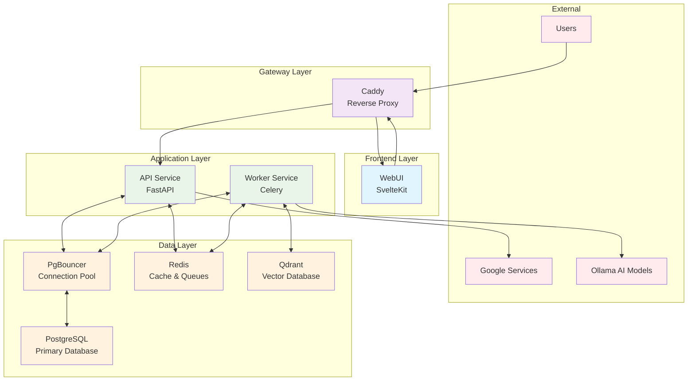

---

## 🔄 Service Communication Flow

### Request Flow Architecture

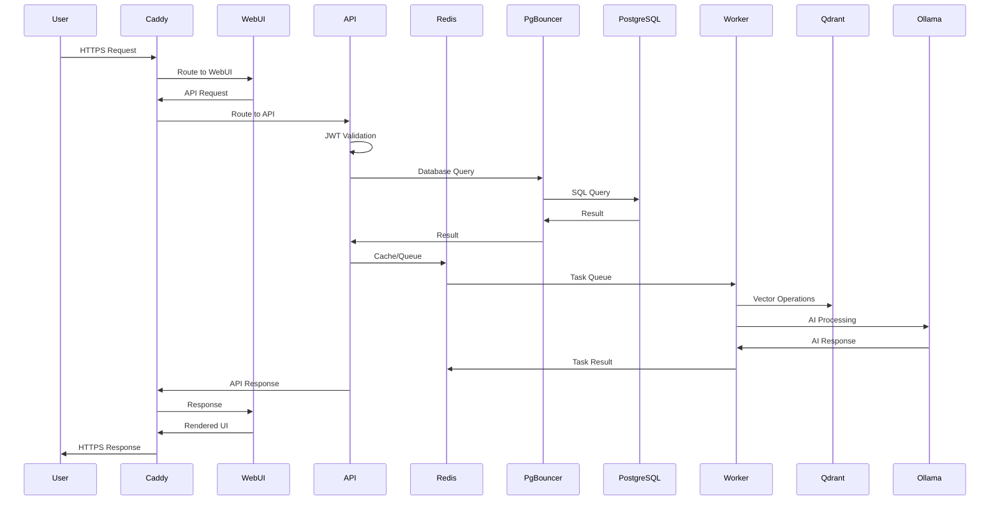

---

## 🐳 Container Architecture

### Service Containers Overview

| Service | Container | Port | Purpose | Resources |
|---------|-----------|------|---------|-----------|
| **WebUI** | `webui_container` | 3000 | SvelteKit frontend interface | 1 CPU, 512MB |
| **Caddy** | `caddy_container` | 80,443 | Reverse proxy & SSL termination | 0.5 CPU, 256MB |
| **API** | `api_container` | 8000 | FastAPI backend service | 2 CPU, 1GB |
| **Worker** | `worker_container` | - | Celery background tasks | 2 CPU, 2GB |
| **PostgreSQL** | `postgres_container` | 5432 | Primary database | 1 CPU, 1GB |
| **PgBouncer** | `pgbouncer_container` | 6432 | Connection pooling | 0.5 CPU, 128MB |
| **Redis** | `redis_container` | 6379 | Cache & message broker | 1 CPU, 512MB |
| **Qdrant** | `qdrant_container` | 6333 | Vector database | 1 CPU, 1GB |

### Container Network Architecture

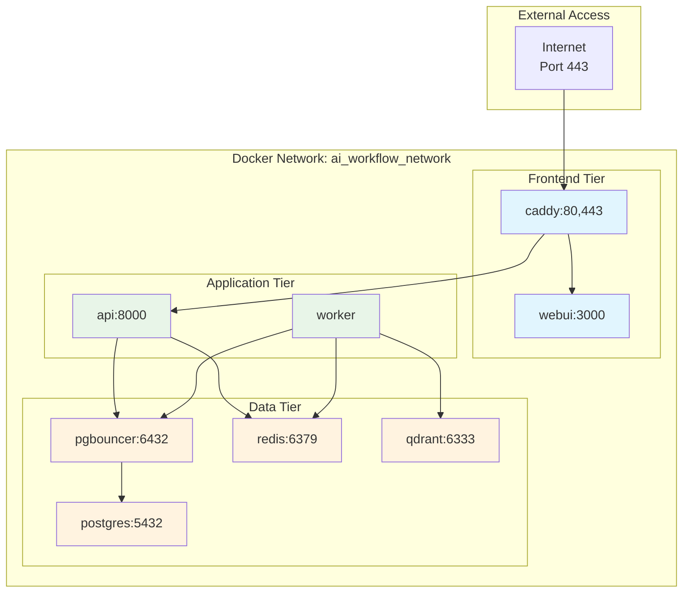

---

## 📊 Data Architecture

### Database Schema Architecture

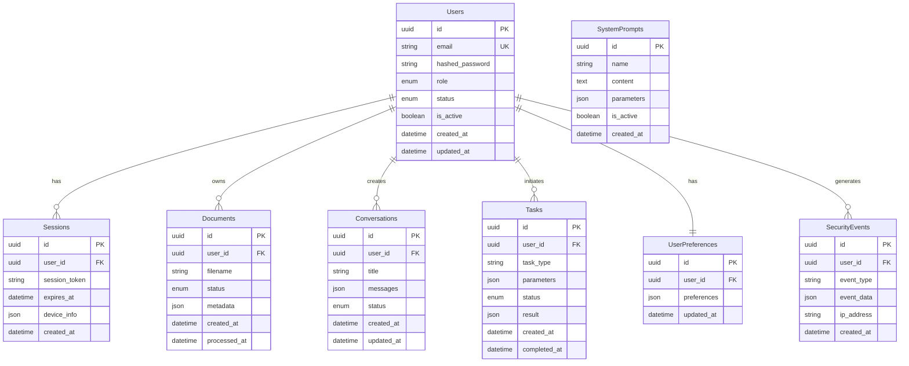

### Data Flow Architecture

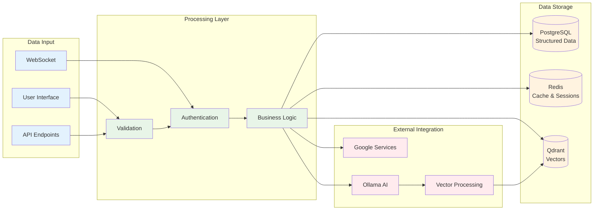

---

## 🔐 Security Architecture

### Multi-Layer Security Model

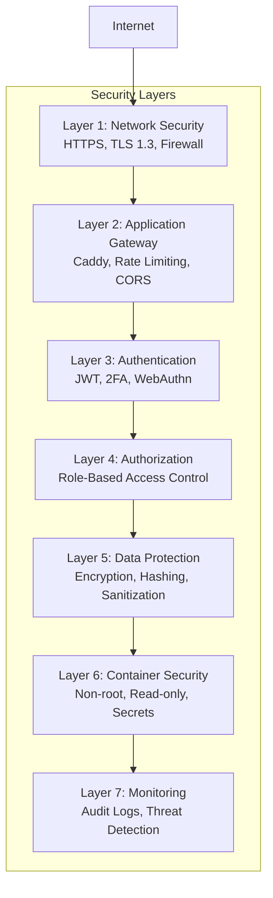

### Authentication & Authorization Flow

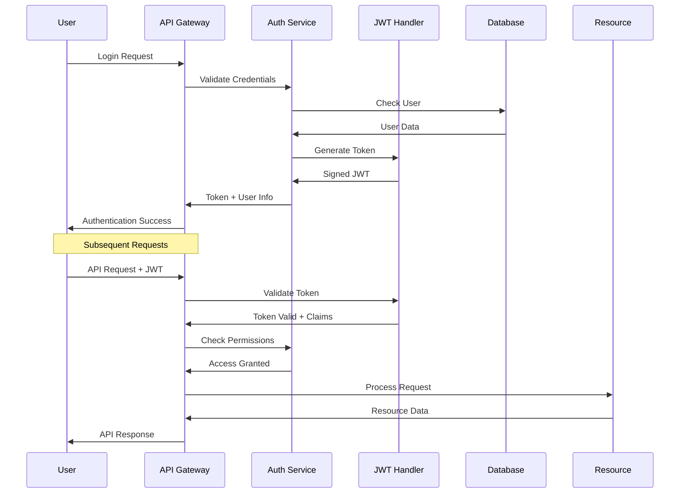

---

## 🚀 Application Architecture

### FastAPI Service Architecture

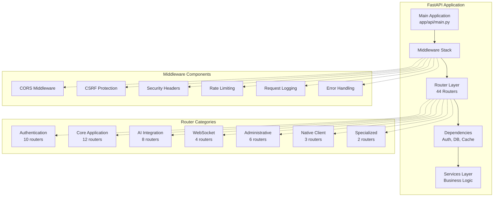

### Celery Worker Architecture

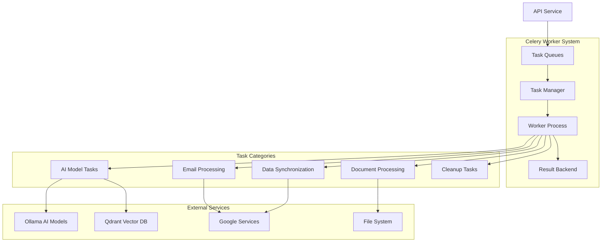

---

## 🌐 Frontend Architecture

### SvelteKit Application Structure

```mermaid
graph TB
    subgraph "SvelteKit Frontend"
        APP[App Shell<br/>+layout.svelte]
        ROUTES[Route Components]
        COMP[Shared Components]
        STORE[State Management]
        API[API Client]
    end
    
    subgraph "Route Structure"
        LOGIN[/login<br/>Authentication]
        DASH[/dashboard<br/>Main Interface]
        CHAT[/chat<br/>AI Conversations]
        DOCS[/documents<br/>File Management]
        SETTINGS[/settings<br/>User Preferences]
        ADMIN[/admin<br/>Administration]
    end
    
    subgraph "Component Library"
        UI[UI Components]
        FORMS[Form Components]
        CHARTS[Chart Components]
        MODAL[Modal Components]
        WS_COMP[WebSocket Components]
    end
    
    subgraph "State & Data"
        AUTH_STORE[Authentication Store]
        USER_STORE[User Data Store]
        CHAT_STORE[Chat State Store]
        WS_STORE[WebSocket Store]
    end
    
    APP --> ROUTES
    APP --> COMP
    ROUTES --> STORE
    STORE --> API
    
    ROUTES -.-> LOGIN
    ROUTES -.-> DASH
    ROUTES -.-> CHAT
    ROUTES -.-> DOCS
    ROUTES -.-> SETTINGS
    ROUTES -.-> ADMIN
    
    COMP -.-> UI
    COMP -.-> FORMS
    COMP -.-> CHARTS
    COMP -.-> MODAL
    COMP -.-> WS_COMP
    
    STORE -.-> AUTH_STORE
    STORE -.-> USER_STORE
    STORE -.-> CHAT_STORE
    STORE -.-> WS_STORE
    
    classDef frontend fill:#e1f5fe
    classDef routes fill:#e8f5e8
    classDef components fill:#fff3e0
    classDef store fill:#f3e5f5
```

---

## 🔄 Integration Architecture

### AI Services Integration

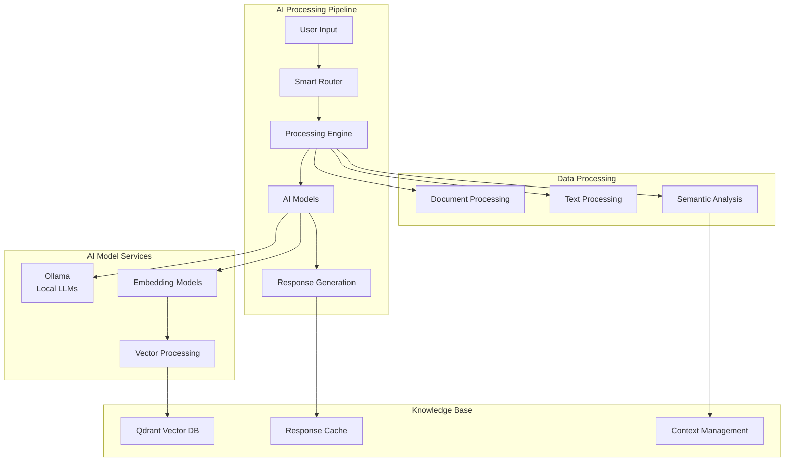

### Google Services Integration

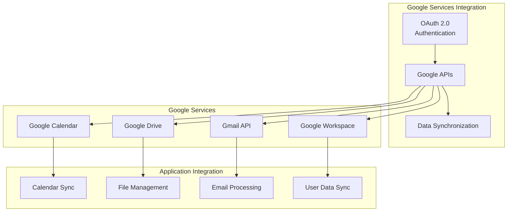

---

## 📡 Communication Protocols

### WebSocket Architecture

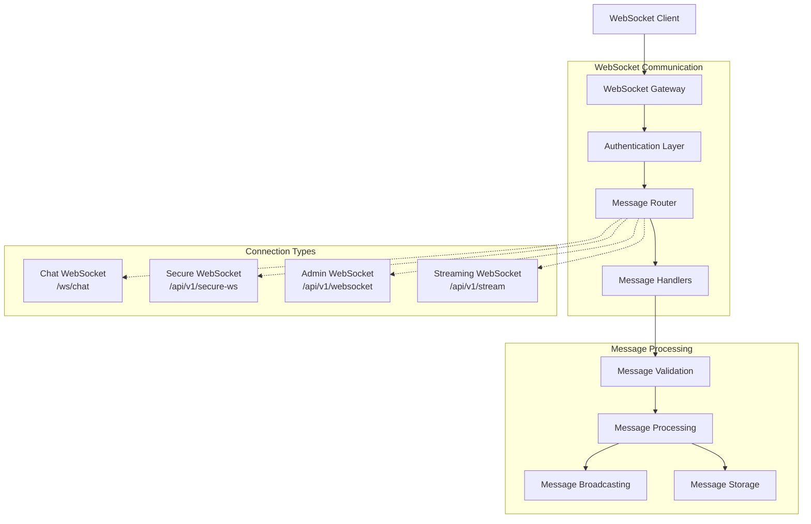

### API Communication Patterns

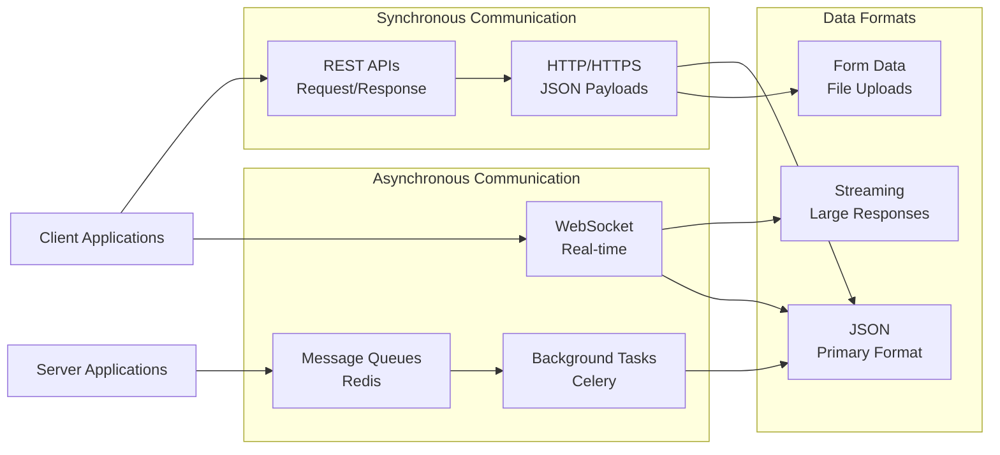

---

## 🔧 Configuration Management

### Environment Configuration

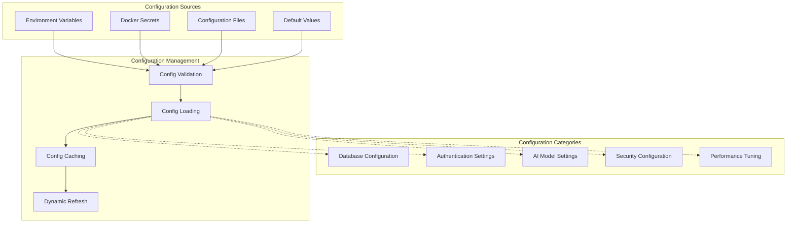

### Service Configuration

| Service | Configuration Method | Key Settings |
|---------|---------------------|--------------|
| **API** | Environment + Secrets | Database URL, JWT Secret, Redis URL |
| **Worker** | Environment + Files | Ollama URL, Queue Settings, Concurrency |
| **Database** | Environment + Init Scripts | Connection Limits, Performance Tuning |
| **Redis** | Configuration File | Memory Limits, Persistence, Clustering |
| **Caddy** | Caddyfile | SSL Certificates, Reverse Proxy Rules |
| **WebUI** | Environment + Build Config | API Endpoints, Feature Flags |

---

## 📈 Performance Architecture

### Performance Optimization Strategy

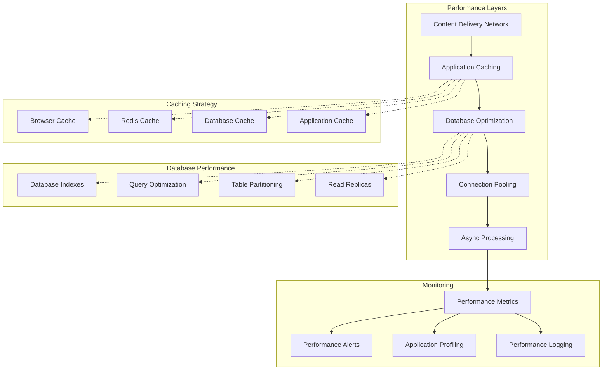

### Resource Allocation

| Component | CPU Allocation | Memory Allocation | Disk I/O Priority | Network Priority |
|-----------|----------------|-------------------|-------------------|------------------|
| **API Service** | 2 cores (50%) | 1GB (primary) | Medium | High |
| **Worker Service** | 2 cores (70%) | 2GB (processing) | High | Medium |
| **Database** | 1 core (80%) | 1GB (buffer pool) | Very High | Medium |
| **Redis** | 1 core (30%) | 512MB (cache) | Low | High |
| **WebUI** | 1 core (20%) | 512MB (static) | Low | High |
| **Caddy** | 0.5 core (10%) | 256MB (proxy) | Low | Very High |

---

## 🔍 Monitoring Architecture

### Comprehensive Monitoring Stack

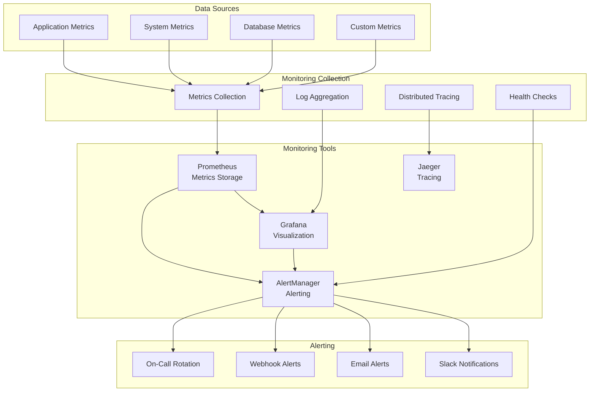

---

## 🚀 Deployment Architecture

### Multi-Environment Strategy

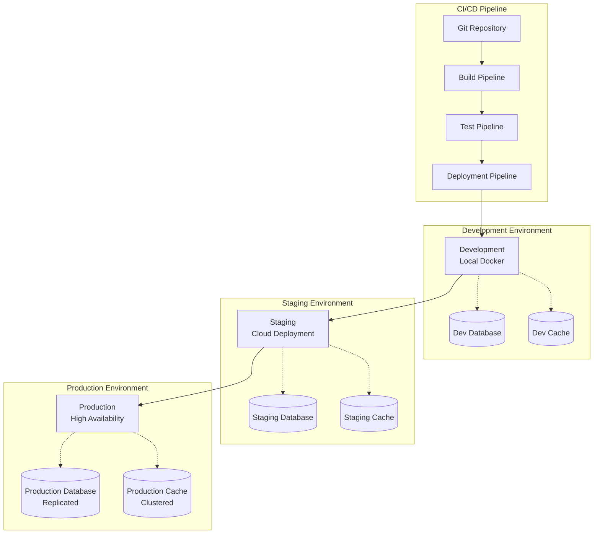

### Container Orchestration

```yaml
# Docker Compose Architecture Overview
version: '3.8'
services:
  caddy:          # Gateway Layer
    image: caddy:2-alpine
    ports: ["80:80", "443:443"]
    
  webui:          # Frontend Layer
    build: ./app/webui
    expose: ["3000"]
    
  api:            # Application Layer
    build: ./app/api
    expose: ["8000"]
    depends_on: [postgres, redis]
    
  worker:         # Processing Layer
    build: ./app/worker
    depends_on: [postgres, redis, qdrant]
    
  postgres:       # Data Layer - Primary
    image: postgres:15
    volumes: ["postgres_data:/var/lib/postgresql/data"]
    
  pgbouncer:      # Data Layer - Pooling
    image: pgbouncer/pgbouncer:latest
    depends_on: [postgres]
    
  redis:          # Data Layer - Cache
    image: redis:7-alpine
    volumes: ["redis_data:/data"]
    
  qdrant:         # Data Layer - Vector
    image: qdrant/qdrant:latest
    volumes: ["qdrant_data:/qdrant/storage"]

networks:
  ai_workflow_network:
    driver: bridge
    
volumes:
  postgres_data:
  redis_data:
  qdrant_data:
```

---

## 📋 System Specifications

### Hardware Requirements

#### Minimum Requirements
- **CPU**: 4 cores (2.0 GHz)
- **Memory**: 8 GB RAM
- **Storage**: 50 GB SSD
- **Network**: 100 Mbps

#### Recommended Requirements
- **CPU**: 8 cores (3.0 GHz)
- **Memory**: 16 GB RAM
- **Storage**: 200 GB NVMe SSD
- **Network**: 1 Gbps

#### Production Requirements
- **CPU**: 16 cores (3.5 GHz)
- **Memory**: 32 GB RAM
- **Storage**: 1 TB NVMe SSD (+ backup)
- **Network**: 10 Gbps

### Software Requirements

#### Operating System
- **Linux**: Ubuntu 20.04+ or CentOS 8+ (preferred)
- **Docker**: Version 20.10+
- **Docker Compose**: Version 2.0+

#### Runtime Dependencies
- **Python**: 3.11+
- **Node.js**: 18+
- **PostgreSQL**: 15+
- **Redis**: 7+

---

## 🔄 Scalability Architecture

### Horizontal Scaling Strategy

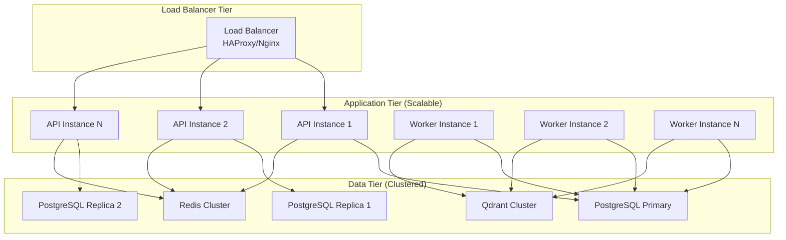

### Auto-Scaling Triggers

| Metric | Scale Up Threshold | Scale Down Threshold | Action |
|--------|-------------------|----------------------|---------|
| **CPU Usage** | > 70% for 5 minutes | < 30% for 10 minutes | Add/Remove API instances |
| **Memory Usage** | > 80% for 3 minutes | < 40% for 15 minutes | Add/Remove Worker instances |
| **Queue Length** | > 100 pending tasks | < 10 pending tasks | Scale Worker pool |
| **Response Time** | > 2 seconds (95th%) | < 500ms (95th%) | Scale API instances |
| **Connection Pool** | > 80% utilization | < 40% utilization | Scale Database connections |

---

This comprehensive system architecture documentation provides complete visibility into the AI Workflow Engine's design, implementation, and operational characteristics across all layers of the system.