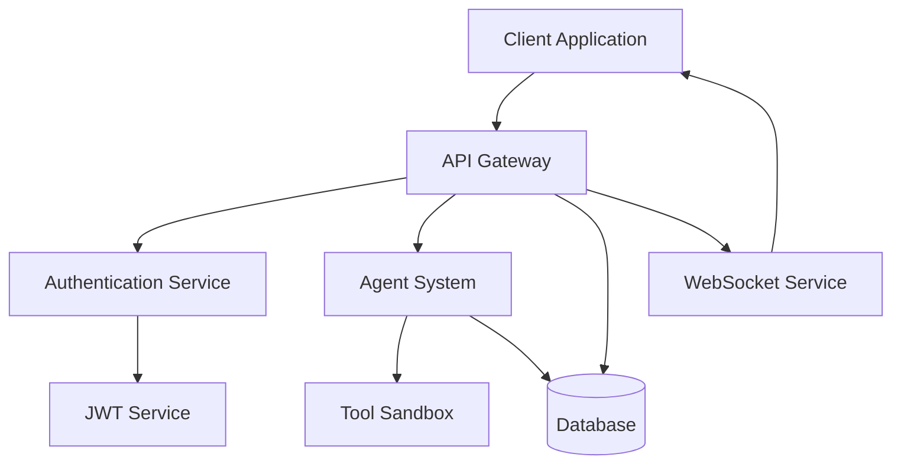

# Architecture & Design

This section provides comprehensive documentation about the AI Workflow Engine's architecture, design patterns, and core concepts.

## 🏗️ Architecture Overview

The AI Workflow Engine follows a modular, microservices-oriented architecture with the following key components:

- **API Layer**: FastAPI-based REST and WebSocket APIs
- **Agent System**: Multi-agent orchestration and processing
- **Database Layer**: PostgreSQL with advanced features
- **Security Layer**: mTLS, JWT, and comprehensive security controls
- **Frontend**: Svelte-based web user interface
- **Infrastructure**: Docker-based containerized deployment

## 📋 Architecture Documentation

### [🎯 System Architecture Overview](system-overview.md)
High-level system architecture and component interactions:
- System diagram and flow
- Component responsibilities
- Data flow patterns
- Integration points

### [🧩 Component Architecture](components.md)
Detailed component documentation:
- API components and structure
- Agent system components
- Database components
- Frontend components
- Infrastructure components

### [🗄️ Database Design](database.md)
Database architecture and design:
- Schema design
- Entity relationships
- Performance considerations
- Migration strategies
- Data modeling patterns

### [🔐 Security Architecture](security-design.md)
Security design and implementation:
- Authentication flows
- Authorization patterns
- Security layers
- Threat model
- Security controls

## 🎨 Design Patterns

### Core Patterns Used
- **Repository Pattern**: Database abstraction
- **Service Layer Pattern**: Business logic separation  
- **Observer Pattern**: Event-driven architecture
- **Factory Pattern**: Agent creation and management
- **Singleton Pattern**: Configuration management
- **Decorator Pattern**: Security middleware

### Architectural Principles
- **Separation of Concerns**: Clear component boundaries
- **Single Responsibility**: Each component has one job
- **Dependency Injection**: Loose coupling between components
- **Event-Driven**: Asynchronous communication
- **Security by Design**: Security integrated throughout

## 🔄 Data Flow

### Request Processing Flow
1. **Request Reception**: API gateway receives request
2. **Authentication**: Security layer validates credentials
3. **Authorization**: Permissions are checked
4. **Business Logic**: Service layer processes request
5. **Data Access**: Repository layer handles database operations
6. **Response**: Formatted response returned

### Agent Processing Flow
1. **Task Reception**: Agent receives processing task
2. **Context Setup**: Security and processing context established
3. **Tool Execution**: Tools executed in sandboxed environment
4. **Result Processing**: Results validated and formatted
5. **Response Delivery**: Results delivered via appropriate channel

## 📊 Component Interactions

## 🚀 Performance Considerations

### Scalability Design
- **Horizontal Scaling**: Stateless service design
- **Database Optimization**: Connection pooling, query optimization
- **Caching Strategy**: Redis for session and data caching
- **Async Processing**: Non-blocking I/O throughout
- **Load Balancing**: Support for multiple instances

### Monitoring Points
- API response times
- Database query performance
- Agent processing times
- Memory and CPU usage
- Security audit events

## 📦 Module Dependencies

### Core Dependencies
- **FastAPI**: Web framework and API development
- **SQLAlchemy**: Database ORM and query building  
- **Pydantic**: Data validation and serialization
- **Redis**: Caching and session storage
- **PostgreSQL**: Primary database system
- **Docker**: Containerization and deployment

### Security Dependencies
- **cryptography**: Encryption and certificate handling
- **PyJWT**: JWT token processing
- **bcrypt**: Password hashing
- **OpenSSL**: TLS/SSL certificate management

## 🔗 Related Documentation

- [Development Environment Setup](../development/environment-setup.md)
- [Security Implementation Guide](../security/overview.md)
- [API Reference](../api/reference.md)
- [Database Setup](../infrastructure/database.md)
- [Agent System Documentation](../agents/overview.md)

## 🛠️ Architecture Decision Records

For detailed architectural decisions and their rationale, see:
- [ADR-001: Database Selection](decisions/adr-001-database-selection.md)
- [ADR-002: API Framework Choice](decisions/adr-002-api-framework.md)
- [ADR-003: Security Architecture](decisions/adr-003-security-architecture.md)
- [ADR-004: Agent System Design](decisions/adr-004-agent-system.md)

---

**For Implementation Details**: See the [Development Guides](../development/README.md) for implementing these architectural patterns.