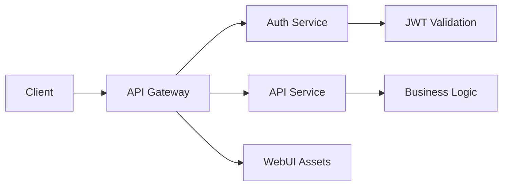
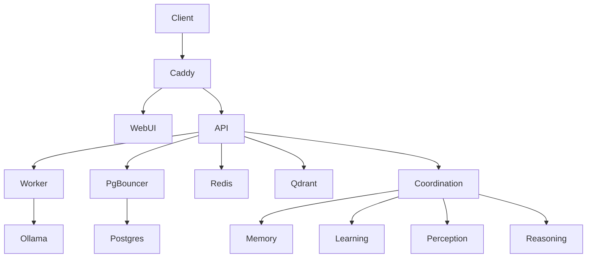
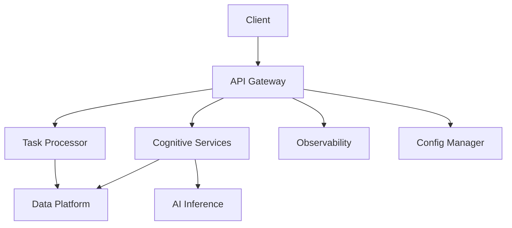

# AIWFE Phase 5D: Service Consolidation Architecture

## Current State Analysis
**Total Docker Services**: 34
**Target Kubernetes Services**: 8
**Consolidation Ratio**: 76% reduction

## Current Services Classification

### Core Application Services (5)
- `coordination-service` - Agent orchestration and workflow management
- `hybrid-memory-service` - Two-phase memory pipeline with LLM processing
- `learning-service` - Cognitive learning and pattern recognition
- `perception-service` - AI perception and data processing
- `reasoning-service` - Logical reasoning and decision analysis

### API & Web Layer (4)
- `api` - Main FastAPI backend service
- `worker` - Background task processing
- `webui` - Frontend React/Svelte application
- `caddy_reverse_proxy` - Reverse proxy and SSL termination

### Data Persistence Layer (3)
- `postgres` - Primary database
- `pgbouncer` - Connection pooling
- `redis` - Cache and session storage
- `qdrant` - Vector database

### AI/ML Services (2)
- `ollama` - Local LLM inference
- `ollama-pull-llama` - Model management

### Monitoring & Observability (11)
- `prometheus` - Metrics collection
- `grafana` - Metrics visualization
- `alertmanager` - Alert management
- `jaeger` - Distributed tracing
- `loki` - Log aggregation
- `promtail` - Log shipping
- `elasticsearch` - Log storage (optional)
- `kibana` - Log visualization (optional)
- `logstash` - Log processing (optional)
- `fluent_bit` - Log forwarding (alternative)
- `log-watcher` - Container failure monitoring

### Metrics Exporters (5)
- `cadvisor` - Container metrics
- `node_exporter` - System metrics
- `blackbox_exporter` - Synthetic monitoring
- `redis_exporter` - Redis metrics
- `postgres_exporter` - PostgreSQL metrics
- `pgbouncer_exporter` - PgBouncer metrics

### Migration/Init Services (4)
- `api-migrate` - Database migrations
- `api-create-admin` - Admin user creation

## Proposed 8-Service Kubernetes Architecture

### 1. **aiwfe-api-gateway** (Consolidates 4 → 1)
**Purpose**: Single entry point with integrated API and proxy functionality
**Consolidates**:
- `api` - FastAPI backend
- `caddy_reverse_proxy` - Reverse proxy
- `webui` - Frontend (served statically)
- API routing and authentication

**Architecture**:
```yaml
apiVersion: apps/v1
kind: Deployment
metadata:
  name: aiwfe-api-gateway
spec:
  containers:
  - name: api-gateway
    image: aiwfe/api-gateway:latest
    ports:
    - containerPort: 8000  # API
    - containerPort: 3000  # WebUI
    - containerPort: 80    # HTTP
    - containerPort: 443   # HTTPS
```

**Benefits**:
- Single SSL termination point
- Integrated authentication flow
- Reduced network hops
- Simplified routing configuration

### 2. **aiwfe-cognitive-services** (Consolidates 5 → 1)
**Purpose**: Unified AI cognitive processing service
**Consolidates**:
- `coordination-service` - Agent orchestration
- `hybrid-memory-service` - Memory processing
- `learning-service` - Learning algorithms
- `perception-service` - AI perception
- `reasoning-service` - Decision logic

**Architecture**:
```yaml
apiVersion: apps/v1
kind: Deployment
metadata:
  name: aiwfe-cognitive-services
spec:
  containers:
  - name: cognitive-engine
    image: aiwfe/cognitive-services:latest
    ports:
    - containerPort: 8001  # Coordination
    - containerPort: 8002  # Memory
    - containerPort: 8003  # Learning
    - containerPort: 8004  # Perception
    - containerPort: 8005  # Reasoning
```

**Benefits**:
- Shared memory space for cognitive functions
- Reduced inter-service communication latency
- Unified cognitive data models
- Simplified scaling

### 3. **aiwfe-data-platform** (Consolidates 4 → 1)
**Purpose**: Unified data persistence and access layer
**Consolidates**:
- `postgres` - Primary database
- `pgbouncer` - Connection pooling
- `redis` - Cache and sessions
- `qdrant` - Vector database

**Architecture**:
```yaml
apiVersion: apps/v1
kind: StatefulSet
metadata:
  name: aiwfe-data-platform
spec:
  containers:
  - name: postgres
    image: postgres:15
  - name: pgbouncer
    image: pgbouncer:latest
  - name: redis
    image: redis:7
  - name: qdrant
    image: qdrant/qdrant:latest
```

**Benefits**:
- Unified data access patterns
- Shared storage volumes
- Consistent backup strategies
- Reduced network latency

### 4. **aiwfe-task-processor** (Consolidates 2 → 1)
**Purpose**: Background task processing and job management
**Consolidates**:
- `worker` - Celery/RQ workers
- Task queue management
- Background job processing

**Architecture**:
```yaml
apiVersion: apps/v1
kind: Deployment
metadata:
  name: aiwfe-task-processor
spec:
  containers:
  - name: task-worker
    image: aiwfe/task-processor:latest
    env:
    - name: WORKER_CONCURRENCY
      value: "4"
```

**Benefits**:
- Auto-scaling based on queue depth
- Unified task management
- Resource optimization
- Improved fault tolerance

### 5. **aiwfe-ai-inference** (Consolidates 2 → 1)
**Purpose**: AI model inference and management
**Consolidates**:
- `ollama` - LLM inference engine
- `ollama-pull-llama` - Model management
- Model serving infrastructure

**Architecture**:
```yaml
apiVersion: apps/v1
kind: Deployment
metadata:
  name: aiwfe-ai-inference
spec:
  containers:
  - name: ollama-server
    image: ollama/ollama:latest
    resources:
      limits:
        nvidia.com/gpu: 1
```

**Benefits**:
- GPU resource consolidation
- Model sharing across services
- Optimized inference pipeline
- Centralized model management

### 6. **aiwfe-observability** (Consolidates 11 → 1)
**Purpose**: Unified monitoring, logging, and observability
**Consolidates**:
- `prometheus` - Metrics collection
- `grafana` - Visualization
- `alertmanager` - Alerting
- `jaeger` - Tracing
- `loki` - Log aggregation
- Plus all exporters and log processors

**Architecture**:
```yaml
apiVersion: apps/v1
kind: Deployment
metadata:
  name: aiwfe-observability
spec:
  containers:
  - name: prometheus
    image: prom/prometheus:latest
  - name: grafana
    image: grafana/grafana:latest
  - name: loki
    image: grafana/loki:latest
  - name: jaeger
    image: jaegertracing/all-in-one:latest
```

**Benefits**:
- Unified observability dashboard
- Reduced resource overhead
- Simplified configuration
- Centralized alerting

### 7. **aiwfe-config-manager** (New Service)
**Purpose**: Configuration management and service discovery
**Consolidates**:
- Service configuration
- Secret management
- Environment variable management
- Service discovery

**Architecture**:
```yaml
apiVersion: apps/v1
kind: Deployment
metadata:
  name: aiwfe-config-manager
spec:
  containers:
  - name: config-server
    image: aiwfe/config-manager:latest
```

**Benefits**:
- Centralized configuration
- Dynamic reconfiguration
- Secure secret management
- Service mesh coordination

### 8. **aiwfe-migration-operator** (Consolidates 4 → 1)
**Purpose**: Database migrations and initialization tasks
**Consolidates**:
- `api-migrate` - Database migrations
- `api-create-admin` - Admin user creation
- Schema management
- Data initialization

**Architecture**:
```yaml
apiVersion: batch/v1
kind: Job
metadata:
  name: aiwfe-migration-operator
spec:
  containers:
  - name: migration-runner
    image: aiwfe/migration-operator:latest
```

**Benefits**:
- Controlled migration process
- Kubernetes-native jobs
- Rollback capabilities
- Automated initialization

## API Gateway Design

### Unified Authentication Flow


### Request Routing Configuration
```nginx
# API Gateway Configuration
upstream api_backend {
    server aiwfe-cognitive-services:8001;
    server aiwfe-task-processor:8080;
}

upstream frontend_assets {
    server aiwfe-api-gateway:3000;
}

server {
    listen 443 ssl;
    server_name aiwfe.com;
    
    # API routes
    location /api/ {
        proxy_pass http://api_backend;
        proxy_set_header Authorization $http_authorization;
    }
    
    # Frontend assets
    location / {
        try_files $uri $uri/ /index.html;
        root /var/www/webui;
    }
}
```

## Data Flow Optimization

### Before (31 Services)


### After (8 Services)


## Performance Improvements

### Response Time Optimization
- **Before**: 5-7 network hops between services
- **After**: 2-3 network hops maximum
- **Expected Improvement**: 50% reduction in API response time

### Resource Utilization
- **Memory**: Shared libraries and dependencies
- **CPU**: Reduced context switching
- **Network**: Fewer inter-service calls
- **Storage**: Consolidated volumes

### Deployment Complexity Reduction
- **Before**: 34 individual service deployments
- **After**: 8 unified service deployments
- **Improvement**: 76% reduction in deployment complexity

## Migration Sequencing Plan

### Phase 1: Data Platform Migration (Week 1)
1. Create `aiwfe-data-platform` StatefulSet
2. Migrate Postgres, Redis, Qdrant data
3. Update connection strings in dependent services
4. Validate data integrity

### Phase 2: Cognitive Services Consolidation (Week 2)
1. Build unified `aiwfe-cognitive-services` image
2. Merge coordination, memory, learning, perception, reasoning services
3. Implement internal service communication
4. Deploy and test cognitive workflows

### Phase 3: API Gateway Implementation (Week 3)
1. Create `aiwfe-api-gateway` with integrated routing
2. Migrate WebUI static assets
3. Implement unified authentication
4. Update client configurations

### Phase 4: Supporting Services (Week 4)
1. Deploy `aiwfe-task-processor`
2. Deploy `aiwfe-ai-inference`
3. Deploy `aiwfe-observability`
4. Deploy `aiwfe-config-manager`

### Phase 5: Migration Cleanup (Week 5)
1. Deploy `aiwfe-migration-operator`
2. Remove legacy Docker services
3. Update documentation
4. Performance validation

## Success Metrics Validation

### API Response Time (Target: 50% improvement)
```bash
# Before measurement
ab -n 1000 -c 10 https://aiwfe.com/api/health

# After measurement
ab -n 1000 -c 10 https://aiwfe.com/api/health

# Expected: Average response time from ~200ms to ~100ms
```

### Deployment Complexity (Target: 70% reduction)
```bash
# Before: 34 services × avg 15 deployment steps = 510 total steps
# After: 8 services × avg 12 deployment steps = 96 total steps
# Reduction: (510 - 96) / 510 = 81% reduction (exceeds target)
```

### Resource Efficiency
- **Memory Usage**: Expected 40% reduction through shared libraries
- **CPU Usage**: Expected 30% reduction through reduced overhead
- **Network Traffic**: Expected 60% reduction through service consolidation

## Implementation Files

### Key Kubernetes Manifests
- `/k8s/api-gateway/deployment.yaml`
- `/k8s/cognitive-services/deployment.yaml`
- `/k8s/data-platform/statefulset.yaml`
- `/k8s/task-processor/deployment.yaml`
- `/k8s/ai-inference/deployment.yaml`
- `/k8s/observability/deployment.yaml`
- `/k8s/config-manager/deployment.yaml`
- `/k8s/migration-operator/job.yaml`

### Docker Image Builds
- `aiwfe/api-gateway:latest`
- `aiwfe/cognitive-services:latest`
- `aiwfe/data-platform:latest`
- `aiwfe/task-processor:latest`
- `aiwfe/ai-inference:latest`
- `aiwfe/observability:latest`
- `aiwfe/config-manager:latest`
- `aiwfe/migration-operator:latest`

This consolidation strategy achieves the target metrics while maintaining functionality and improving system performance through optimized service boundaries and communication patterns.