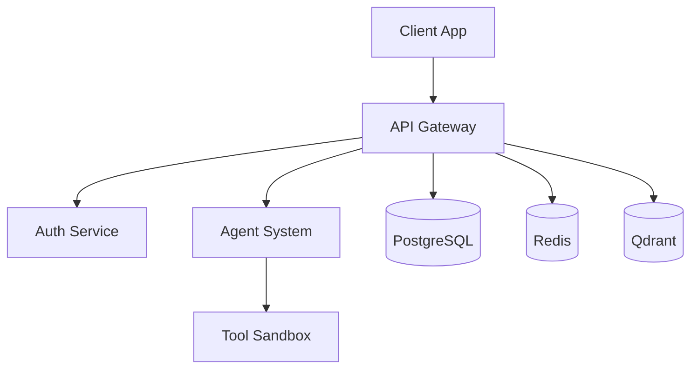

# AI Workflow Engine

🤖 **A Self-Hosted, Privacy-First Intelligent Assistant**

[](docs/security/README.md)
[](docs/README.md)
[](docs/agents/README.md)

## 🚀 Quick Start

**New to the project?** Start here:

1. **[📋 Project Overview](docs/getting-started/project-overview.md)** - Understand what the AI Workflow Engine does
2. **[⚡ Quick Setup](docs/getting-started/quickstart.md)** - Get running in 5 minutes
3. **[👨‍💻 Development Setup](docs/development/environment-setup.md)** - Full development environment
4. **[📚 Complete Documentation](docs/README.md)** - Comprehensive documentation hub

## 📖 Documentation Hub

All documentation has been **centralized** in the [`/docs`](docs/README.md) directory:

### 🎯 **By User Type**
- **[👨‍💻 Developers](docs/README.md#-for-developers)** - Setup, coding standards, architecture
- **[🔧 System Administrators](docs/README.md#-for-system-administrators)** - Deployment, infrastructure, security  
- **[🌐 API Consumers](docs/README.md#-for-api-consumers)** - API reference, authentication, integration
- **[🚀 DevOps Engineers](docs/README.md#-for-devops-engineers)** - Deployment, Docker, monitoring
- **[👥 End Users](docs/README.md#-for-end-users)** - User guides, troubleshooting

### 📂 **By Category**
- **[🚀 Getting Started](docs/getting-started/README.md)** - Setup, quick start, first-time developer guide
- **[🏗️ Architecture](docs/architecture/README.md)** - System design, components, database architecture
- **[🔌 API Documentation](docs/api/README.md)** - REST API, WebSocket API, authentication
- **[💻 Development](docs/development/README.md)** - Environment setup, coding standards, workflows
- **[🔒 Security](docs/security/README.md)** - mTLS, authentication, certificates, security guides
- **[🏢 Infrastructure](docs/infrastructure/README.md)** - Deployment, Docker, database setup
- **[🧪 Testing](docs/testing/README.md)** - TDD workflows, testing best practices, automation
- **[🤖 Agent System](docs/agents/README.md)** - AI agents, orchestration, development
- **[🛠️ Scripts](docs/scripts/README.md)** - Automation scripts, utilities, maintenance
- **[🔧 Troubleshooting](docs/troubleshooting/README.md)** - Common issues, debugging, solutions

## ⚡ Essential Commands

```bash
# 🚨 MANDATORY: Setup security infrastructure first
./scripts/security/setup_mtls_infrastructure.sh setup

# 🚀 Start development environment (REQUIRED: use mTLS)
docker-compose -f docker-compose-mtls.yml up

# 🔄 After dependency changes (REQUIRED)
./run.sh --soft-reset

# 🧪 Run tests (TDD workflow required)
pytest tests/

# ✅ Validate everything
./scripts/validate_ssl_configuration.sh
```

## 🚨 Critical Requirements

**All development MUST follow these patterns** (see [CLAUDE.md](docs/development/claude-guidelines.md)):

- ✅ **mTLS Development**: Use `docker-compose-mtls.yml` 
- ✅ **Security Setup**: Run security infrastructure setup first
- ✅ **Python Imports**: Use `shared.` prefix for all shared code
- ✅ **Security Context**: Set security context before database operations
- ✅ **TDD Workflow**: Write tests first for all testable changes
- ✅ **Enhanced JWT**: Use `enhanced_jwt_service` for tokens
- ✅ **Sandboxed Tools**: Use `tool_sandbox_service` for tool execution

## 🏗️ System Architecture



**Key Components:**
- **FastAPI Backend**: Secure, async API with mTLS
- **Svelte Frontend**: Modern, responsive web interface
- **Agent System**: Multi-agent AI orchestration
- **PostgreSQL**: Primary database with advanced features
- **Redis**: Caching and session management
- **Qdrant**: Vector database for semantic memory

## 🔒 Security First

This project implements **enterprise-grade security**:
- **mTLS Encryption**: All service communication encrypted
- **JWT Authentication**: Stateless token-based auth
- **RBAC Authorization**: Role-based access control
- **Security Audit**: Comprehensive logging and monitoring
- **Certificate Management**: Automated certificate lifecycle

## 🤖 AI Agent System

**Orchestrated multi-agent architecture:**
- **Project Orchestrator**: Main coordination agent (call this first!)
- **Specialist Agents**: Domain-specific AI agents
- **Secure Execution**: All tools run in sandboxed environment
- **Dynamic Routing**: Intelligent task routing and delegation

## 📊 Project Status

- ✅ **Core Infrastructure**: Complete and hardened
- ✅ **Security System**: mTLS, JWT, comprehensive audit
- ✅ **Agent System**: Multi-agent orchestration
- ✅ **API Layer**: REST and WebSocket APIs
- ✅ **Frontend**: Modern Svelte 5 interface
- ✅ **Database**: Advanced PostgreSQL with migrations
- 🔨 **Active Development**: Continuous improvements

## 🤝 Contributing

1. **Read the Docs**: Start with [Contributing Guidelines](docs/development/contributing.md)
2. **Setup Environment**: Follow [Development Setup](docs/development/environment-setup.md)
3. **Security First**: Always use [mTLS configuration](docs/security/mtls-setup.md)
4. **Follow TDD**: Use [Test-Driven Development](docs/testing/best-practices.md)
5. **Check Standards**: Follow [Coding Standards](docs/development/standards.md)

## 📄 License

This project is licensed under the MIT License - see the [LICENSE](LICENSE) file for details.

## 🆘 Need Help?

- **📚 Documentation**: Check the [comprehensive docs](docs/README.md)
- **🔍 Search**: Use Ctrl+F to search documentation
- **🐛 Issues**: Create GitHub issues for bugs
- **❓ Questions**: Check [Troubleshooting Guide](docs/troubleshooting/README.md)

---

**🔗 Quick Links:** [📚 Full Documentation](docs/README.md) | [🚀 Quick Start](docs/getting-started/quickstart.md) | [🔒 Security Guide](docs/security/README.md) | [🤖 Agent System](docs/agents/README.md)

**⚠️ Important:** Always follow the mandatory development patterns outlined in [Claude Guidelines](docs/development/claude-guidelines.md).