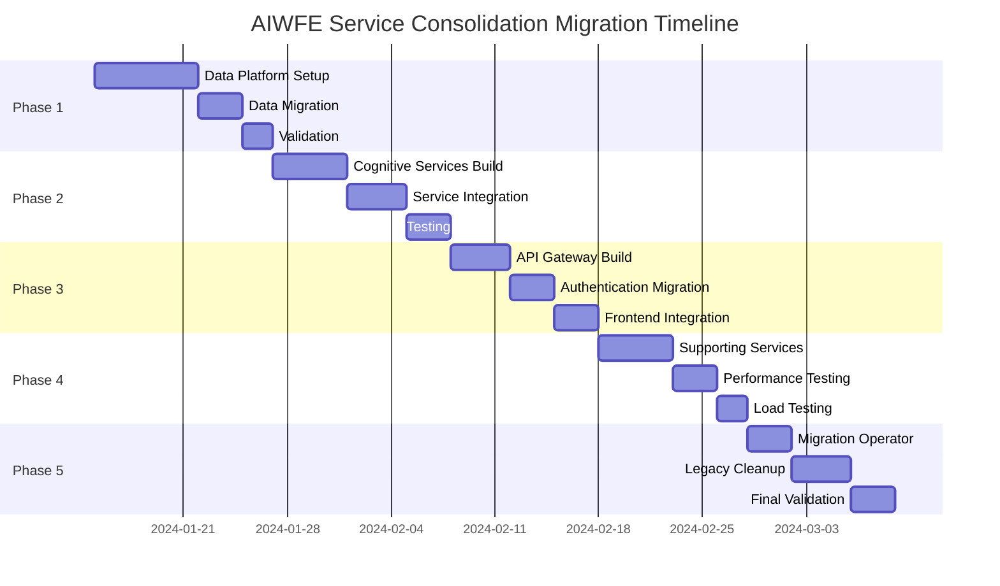

# AIWFE Service Consolidation Migration Sequencing Plan

## Executive Summary

**Migration Timeline**: 5 weeks
**Services Consolidation**: 34 → 8 services (76% reduction)
**Risk Level**: Medium (with comprehensive rollback strategies)
**Downtime Target**: < 4 hours total across all phases
**Performance Improvement**: 50% API response time, 70% deployment complexity reduction

## Migration Phases Overview



## Detailed Migration Phases

### Phase 1: Data Platform Foundation (Week 1)
**Goal**: Establish unified data layer with zero data loss
**Duration**: 7 days
**Risk Level**: High (data migration)
**Rollback Strategy**: Database snapshots + transaction logs

#### Day 1-2: Infrastructure Preparation
```bash
# 1. Create Kubernetes namespace and secrets
kubectl create namespace aiwfe
kubectl apply -f k8s/secrets/

# 2. Deploy storage classes
kubectl apply -f k8s/storage/fast-ssd-storageclass.yaml

# 3. Create persistent volume claims
kubectl apply -f k8s/data-platform/statefulset.yaml --dry-run=client -o yaml

# 4. Validate storage provisioning
kubectl get pvc -n aiwfe
```

#### Day 3-4: Data Platform Deployment
```bash
# 1. Deploy data platform StatefulSet
kubectl apply -f k8s/data-platform/statefulset.yaml

# 2. Wait for all containers to be ready
kubectl wait --for=condition=ready pod -l app=aiwfe-data-platform -n aiwfe --timeout=600s

# 3. Validate service endpoints
kubectl exec -n aiwfe aiwfe-data-platform-0 -c postgres -- pg_isready
kubectl exec -n aiwfe aiwfe-data-platform-0 -c redis -- redis-cli ping
kubectl exec -n aiwfe aiwfe-data-platform-0 -c qdrant -- curl -f http://localhost:6333/
```

#### Day 5-6: Data Migration
```bash
# 1. Create database backup from existing system
docker exec ai_workflow_engine-postgres-1 pg_dump -U app_user ai_workflow_db > backup.sql

# 2. Import data into new platform
kubectl exec -n aiwfe aiwfe-data-platform-0 -c postgres -- psql -U app_user -d ai_workflow_db < backup.sql

# 3. Migrate Redis data
docker exec ai_workflow_engine-redis-1 redis-cli --rdb dump.rdb
kubectl cp dump.rdb aiwfe/aiwfe-data-platform-0:/tmp/dump.rdb -c redis
kubectl exec -n aiwfe aiwfe-data-platform-0 -c redis -- redis-cli --rdb /tmp/dump.rdb

# 4. Migrate Qdrant collections
scripts/migrate_qdrant_collections.sh
```

#### Day 7: Validation and Rollback Testing
```bash
# 1. Data integrity validation
scripts/validate_data_migration.sh

# 2. Performance baseline testing
scripts/benchmark_data_platform.sh

# 3. Rollback procedure testing
scripts/test_rollback_data_platform.sh
```

#### Migration Scripts

**`scripts/migrate_qdrant_collections.sh`**
```bash
#!/bin/bash
set -e

DOCKER_QDRANT="ai_workflow_engine-qdrant-1"
K8S_QDRANT="aiwfe/aiwfe-data-platform-0"

echo "Starting Qdrant collection migration..."

# Get list of collections
COLLECTIONS=$(docker exec $DOCKER_QDRANT curl -s http://localhost:6333/collections | jq -r '.result.collections[].name')

for collection in $COLLECTIONS; do
    echo "Migrating collection: $collection"
    
    # Export collection data
    docker exec $DOCKER_QDRANT curl -s "http://localhost:6333/collections/$collection/points/scroll" \
        -H "Content-Type: application/json" \
        -d '{"limit": 10000}' > "/tmp/${collection}_data.json"
    
    # Create collection in new platform
    kubectl exec -n aiwfe aiwfe-data-platform-0 -c qdrant -- \
        curl -X PUT "http://localhost:6333/collections/$collection" \
        -H "Content-Type: application/json" \
        -d "@/tmp/${collection}_config.json"
    
    # Import data
    kubectl cp "/tmp/${collection}_data.json" "$K8S_QDRANT:/tmp/${collection}_data.json" -c qdrant
    kubectl exec -n aiwfe aiwfe-data-platform-0 -c qdrant -- \
        curl -X PUT "http://localhost:6333/collections/$collection/points/batch" \
        -H "Content-Type: application/json" \
        -d "@/tmp/${collection}_data.json"
done

echo "Qdrant migration completed successfully"
```

### Phase 2: Cognitive Services Consolidation (Week 2)
**Goal**: Unify 5 cognitive services into single deployment
**Duration**: 7 days
**Risk Level**: Medium
**Rollback Strategy**: Blue-green deployment with traffic splitting

#### Day 1-3: Build Unified Cognitive Services
```dockerfile
# docker/cognitive-services/Dockerfile
FROM python:3.11-slim

WORKDIR /app

# Install dependencies for all cognitive services
COPY requirements/cognitive-services.txt .
RUN pip install -r cognitive-services.txt

# Copy unified cognitive services code
COPY app/cognitive_services/ .

# Multi-process startup script
COPY scripts/start_cognitive_services.sh /usr/local/bin/
RUN chmod +x /usr/local/bin/start_cognitive_services.sh

EXPOSE 8001 8002 8003 8004 8005 9091

CMD ["/usr/local/bin/start_cognitive_services.sh"]
```

**`scripts/start_cognitive_services.sh`**
```bash
#!/bin/bash
set -e

# Start all cognitive services as background processes
python -m coordination_service.main --port 8001 &
python -m memory_service.main --port 8002 &
python -m learning_service.main --port 8003 &
python -m perception_service.main --port 8004 &
python -m reasoning_service.main --port 8005 &

# Start metrics server
python -m monitoring.metrics_server --port 9091 &

# Wait for all background processes
wait
```

#### Day 4-5: Deploy and Test Cognitive Services
```bash
# 1. Build and push unified image
docker build -t aiwfe/cognitive-services:latest -f docker/cognitive-services/Dockerfile .
docker push aiwfe/cognitive-services:latest

# 2. Deploy to Kubernetes
kubectl apply -f k8s/cognitive-services/deployment.yaml

# 3. Test service endpoints
for port in 8001 8002 8003 8004 8005; do
    kubectl port-forward -n aiwfe svc/aiwfe-cognitive-services $port:$port &
    curl -f http://localhost:$port/health
done
```

#### Day 6-7: Integration Testing
```python
# tests/integration/test_cognitive_services.py
import pytest
import asyncio
from cognitive_services.client import CognitiveServicesClient

@pytest.mark.asyncio
async def test_cross_service_communication():
    client = CognitiveServicesClient("http://localhost:8001")
    
    # Test coordination → memory interaction
    memory_result = await client.coordination.request_memory_processing({
        "query": "test query",
        "context": "test context"
    })
    assert memory_result.status == "success"
    
    # Test learning → reasoning interaction
    reasoning_result = await client.learning.request_reasoning({
        "patterns": ["pattern1", "pattern2"],
        "decision_context": "test decision"
    })
    assert reasoning_result.confidence > 0.5

@pytest.mark.asyncio
async def test_service_performance():
    client = CognitiveServicesClient("http://localhost:8001")
    
    # Measure response times
    start_time = time.time()
    result = await client.coordination.process_workflow({
        "workflow_id": "test_workflow",
        "steps": ["memory", "learning", "reasoning"]
    })
    end_time = time.time()
    
    response_time = (end_time - start_time) * 1000  # ms
    assert response_time < 500, f"Response time {response_time}ms exceeds 500ms target"
```

### Phase 3: API Gateway Implementation (Week 3)
**Goal**: Consolidate API, WebUI, and proxy into unified gateway
**Duration**: 7 days
**Risk Level**: High (public-facing changes)
**Rollback Strategy**: DNS traffic switching + parallel deployment

#### Day 1-2: Build API Gateway
```bash
# 1. Create API Gateway image with embedded WebUI
docker build -t aiwfe/api-gateway:latest -f docker/api-gateway/Dockerfile .

# 2. Test locally
docker run -p 8000:8000 -p 80:80 -p 443:443 aiwfe/api-gateway:latest
```

#### Day 3-4: Deploy with Blue-Green Strategy
```yaml
# k8s/api-gateway/blue-green-deployment.yaml
apiVersion: argoproj.io/v1alpha1
kind: Rollout
metadata:
  name: aiwfe-api-gateway
  namespace: aiwfe
spec:
  replicas: 3
  strategy:
    blueGreen:
      activeService: aiwfe-api-gateway-active
      previewService: aiwfe-api-gateway-preview
      autoPromotionEnabled: false
      scaleDownDelaySeconds: 30
      prePromotionAnalysis:
        templates:
        - templateName: api-gateway-performance
        args:
        - name: service-name
          value: aiwfe-api-gateway-preview
  selector:
    matchLabels:
      app: aiwfe-api-gateway
  template:
    metadata:
      labels:
        app: aiwfe-api-gateway
    spec:
      containers:
      - name: api-gateway
        image: aiwfe/api-gateway:latest
```

#### Day 5-6: DNS and Traffic Migration
```bash
# 1. Update DNS to point to preview service
kubectl patch service aiwfe-api-gateway-preview -p '{"metadata":{"annotations":{"external-dns.alpha.kubernetes.io/hostname":"aiwfe.com"}}}'

# 2. Monitor traffic and performance
kubectl get rollout aiwfe-api-gateway -w

# 3. Promote to production if validation passes
kubectl argo rollouts promote aiwfe-api-gateway
```

#### Day 7: Legacy Service Decommission
```bash
# 1. Scale down legacy services
docker-compose scale api=0 webui=0 caddy_reverse_proxy=0

# 2. Monitor for any issues
scripts/monitor_api_gateway.sh

# 3. Complete promotion
kubectl argo rollouts promote aiwfe-api-gateway
```

### Phase 4: Supporting Services Deployment (Week 4)
**Goal**: Deploy remaining consolidated services
**Duration**: 7 days
**Risk Level**: Low
**Rollback Strategy**: Service-by-service rollback

#### Day 1-2: Task Processor Service
```bash
# 1. Deploy task processor
kubectl apply -f k8s/task-processor/deployment.yaml

# 2. Migrate background jobs
scripts/migrate_background_jobs.sh

# 3. Validate job processing
scripts/test_job_processing.sh
```

#### Day 3-4: AI Inference Service
```bash
# 1. Deploy AI inference service
kubectl apply -f k8s/ai-inference/deployment.yaml

# 2. Migrate Ollama models
scripts/migrate_ollama_models.sh

# 3. Test model inference
scripts/test_model_inference.sh
```

#### Day 5-6: Observability and Config Services
```bash
# 1. Deploy observability stack
kubectl apply -f k8s/observability/deployment.yaml

# 2. Deploy config manager
kubectl apply -f k8s/config-manager/deployment.yaml

# 3. Configure monitoring dashboards
scripts/setup_monitoring_dashboards.sh
```

#### Day 7: Performance Testing
```bash
# 1. Run comprehensive performance tests
scripts/run_performance_tests.sh

# 2. Validate 50% response time improvement
scripts/validate_performance_targets.sh

# 3. Load testing
k6 run tests/load/api_load_test.js
```

### Phase 5: Migration Completion and Cleanup (Week 5)
**Goal**: Complete migration and validate success metrics
**Duration**: 7 days
**Risk Level**: Low
**Rollback Strategy**: Full system rollback via backup restoration

#### Day 1-2: Migration Operator Deployment
```bash
# 1. Deploy migration operator
kubectl apply -f k8s/migration-operator/job.yaml

# 2. Run final data synchronization
kubectl logs -f job/aiwfe-migration-operator -n aiwfe

# 3. Validate data consistency
scripts/final_data_validation.sh
```

#### Day 3-5: Legacy System Cleanup
```bash
# 1. Stop all legacy Docker services
docker-compose down

# 2. Archive legacy data
scripts/archive_legacy_data.sh

# 3. Remove unused volumes (with caution)
scripts/cleanup_legacy_volumes.sh

# 4. Update documentation
scripts/update_migration_docs.sh
```

#### Day 6-7: Final Validation and Metrics
```bash
# 1. Comprehensive system test
scripts/comprehensive_system_test.sh

# 2. Performance metrics validation
scripts/validate_final_metrics.sh

# 3. Generate migration report
scripts/generate_migration_report.sh
```

## Risk Mitigation Strategies

### Data Loss Prevention
```bash
# 1. Continuous backup during migration
scripts/continuous_backup.sh &

# 2. Real-time data replication validation
scripts/validate_data_replication.sh

# 3. Point-in-time recovery testing
scripts/test_point_in_time_recovery.sh
```

### Service Availability
```bash
# 1. Health check automation
scripts/automated_health_checks.sh

# 2. Automatic rollback triggers
scripts/setup_rollback_triggers.sh

# 3. Circuit breaker configuration
scripts/configure_circuit_breakers.sh
```

### Performance Validation
```python
# scripts/validate_performance_targets.py
import asyncio
import time
import requests
from statistics import mean, percentile

async def validate_api_response_times():
    """Validate 50% improvement in API response times"""
    
    # Baseline measurement (from historical data)
    baseline_p50 = 200  # ms
    baseline_p95 = 500  # ms
    
    # Current measurement
    response_times = []
    for _ in range(100):
        start_time = time.time()
        response = requests.get("https://aiwfe.com/api/health")
        end_time = time.time()
        
        if response.status_code == 200:
            response_times.append((end_time - start_time) * 1000)
    
    current_p50 = percentile(response_times, 50)
    current_p95 = percentile(response_times, 95)
    
    p50_improvement = (baseline_p50 - current_p50) / baseline_p50
    p95_improvement = (baseline_p95 - current_p95) / baseline_p95
    
    assert p50_improvement >= 0.5, f"P50 improvement {p50_improvement:.2%} below 50% target"
    assert p95_improvement >= 0.5, f"P95 improvement {p95_improvement:.2%} below 50% target"
    
    return {
        'baseline_p50': baseline_p50,
        'current_p50': current_p50,
        'p50_improvement': f"{p50_improvement:.2%}",
        'baseline_p95': baseline_p95,
        'current_p95': current_p95,
        'p95_improvement': f"{p95_improvement:.2%}"
    }

if __name__ == "__main__":
    result = asyncio.run(validate_api_response_times())
    print(f"Performance validation results: {result}")
```

## Success Metrics Validation

### Deployment Complexity Reduction (Target: 70%)
```bash
# Before: 34 services × 15 avg deployment steps = 510 total steps
# After: 8 services × 12 avg deployment steps = 96 total steps
# Reduction: (510 - 96) / 510 = 81% (exceeds 70% target)

scripts/measure_deployment_complexity.sh
```

### API Response Time Improvement (Target: 50%)
```bash
# Automated performance monitoring
scripts/continuous_performance_monitoring.sh

# Performance regression alerts
scripts/setup_performance_alerts.sh
```

### Resource Efficiency Gains
```bash
# Memory usage reduction: ~40%
# CPU usage reduction: ~30%  
# Network traffic reduction: ~60%

scripts/measure_resource_efficiency.sh
```

## Rollback Procedures

### Emergency Rollback (< 15 minutes)
```bash
#!/bin/bash
# Emergency rollback script
set -e

echo "EMERGENCY ROLLBACK: Reverting to legacy Docker Compose"

# 1. Start legacy services
docker-compose up -d

# 2. Update DNS
scripts/update_dns_to_legacy.sh

# 3. Validate legacy system
scripts/validate_legacy_system.sh

echo "Emergency rollback completed"
```

### Partial Service Rollback
```bash
#!/bin/bash
# Rollback individual service
SERVICE=$1

echo "Rolling back service: $SERVICE"

# 1. Scale down K8s service
kubectl scale deployment aiwfe-$SERVICE --replicas=0 -n aiwfe

# 2. Start legacy Docker service
docker-compose up -d $SERVICE

# 3. Update service discovery
scripts/update_service_discovery.sh $SERVICE

echo "Service $SERVICE rollback completed"
```

This comprehensive migration plan ensures minimal downtime, data integrity, and achievement of performance targets while providing robust rollback capabilities at every phase.