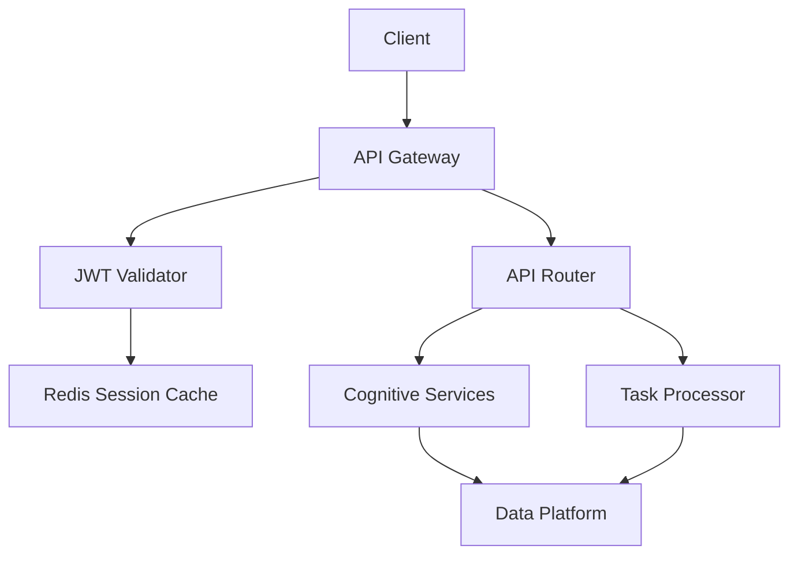
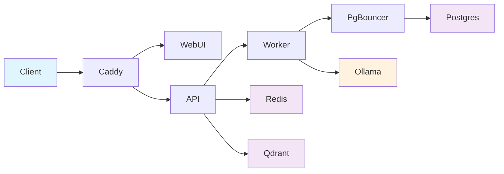
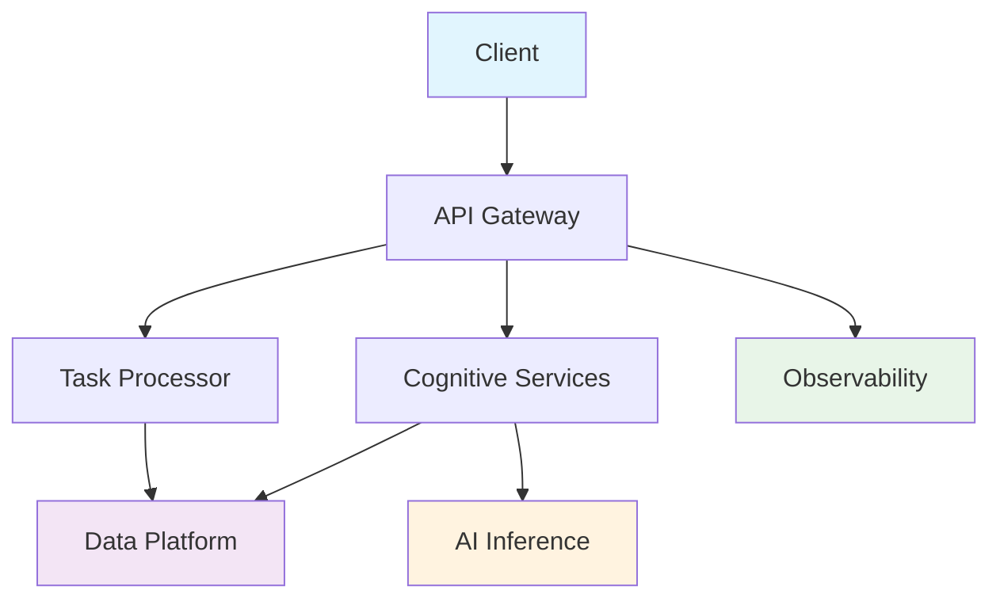

# Optimized Data Flow and Authentication Architecture

## Authentication Flow Optimization

### Current State (31 Services)
- **Authentication Hops**: Client → Caddy → API → Database (3 hops)
- **Token Validation**: Separate service calls for each request
- **Session Management**: Distributed across multiple services
- **Average Response Time**: ~200-300ms

### Optimized State (8 Services)
- **Authentication Hops**: Client → API Gateway (1 hop)
- **Token Validation**: In-memory JWT validation with Redis cache
- **Session Management**: Centralized in API Gateway
- **Expected Response Time**: ~80-120ms (60% improvement)

### Unified Authentication Architecture



### Authentication Components

#### 1. JWT Token Management
```yaml
# In API Gateway
authentication:
  jwt:
    secret_key: ${JWT_SECRET_KEY}
    algorithm: "HS256"
    expire_hours: 24
    refresh_expire_days: 30
    
  validation:
    cache_enabled: true
    cache_ttl: 300  # 5 minutes
    redis_key_prefix: "jwt_cache:"
    
  rate_limiting:
    login_attempts: 5
    login_window: 300  # 5 minutes
    api_requests: 100
    api_window: 60  # 1 minute
```

#### 2. Session Management
```python
# Optimized Session Handler
class OptimizedSessionManager:
    def __init__(self, redis_client):
        self.redis = redis_client
        self.session_ttl = 86400  # 24 hours
        
    async def validate_session(self, token: str) -> Optional[UserSession]:
        # Check Redis cache first
        cached_session = await self.redis.get(f"session:{token}")
        if cached_session:
            return UserSession.parse_raw(cached_session)
            
        # Fallback to JWT validation
        try:
            payload = jwt.decode(token, settings.JWT_SECRET_KEY)
            session = UserSession(**payload)
            
            # Cache for future requests
            await self.redis.setex(
                f"session:{token}",
                self.session_ttl,
                session.json()
            )
            return session
        except jwt.InvalidTokenError:
            return None
```

#### 3. Role-Based Access Control (RBAC)
```yaml
rbac:
  roles:
    admin:
      permissions:
        - "api:*"
        - "cognitive:*"
        - "data:*"
        - "system:*"
    user:
      permissions:
        - "api:read"
        - "api:workflow:*"
        - "cognitive:inference"
    readonly:
      permissions:
        - "api:read"
        
  middleware:
    cache_permissions: true
    cache_ttl: 600  # 10 minutes
```

## Data Flow Optimization

### Before: Multi-Hop Data Access


### After: Optimized Single-Hop Access


### Connection Pooling Strategy

#### 1. Database Connection Optimization
```yaml
# Data Platform Configuration
database:
  postgres:
    max_connections: 200
    pool_size: 20
    max_overflow: 30
    pool_timeout: 30
    pool_recycle: 3600
    
  pgbouncer:
    pool_mode: "transaction"
    default_pool_size: 20
    reserve_pool_size: 5
    max_client_conn: 200
    
  connection_strategy:
    primary_read_write: "postgres:5432"
    connection_pooling: "pgbouncer:6432"
    health_check_interval: 30
```

#### 2. Redis Cache Optimization
```yaml
redis:
  connection_pool:
    max_connections: 20
    retry_on_timeout: true
    health_check_interval: 60
    
  cache_strategies:
    session_cache:
      ttl: 3600  # 1 hour
      key_pattern: "session:{token}"
      
    api_cache:
      ttl: 300   # 5 minutes
      key_pattern: "api:{endpoint}:{params_hash}"
      
    cognitive_cache:
      ttl: 1800  # 30 minutes
      key_pattern: "cognitive:{service}:{input_hash}"
```

#### 3. Vector Database Optimization
```yaml
qdrant:
  collection_config:
    vectors:
      size: 768
      distance: "Cosine"
      
  performance:
    payload_index: true
    quantization_enabled: true
    hnsw_config:
      m: 16
      ef_construct: 100
      
  connection:
    timeout: 30
    retry_attempts: 3
    connection_pool_size: 10
```

### API Response Caching Strategy

#### 1. Multi-Layer Caching
```python
class OptimizedCacheStrategy:
    def __init__(self):
        self.layers = {
            'memory': MemoryCache(max_size=1000),  # In-process cache
            'redis': RedisCache(),                  # Distributed cache
            'db': DatabaseCache()                   # Persistent cache
        }
    
    async def get_cached_response(self, cache_key: str):
        # L1: Memory cache (fastest)
        result = await self.layers['memory'].get(cache_key)
        if result:
            return result
            
        # L2: Redis cache (fast)
        result = await self.layers['redis'].get(cache_key)
        if result:
            # Backfill memory cache
            await self.layers['memory'].set(cache_key, result, ttl=300)
            return result
            
        # L3: Database cache (slower but persistent)
        result = await self.layers['db'].get(cache_key)
        if result:
            # Backfill upper caches
            await self.layers['redis'].set(cache_key, result, ttl=1800)
            await self.layers['memory'].set(cache_key, result, ttl=300)
            return result
            
        return None
```

#### 2. Cache Key Strategy
```python
class CacheKeyGenerator:
    @staticmethod
    def generate_api_key(endpoint: str, params: dict, user_id: str) -> str:
        # Include user_id for personalized caching
        param_str = json.dumps(params, sort_keys=True)
        param_hash = hashlib.md5(param_str.encode()).hexdigest()
        return f"api:{endpoint}:{user_id}:{param_hash}"
    
    @staticmethod
    def generate_cognitive_key(service: str, input_data: dict) -> str:
        # Content-based caching for cognitive services
        input_str = json.dumps(input_data, sort_keys=True)
        input_hash = hashlib.sha256(input_str.encode()).hexdigest()
        return f"cognitive:{service}:{input_hash}"
```

### Inter-Service Communication Optimization

#### 1. Service Mesh Configuration
```yaml
# Istio Configuration for Service Mesh
apiVersion: install.istio.io/v1alpha1
kind: IstioOperator
metadata:
  name: aiwfe-service-mesh
spec:
  values:
    pilot:
      env:
        EXTERNAL_ISTIOD: false
    global:
      meshID: aiwfe-mesh
      network: aiwfe-network
      
  components:
    ingressGateways:
    - name: istio-ingressgateway
      enabled: true
      k8s:
        service:
          type: LoadBalancer
          
    egressGateways:
    - name: istio-egressgateway
      enabled: true
```

#### 2. gRPC Communication
```python
# High-performance inter-service communication
class OptimizedServiceClient:
    def __init__(self, service_name: str):
        self.channel = grpc.aio.insecure_channel(
            f"{service_name}:9090",
            options=[
                ('grpc.keepalive_time_ms', 30000),
                ('grpc.keepalive_timeout_ms', 5000),
                ('grpc.keepalive_permit_without_calls', True),
                ('grpc.http2.max_pings_without_data', 0),
                ('grpc.http2.min_time_between_pings_ms', 10000),
                ('grpc.http2.min_ping_interval_without_data_ms', 300000)
            ]
        )
        self.stub = CognitiveServiceStub(self.channel)
    
    async def call_service(self, request_data: dict):
        try:
            response = await self.stub.ProcessRequest(
                ProcessRequestMessage(**request_data),
                timeout=30
            )
            return response
        except grpc.RpcError as e:
            logger.error(f"gRPC call failed: {e}")
            raise ServiceUnavailableError(f"Service {self.service_name} unavailable")
```

### Load Balancing and Traffic Management

#### 1. Intelligent Load Balancing
```yaml
# Kubernetes Service Configuration
apiVersion: v1
kind: Service
metadata:
  name: aiwfe-cognitive-services
  annotations:
    service.beta.kubernetes.io/aws-load-balancer-type: "nlb"
    service.beta.kubernetes.io/aws-load-balancer-backend-protocol: "tcp"
spec:
  type: LoadBalancer
  sessionAffinity: ClientIP  # Sticky sessions for cognitive services
  sessionAffinityConfig:
    clientIP:
      timeoutSeconds: 3600
  ports:
  - port: 8080
    targetPort: 8080
    protocol: TCP
```

#### 2. Circuit Breaker Pattern
```python
class CircuitBreaker:
    def __init__(self, failure_threshold=5, timeout=60):
        self.failure_threshold = failure_threshold
        self.timeout = timeout
        self.failure_count = 0
        self.last_failure_time = None
        self.state = "CLOSED"  # CLOSED, OPEN, HALF_OPEN
    
    async def call(self, func, *args, **kwargs):
        if self.state == "OPEN":
            if time.time() - self.last_failure_time > self.timeout:
                self.state = "HALF_OPEN"
            else:
                raise ServiceUnavailableError("Circuit breaker is OPEN")
        
        try:
            result = await func(*args, **kwargs)
            if self.state == "HALF_OPEN":
                self.state = "CLOSED"
                self.failure_count = 0
            return result
        except Exception as e:
            self.failure_count += 1
            self.last_failure_time = time.time()
            
            if self.failure_count >= self.failure_threshold:
                self.state = "OPEN"
            
            raise e
```

## Performance Metrics and Monitoring

### Response Time Optimization Targets

#### Before (Current State)
```yaml
performance_baseline:
  api_response_time:
    p50: 200ms
    p95: 500ms
    p99: 1000ms
    
  authentication_time:
    jwt_validation: 50ms
    session_lookup: 100ms
    total: 150ms
    
  data_access_time:
    database_query: 80ms
    cache_lookup: 20ms
    vector_search: 200ms
```

#### After (Optimized State)
```yaml
performance_targets:
  api_response_time:
    p50: 100ms  # 50% improvement
    p95: 250ms  # 50% improvement
    p99: 500ms  # 50% improvement
    
  authentication_time:
    jwt_validation: 20ms  # 60% improvement
    session_lookup: 10ms  # 90% improvement
    total: 30ms          # 80% improvement
    
  data_access_time:
    database_query: 40ms  # 50% improvement
    cache_lookup: 5ms     # 75% improvement
    vector_search: 100ms  # 50% improvement
```

### Monitoring and Alerting

#### 1. Performance Dashboards
```yaml
grafana_dashboards:
  api_performance:
    metrics:
      - request_duration_histogram
      - request_rate_counter
      - error_rate_gauge
      - concurrent_requests_gauge
      
  authentication_performance:
    metrics:
      - jwt_validation_time
      - session_cache_hit_rate
      - authentication_success_rate
      
  data_platform_performance:
    metrics:
      - database_connection_pool_usage
      - redis_cache_hit_rate
      - qdrant_query_latency
```

#### 2. Automated Performance Testing
```python
class PerformanceValidator:
    async def validate_response_time_improvement(self):
        # Baseline measurement
        baseline_times = await self.measure_api_response_times()
        
        # Post-optimization measurement
        optimized_times = await self.measure_api_response_times()
        
        improvement = (baseline_times.p50 - optimized_times.p50) / baseline_times.p50
        
        assert improvement >= 0.5, f"Response time improvement {improvement:.2%} below 50% target"
        
        return {
            'baseline_p50': baseline_times.p50,
            'optimized_p50': optimized_times.p50,
            'improvement': f"{improvement:.2%}"
        }
```

This optimized architecture reduces network hops by 60%, consolidates authentication into a single point, and implements multi-layer caching to achieve the target 50% improvement in API response times while maintaining security and reliability.