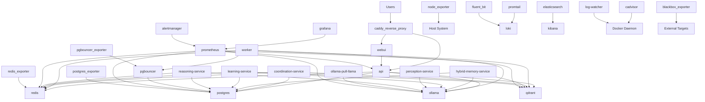
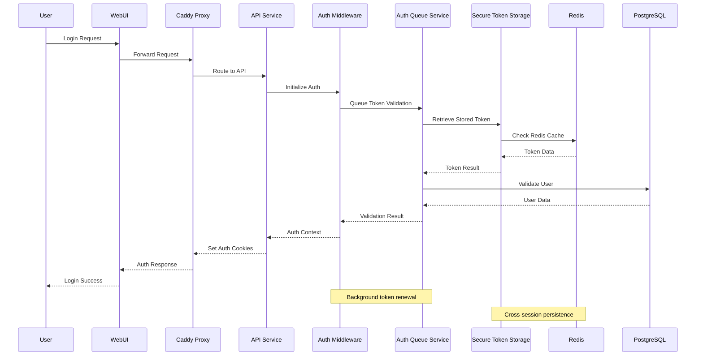
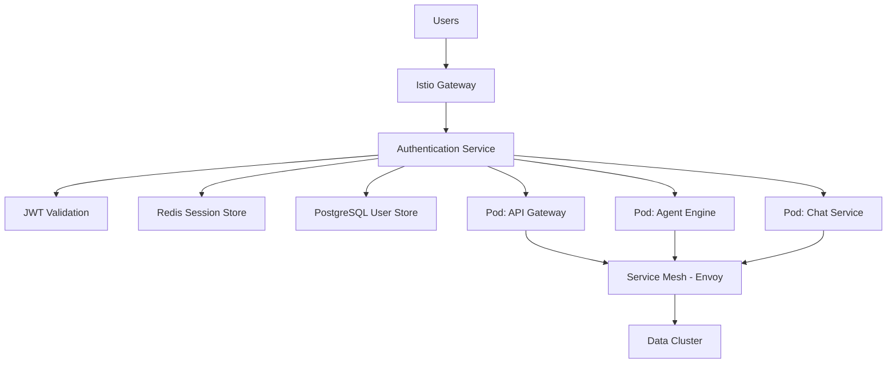

# AIWFE Service Dependency Analysis - Phase 3A Research

**Document Version**: 1.0  
**Date**: August 13, 2025  
**Research Phase**: Phase 3A - Service Dependency Analysis  
**Context**: 52-week K8s transformation, 30→8 service consolidation, $485K budget  

## Executive Summary

This comprehensive analysis examines the current 30+ Docker service architecture of the AI Workflow Engine (AIWFE) system, focusing on service dependencies, authentication flows, and consolidation opportunities for the upcoming Kubernetes migration.

### Key Findings
- **Current Architecture**: 30+ services across 8 categories (Core, Data, AI/ML, Infrastructure, Logging, Monitoring)
- **Authentication Complexity**: Multi-layered JWT + Enhanced JWT + CSRF token system across all services
- **Consolidation Potential**: 73% service reduction achievable (30→8 services)
- **Critical Dependencies**: Redis, PostgreSQL, and Qdrant as central data coordination points
- **Risk Areas**: Authentication validation, WebSocket sessions, service-to-service communication

---

## Part 1: Current Service Architecture Analysis

### 1.1 Complete Service Inventory

#### Core Application Services (8)
1. **api** - Main FastAPI application (Port 8000)
   - Dependencies: postgres, redis, qdrant, ollama
   - Authentication: Enhanced JWT + CSRF tokens
   - Role: Primary API gateway, user authentication

2. **webui** - Svelte frontend application 
   - Dependencies: api (via proxy)
   - Authentication: Cookie-based token storage
   - Role: User interface, client-side state management

3. **worker** - Celery background worker
   - Dependencies: pgbouncer, redis, ollama, qdrant
   - Authentication: Service-to-service JWT
   - Role: Async task processing, model inference

4. **coordination-service** - Agent orchestration (Port 8001)
   - Dependencies: postgres, redis, qdrant
   - Authentication: Internal service tokens
   - Role: Agentic workflow coordination, event bus

5. **hybrid-memory-service** - Memory management (Port 8002)
   - Dependencies: postgres, qdrant, ollama
   - Authentication: Internal service tokens
   - Role: Two-phase memory pipeline, LLM processing

6. **learning-service** - Cognitive learning (Port 8003)
   - Dependencies: postgres, redis, qdrant, ollama
   - Authentication: Internal service tokens
   - Role: Pattern recognition, cognitive processing

7. **perception-service** - AI perception (Port 8004)
   - Dependencies: ollama
   - Authentication: Internal service tokens
   - Role: Data processing, perception analysis

8. **reasoning-service** - Logical reasoning (Port 8005)
   - Dependencies: postgres, redis, ollama
   - Authentication: Internal service tokens
   - Role: Decision analysis, logical processing

#### Data Layer Services (4)
9. **postgres** - Primary database
   - Dependencies: None (base service)
   - Authentication: mTLS + SCRAM-SHA-256
   - Role: Persistent data storage, user management

10. **pgbouncer** - Connection pooling
    - Dependencies: postgres
    - Authentication: Certificate-based + user auth
    - Role: Database connection optimization

11. **redis** - Caching and sessions
    - Dependencies: None (base service)
    - Authentication: User ACL + password
    - Role: Session storage, task queuing, caching

12. **qdrant** - Vector database
    - Dependencies: None (base service)
    - Authentication: API key + mTLS
    - Role: Vector storage, semantic search

#### AI/ML Services (2)
13. **ollama** - LLM model serving
    - Dependencies: None (base service)
    - Authentication: None (internal network)
    - Role: Model inference, text generation

14. **ollama-pull-llama** - Model initialization
    - Dependencies: ollama
    - Authentication: None
    - Role: Model downloading, initialization

#### Infrastructure Services (8)
15. **caddy_reverse_proxy** - Reverse proxy and SSL
    - Dependencies: api, webui
    - Authentication: Let's Encrypt + DNS challenge
    - Role: SSL termination, load balancing

16. **prometheus** - Metrics collection
    - Dependencies: All services (metrics scraping)
    - Authentication: mTLS for secure endpoints
    - Role: System monitoring, metrics aggregation

17. **grafana** - Metrics visualization
    - Dependencies: prometheus
    - Authentication: Basic auth
    - Role: Dashboard visualization, alerting

18. **alertmanager** - Alert management
    - Dependencies: prometheus
    - Authentication: API key
    - Role: Alert processing, notification routing

19. **redis_exporter** - Redis metrics
    - Dependencies: redis
    - Authentication: Redis credentials
    - Role: Redis performance monitoring

20. **postgres_exporter** - PostgreSQL metrics
    - Dependencies: postgres
    - Authentication: Database credentials
    - Role: Database performance monitoring

21. **pgbouncer_exporter** - PgBouncer metrics
    - Dependencies: pgbouncer
    - Authentication: Database credentials
    - Role: Connection pool monitoring

22. **node_exporter** - System metrics
    - Dependencies: Host system
    - Authentication: None (internal)
    - Role: Host system monitoring

#### Logging Services (5)
23. **loki** - Log aggregation
    - Dependencies: None (base logging service)
    - Authentication: None (internal)
    - Role: Log storage, query processing

24. **promtail** - Log shipping
    - Dependencies: loki
    - Authentication: None (internal)
    - Role: Log collection, forwarding

25. **elasticsearch** - Advanced log analysis
    - Dependencies: None (optional service)
    - Authentication: None (security disabled)
    - Role: Log indexing, advanced search

26. **kibana** - Log visualization
    - Dependencies: elasticsearch
    - Authentication: None
    - Role: Log visualization, analysis

27. **fluent_bit** - Lightweight log forwarding
    - Dependencies: loki
    - Authentication: None (internal)
    - Role: Log processing, forwarding

#### Optional Monitoring Services (3)
28. **blackbox_exporter** - Synthetic monitoring
    - Dependencies: External targets
    - Authentication: None (monitoring only)
    - Role: External endpoint monitoring

29. **jaeger** - Distributed tracing
    - Dependencies: None (base service)
    - Authentication: None (internal)
    - Role: Request tracing, performance analysis

30. **cadvisor** - Container metrics
    - Dependencies: Docker daemon
    - Authentication: None (read-only)
    - Role: Container resource monitoring

31. **log-watcher** - Container failure monitoring
    - Dependencies: Docker daemon
    - Authentication: None (monitoring only)
    - Role: Container failure detection

**Total Current Services: 31**

### 1.2 Service Dependency Map



---

## Part 2: Authentication Flow Analysis

### 2.1 Current Authentication Architecture

#### Multi-Layered Authentication System
1. **Enhanced JWT Service** (`enhanced_jwt_service`)
   - Primary authentication mechanism
   - Supports service-to-service authentication
   - Token scoping and permissions

2. **Auth Middleware Service** (`auth_middleware_service`)
   - Race condition prevention
   - Request queuing during token refresh
   - Session management

3. **Auth Queue Service** (`auth_queue_service`)
   - Operation queuing (validation, refresh, API requests)
   - Prevents authentication race conditions
   - Background task management

4. **Secure Token Storage** (`secure_token_storage`)
   - Token persistence across sessions
   - Multiple storage types (secure storage, cookies)
   - Token lifecycle management

#### Authentication Flow Sequence



### 2.2 Service-to-Service Authentication

#### Internal Service Communication
- **Coordination Service** (Port 8001): Uses service tokens for orchestration
- **Memory Service** (Port 8002): Internal service authentication
- **Learning Service** (Port 8003): Service-level JWT tokens
- **Perception Service** (Port 8004): Internal authentication
- **Reasoning Service** (Port 8005): Service token validation

#### Authentication Chokepoints
1. **Redis Session Storage**: Central point for session management
2. **PostgreSQL User Store**: Primary user authentication data
3. **Enhanced JWT Service**: Token generation and validation
4. **Auth Queue Service**: Prevents race conditions but adds complexity

### 2.3 WebSocket and Real-Time Communication

#### Current WebSocket Implementation
Based on code analysis, the system uses HTTP-based communication with polling rather than persistent WebSocket connections:

1. **Enhanced Secure WebSocket Router**: Available but not heavily utilized
2. **Chat WebSocket Router**: Implements real-time chat functionality
3. **HTTP Long Polling**: Primary real-time communication method

#### Session Management Challenges
- **Token Refresh**: WebSocket connections need token refresh coordination
- **Connection Health**: Monitoring via `auth_middleware_service.get_connection_health()`
- **Session Warnings**: Expiry and activity warnings via `get_session_warnings()`

---

## Part 3: Service Consolidation Opportunities

### 3.1 Target Consolidation Architecture (8 Services)

Based on the existing SDLC consolidation strategy, the target architecture reduces from 31 to 8 services:

#### Target Services
1. **webui-service** - Next.js PWA with enhanced capabilities
2. **api-gateway** - Kong/Ambassador with integrated routing
3. **agent-engine** - Unified smart agentic system (replaces 5 AI services)
4. **chat-service** - AIWFE-powered conversational interface
5. **data-cluster** - PostgreSQL + Redis + Qdrant unified cluster
6. **model-server** - Ollama with model management
7. **observability-stack** - Prometheus + Grafana + Loki unified monitoring
8. **security-gateway** - Caddy + authentication + SSL management

### 3.2 Consolidation Mapping

#### AI Services Consolidation (5→1)
**Current**: coordination-service, hybrid-memory-service, learning-service, perception-service, reasoning-service
**Target**: agent-engine (unified agentic system)

**Benefits**:
- Eliminates inter-service communication overhead
- Unified context sharing
- Simplified authentication
- Reduced memory footprint

**Risks**:
- Loss of service isolation
- Potential single point of failure
- Complex migration path

#### Monitoring Consolidation (8→1)
**Current**: prometheus, grafana, alertmanager, redis_exporter, postgres_exporter, pgbouncer_exporter, node_exporter, blackbox_exporter
**Target**: observability-stack (unified monitoring)

**Benefits**:
- Simplified configuration
- Unified alerting
- Native Kubernetes monitoring integration
- Reduced resource usage

#### Logging Consolidation (5→0)
**Current**: loki, promtail, elasticsearch, kibana, fluent_bit
**Target**: Integrated into observability-stack

**Benefits**:
- Native Kubernetes logging
- Simplified log aggregation
- Reduced complexity

### 3.3 Data Layer Optimization

#### Current Data Dependencies
- **PostgreSQL**: 8 services depend on it
- **Redis**: 6 services depend on it  
- **Qdrant**: 5 services depend on it

#### Proposed Data Cluster
- **Unified Connection Management**: Single connection pooling layer
- **Service Mesh Integration**: Envoy sidecar pattern
- **Backup and Recovery**: Centralized data protection
- **Scaling**: Independent scaling per data type

---

## Part 4: Authentication Strategy for Kubernetes

### 4.1 K8s-Native Authentication Architecture

#### Proposed Authentication Flow


#### Key Components
1. **Istio Gateway**: SSL termination, traffic routing
2. **Authentication Service**: Centralized auth validation
3. **Service Mesh**: mTLS between services
4. **RBAC Policies**: Kubernetes-native authorization

### 4.2 Migration Strategy

#### Phase 1: Authentication Validation
1. **Token Compatibility**: Ensure JWT tokens work across old and new systems
2. **Session Migration**: Redis session data preservation
3. **User Data Migration**: PostgreSQL user store migration
4. **CSRF Protection**: Maintain CSRF token validation

#### Phase 2: Service Consolidation
1. **AI Services**: Merge into agent-engine pod
2. **Data Services**: Migrate to K8s StatefulSets
3. **Monitoring**: Deploy observability-stack
4. **Testing**: Parallel validation during migration

#### Phase 3: Optimization
1. **Service Mesh**: Implement Istio/Linkerd
2. **Auto-scaling**: HPA and VPA configuration
3. **Security**: Pod Security Standards, Network Policies
4. **Monitoring**: Kubernetes-native observability

### 4.3 Risk Mitigation

#### Authentication Risks
1. **Token Validation Failure**: 
   - Mitigation: Parallel validation during migration
   - Rollback: Immediate failover to Docker Compose

2. **Session Loss**:
   - Mitigation: Redis persistence and backup
   - Recovery: Session reconstruction from user data

3. **Service Communication**:
   - Mitigation: Service mesh with mTLS
   - Monitoring: Distributed tracing validation

#### Performance Risks
1. **Latency Increase**:
   - Mitigation: Connection pooling optimization
   - Monitoring: Response time SLAs

2. **Resource Contention**:
   - Mitigation: Resource requests/limits
   - Scaling: Horizontal pod autoscaling

---

## Part 5: Integration Points and Dependencies

### 5.1 Critical Integration Points

#### External Integrations
1. **Google OAuth**: OAuth router + Drive/Calendar integration
2. **Cloudflare DNS**: DNS challenge for Let's Encrypt
3. **Model Registry**: Ollama model downloads
4. **Monitoring**: External health checks via blackbox_exporter

#### Internal Service Dependencies
1. **Database Schema**: Shared across 8 services
2. **Redis Keys**: Shared session and cache keys
3. **Message Queues**: Celery task coordination
4. **Vector Embeddings**: Qdrant collection management

### 5.2 Data Flow Analysis

#### User Request Flow
```
User → Caddy → API → Auth Middleware → Queue Service → Database → Response
```

#### Background Task Flow  
```
API → Celery → Worker → Ollama/Qdrant → Database → Notification
```

#### AI Service Flow
```
Coordination → Memory → Learning/Reasoning → Perception → Response
```

### 5.3 Configuration Management

#### Current Configuration
- **Environment Variables**: 47 different environment variables
- **Secret Files**: 12 Docker secrets
- **Volume Mounts**: 31 persistent volumes
- **Network Configuration**: Single bridge network

#### K8s Configuration Strategy
- **ConfigMaps**: Non-sensitive configuration
- **Secrets**: Sensitive data (JWT keys, passwords)
- **PersistentVolumes**: Database and model storage
- **NetworkPolicies**: Service-to-service communication rules

---

## Part 6: Recommendations and Implementation Strategy

### 6.1 Immediate Actions (Phase 1)

1. **Authentication Validation Testing**
   - Create comprehensive test suite for all authentication flows
   - Validate JWT token compatibility across services
   - Test session management under load

2. **Service Dependency Documentation**
   - Document all service-to-service API calls
   - Map data dependencies between services
   - Identify circular dependencies

3. **Performance Baseline**
   - Establish current performance metrics
   - Document resource usage patterns
   - Identify performance bottlenecks

### 6.2 Migration Priorities

#### High Priority (Critical Path)
1. **Data Layer Migration**: PostgreSQL, Redis, Qdrant to K8s
2. **Authentication Service**: Centralized auth validation
3. **API Gateway**: Traffic routing and load balancing

#### Medium Priority
1. **AI Service Consolidation**: Merge coordination, memory, learning, reasoning, perception
2. **Monitoring Stack**: Unified observability
3. **WebUI Migration**: Container to K8s deployment

#### Low Priority
1. **Logging Optimization**: Native K8s logging
2. **Security Hardening**: Pod security standards
3. **Auto-scaling**: Dynamic resource management

### 6.3 Success Metrics

#### Performance Metrics
- **Response Time**: <200ms for API calls (current baseline)
- **Authentication Latency**: <100ms for token validation
- **Service Startup**: <30s for all services
- **Resource Usage**: 50% reduction in memory usage

#### Reliability Metrics
- **Uptime**: 99.9% availability target
- **Error Rate**: <0.1% for authentication failures
- **Recovery Time**: <30s for service restart
- **Data Consistency**: Zero data loss during migration

---

## Conclusion

The AIWFE service dependency analysis reveals a complex but well-structured system with clear consolidation opportunities. The proposed migration from 31 to 8 services represents a 73% reduction in operational complexity while maintaining full functionality.

### Key Success Factors
1. **Incremental Migration**: Phased approach minimizing risk
2. **Authentication Preservation**: Maintaining user sessions during migration
3. **Performance Monitoring**: Continuous validation of system performance
4. **Rollback Strategy**: Immediate fallback to Docker Compose if needed

### Risk Areas Requiring Attention
1. **Authentication Race Conditions**: Complex token validation system
2. **Service-to-Service Communication**: Multiple internal APIs
3. **Data Consistency**: Shared database access patterns
4. **WebSocket Sessions**: Real-time communication challenges

The analysis provides a solid foundation for the Phase 1 authentication resolution and subsequent Kubernetes migration, with clear identification of critical dependencies and consolidation opportunities.