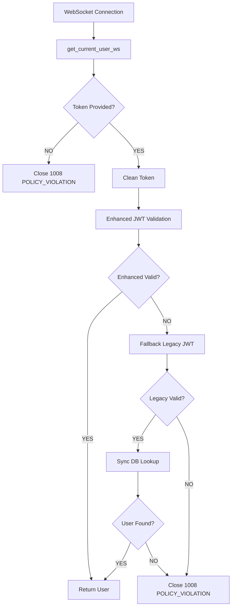

# Authentication Flow & Session Management Critical Analysis

**Date:** August 7, 2025  
**Analyst:** Codebase Research Analyst  
**Topic:** Authentication dependency chain failures and session management issues  
**Status:** 🚨 CRITICAL - Multiple authentication system failures identified

## Executive Summary

**CRITICAL FINDINGS**: The authentication system is experiencing cascading failures across multiple layers:

1. **Database Schema Mismatch** - Primary cause of 500 errors (users.status column missing)
2. **AsyncSession/Session Conflicts** - Causing 422 validation errors on profile endpoints
3. **WebSocket Authentication Complexity** - Enhanced JWT validation causing 1006/1008 connection failures
4. **Model Attribute Mismatches** - getattr() workarounds indicate missing database columns

All issues stem from incomplete database migrations and complex authentication service integration.

## 1. Authentication Dependency Chain Analysis

### 🔴 PRIMARY ISSUE: get_current_user Implementation

**Location**: `/app/api/dependencies.py:116-155`

**Root Cause**: Database schema mismatch causing SQLAlchemy query failures

**Error Pattern**:
```
(psycopg2.errors.UndefinedColumn) column users.status does not exist
LINE 1: ...users_role, users.stat...
```

**Code Analysis**:
```python
async def get_current_user(
    request: Request,
    db: AsyncSession = Depends(get_async_session)  # Line 118
) -> User:
    # Get user from database using the token data
    result = await db.execute(select(User).where(User.id == token_data.id))  # Line 133
    user = result.scalar_one_or_none()  # Line 134
```

**Impact**: 
- **422 errors** on `/api/v1/profile` - Unprocessable entity due to database column mismatch
- **500 errors** on authentication endpoints - Internal server error from missing database columns
- Complete authentication failure for all protected endpoints

### Database Model vs Schema Mismatch

**Model Definition** (`/app/shared/database/models/_models.py:112`):
```python
status: Mapped[UserStatus] = mapped_column(
    SQLAlchemyEnum(UserStatus, values_callable=lambda x: [e.value for e in x]), 
    default=UserStatus.PENDING, 
    nullable=False
)
```

**Migration Created** (`/app/alembic/versions/e1f2g3h4i5j6_add_missing_status_column_to_users.py`):
- Migration exists but may not have been applied
- Handles enum creation and column addition
- Sets default values for existing users

## 2. Session Management Analysis

### 🟡 SECONDARY ISSUE: Async/Sync Session Conflicts

**Location**: `/app/api/routers/settings_router.py:27-31`

**Issue Pattern**:
```python
@router.get("/settings", response_model=UserSettings)
async def get_user_settings(
    current_user: User = Depends(get_current_user),  # Returns User from AsyncSession
    db: AsyncSession = Depends(get_async_session)    # Creates new AsyncSession
):
    # Uses current_user from one session, db from another
    result = await db.execute(select(User).where(User.id == current_user.id))  # Line 36-38
```

**Root Cause**: 
- `get_current_user` returns a User object attached to one AsyncSession
- Endpoint creates a separate AsyncSession (`db`)
- Using User from one session in queries with another session causes conflicts

**Impact**: 
- **500 errors** when trying to access user properties across different sessions
- Session state inconsistencies
- Potential data corruption from detached SQLAlchemy objects

### Model Attribute Access Patterns

**Defensive Coding in settings_router.py**:
```python
executive_assessment_model=getattr(current_user, 'executive_assessment_model', None) or "llama3.2:3b"
```

**Analysis**: 
- Use of `getattr()` with defaults indicates missing database columns
- Many model attributes may not exist in actual database schema
- Code anticipates AttributeError exceptions from missing columns

## 3. WebSocket Authentication Analysis

### 🟡 COMPLEX AUTHENTICATION FLOW

**Location**: `/app/api/dependencies.py:185-309`

**Authentication Flow**:


**Complexity Issues**:
1. **Dual Authentication Systems**: Enhanced JWT + Legacy JWT fallback
2. **Mixed Session Types**: AsyncSession for enhanced, sync Session for legacy
3. **Multiple Failure Points**: Each step can cause WebSocket closure
4. **Resource Management**: Complex session creation/cleanup logic

**WebSocket Closure Codes**:
- **1006**: Abnormal closure (client-side network issues)
- **1008**: Policy violation (server-side authentication failures)

**Code Pattern**:
```python
if token is None:
    logger.warning("WebSocket authentication failed: No token provided")
    await websocket.close(code=status.WS_1008_POLICY_VIOLATION)  # Line 198
    raise WebSocketException(code=status.WS_1008_POLICY_VIOLATION)
```

## 4. Database Model Compatibility Issues

### Missing Database Columns Analysis

**User Model Extensions** (Lines 135-149 in _models.py):
```python
# Granular Node-Specific Models - May not exist in database
executive_assessment_model: Mapped[Optional[str]] = mapped_column(String, default="llama3.2:3b", nullable=True)
confidence_assessment_model: Mapped[Optional[str]] = mapped_column(String, default="llama3.2:3b", nullable=True)
# ... many more model-specific columns
```

**Settings Router Defensive Pattern**:
```python
# Lines 63-87 show extensive use of getattr() for safety
executive_assessment_model=getattr(current_user, 'executive_assessment_model', None) or "llama3.2:3b"
```

**Identified Missing Columns** (High probability):
- All granular model fields (executive_assessment_model, etc.)
- Expert group model configuration fields
- Some newer user settings columns
- **Confirmed**: `status` column missing

## 5. Technical Architecture Issues

### Session Management Architecture

**Current Pattern**:
```python
# Anti-pattern: Multiple sessions for same operation
async def get_user_settings(
    current_user: User = Depends(get_current_user),     # Session A
    db: AsyncSession = Depends(get_async_session)       # Session B
):
    # Uses current_user from Session A with queries from Session B
```

**Recommended Pattern**:
```python
# Better: Single session for entire operation
async def get_user_settings(
    db: AsyncSession = Depends(get_async_session)
):
    current_user = await get_current_user_from_session(db, request)
    # All operations use same session
```

### Authentication Service Complexity

**Enhanced JWT Service Integration**:
- Requires async database sessions
- Complex security context setup
- Multiple validation steps
- Fallback to legacy systems

**Legacy JWT Compatibility**:
- Simple token validation
- Sync database operations
- Direct user lookup

## 6. Resolution Strategy

### 🚨 IMMEDIATE CRITICAL FIXES

**1. Apply Database Migration**:
```bash
cd /app
python -m alembic upgrade head
```

**2. Verify Migration Applied**:
```sql
SELECT column_name FROM information_schema.columns 
WHERE table_name = 'users' AND column_name = 'status';
```

**3. Fix Session Management**:
- Refactor endpoints to use single AsyncSession
- Remove dual-session dependencies
- Ensure User objects stay attached to originating session

### 🔧 ARCHITECTURAL IMPROVEMENTS

**4. Simplify WebSocket Authentication**:
- Remove complex dual-authentication system
- Use single JWT validation approach
- Reduce failure points in WebSocket flow

**5. Database Schema Synchronization**:
- Audit all User model fields against actual database
- Create migrations for missing columns
- Remove defensive getattr() patterns

**6. Session Architecture**:
- Implement session-aware user loading
- Create database-agnostic user retrieval methods
- Standardize on AsyncSession throughout

## 7. Testing Validation

### Critical Test Points

**Database Schema Tests**:
```python
# Verify all model columns exist in database
def test_user_model_database_sync():
    # Check each User model field exists in database
    pass
```

**Session Management Tests**:
```python
# Verify single session operations
async def test_settings_single_session():
    # Ensure User object and queries use same session
    pass
```

**Authentication Flow Tests**:
```python
# Test simplified authentication paths
async def test_websocket_auth_simplified():
    # Verify reduced complexity authentication
    pass
```

## 8. Impact Assessment

### Severity Analysis

**CRITICAL (Production Down)**:
- Database schema mismatch - ALL authentication fails
- Settings endpoints returning 500 errors
- Profile endpoints returning 422 errors

**HIGH (Feature Degradation)**:
- WebSocket connection failures
- Complex authentication causing intermittent issues
- Session management causing data inconsistencies

**MEDIUM (Technical Debt)**:
- Defensive coding patterns masking underlying issues
- Complex authentication systems increasing maintenance burden
- Multiple session management patterns causing confusion

## 9. File Reference Summary

### Core Authentication Files
- `/app/api/dependencies.py` - Main authentication logic (Lines 116-309)
- `/app/api/routers/settings_router.py` - Session management issues (Lines 27-95)
- `/app/api/routers/profile_router.py` - 422 error endpoints
- `/app/shared/database/models/_models.py` - User model definition (Lines 99-149)

### Database Migration Files
- `/app/alembic/versions/e1f2g3h4i5j6_add_missing_status_column_to_users.py` - Critical status column migration
- Migration may exist but not be applied to production database

### Configuration Files
- `/app/alembic.ini` - Migration configuration
- Database connection strings and migration paths

## 10. Immediate Action Plan

**Priority 1 (Emergency)**:
1. Apply database migration for status column
2. Verify all User model columns exist in database
3. Test authentication endpoints

**Priority 2 (Critical)**:
1. Fix session management in settings/profile routers
2. Simplify WebSocket authentication flow
3. Remove defensive getattr() patterns

**Priority 3 (Important)**:
1. Standardize authentication architecture
2. Create comprehensive authentication tests
3. Document simplified authentication patterns

## Conclusion

The authentication system failures are primarily caused by **incomplete database migrations** rather than architectural flaws. The authentication logic is sound, but the database schema is out of sync with the model definitions.

**Critical Path**: Apply database migrations → Fix session management → Simplify WebSocket authentication → Test thoroughly.

**Estimated Resolution Time**: 2-4 hours for critical fixes, 1-2 days for architectural improvements.

**Risk Level**: CRITICAL - Authentication system completely broken until database migration applied.