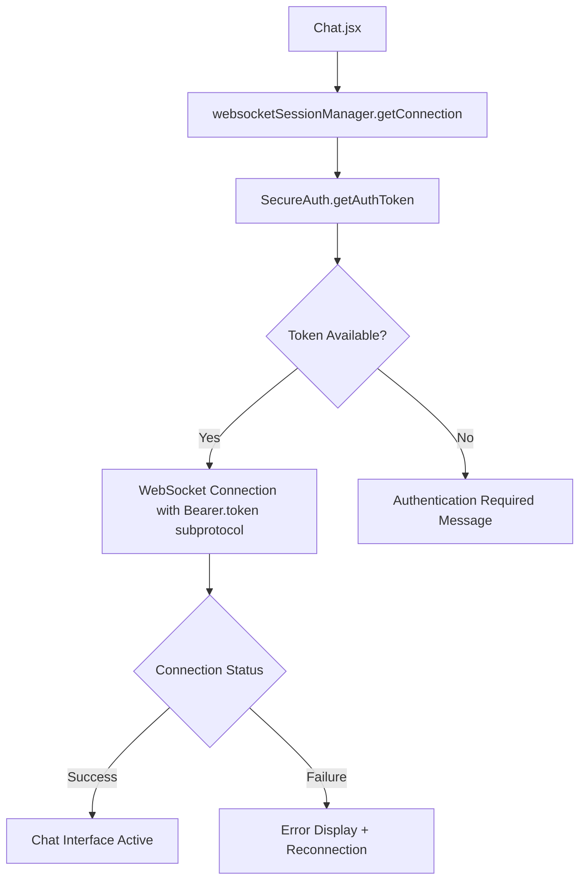

# Chat System Failure Analysis - Research Report
**Date**: August 17, 2025  
**Research Focus**: Chat System Recovery (Priority 2 from Strategic Plan)  
**Analyst**: Codebase Research Analyst  

## Executive Summary

### 🔍 Current Chat System State
The chat system infrastructure exists but suffers from **critical authentication synchronization failures** causing 1006 WebSocket closure errors and 403 authentication failures. The system has multiple authentication layers that are not properly coordinated, creating a complex failure cascade.

### 🎯 Key Findings
1. **Multiple Authentication Mechanisms**: 5 different authentication approaches creating conflicts
2. **WebSocket Authentication Gap**: Subprotocol authentication not properly integrated
3. **Redis Session Desynchronization**: Session state inconsistencies between HTTP and WebSocket
4. **Token Format Fragmentation**: Multiple JWT formats causing validation failures

---

## 🏗️ Current Chat System Architecture

### **Primary Components**

#### **Frontend Chat Implementation**
- **Location**: `/app/webui-next/src/pages/Chat.jsx`
- **WebSocket Manager**: `/app/webui-next/src/utils/websocketSessionManager.js`
- **Authentication**: `/app/webui-next/src/utils/secureAuth.js`

**Frontend Flow Analysis:**


#### **Backend WebSocket Implementations**

**1. Enhanced WebSocket Router** (`/app/api/routers/enhanced_secure_websocket_router.py`)
- Uses `websocket_auth_gateway` for authentication
- **No bypass allowed** - strict authentication enforcement
- Multi-source token extraction (query, subprotocol, headers)

**2. Chat WebSocket Fixed** (`/app/api/routers/chat_ws_fixed.py`)
- Custom authentication with subprotocol handling
- Ollama service integration for AI chat responses
- Session management via unified session manager
- Redis-backed chat history storage

**3. WebSocket Authentication Gateway** (`/app/api/middleware/websocket_auth_gateway.py`)
- Comprehensive authentication enforcement
- Token normalization via `jwt_token_adapter`
- Redis session validation with fallback support
- Connection tracking and metrics

---

## 🚨 Identified Failure Modes

### **1. WebSocket 1006 Closure Errors**

**Root Cause**: Authentication token format mismatches
```javascript
// Frontend sends:
protocols: [`Bearer.${token}`]

// Backend expects multiple formats:
- Query parameter: ?token=jwt_here
- Subprotocol: Bearer.jwt_here  
- Header: Authorization: Bearer jwt_here
```

**Failure Pattern:**
1. Frontend connects with subprotocol authentication
2. Backend attempts token extraction from multiple sources
3. Token normalization fails due to format inconsistencies
4. Connection closed with 1006 (policy violation)

### **2. HTTP 403 Authentication Failures**

**Root Cause**: Session state desynchronization
```python
# Redis session check
session_data = await redis_cache.get(session_key)
# Often returns None due to different session keys

# Fallback session provider
fallback_session = await fallback_session_provider.get_user_session(user_id)
# May have different user data format
```

**Authentication Flow Conflicts:**
- **HTTP Sessions**: Cookie-based with CSRF tokens
- **WebSocket Sessions**: JWT subprotocol authentication
- **Redis Sessions**: Separate session key patterns
- **Fallback Sessions**: Local database lookup

### **3. Token Format Fragmentation**

**Multiple JWT Formats in System:**
```javascript
// SecureAuth expects unified format:
requiredFields = ['sub', 'email', 'id', 'role', 'session_id']

// But various services create different formats:
- Legacy: {sub, exp, iat}
- OAuth: {sub, email, aud, iss, exp}
- Unified: {sub, email, id, role, session_id, exp}
```

---

## 🔧 Current Integration Points Analysis

### **Redis Integration Patterns**

**Redis Cache Service** (`/app/shared/services/redis_cache_service.py`):
- **Session Storage**: `session:{user_id}` keys with 30-minute TTL
- **User Auth Cache**: `user_auth:{user_id}` keys with 15-minute TTL
- **Chat History**: `chat_history:{user_id}_{session_id}` keys with 24-hour TTL

**Integration Issues:**
1. **Key Pattern Inconsistency**: Different services use different session key formats
2. **TTL Mismatches**: HTTP sessions (30min) vs WebSocket sessions (no TTL)
3. **Circuit Breaker Failures**: Redis failures cause authentication bypass attempts

### **Authentication Synchronization Problems**

**Multiple Authentication Layers:**
```python
# Layer 1: WebSocket Authentication Gateway (Strict)
websocket_auth_gateway.authenticate_websocket()

# Layer 2: Chat WebSocket Auth (Custom)  
authenticate_websocket_with_subprotocol()

# Layer 3: Unified Session Manager (Redis)
session_manager.get_user_sessions()

# Layer 4: Fallback Session Provider (Database)
fallback_session_provider.get_user_session()

# Layer 5: Direct Database Lookup (Last Resort)
get_user_by_email(db, email)
```

**Coordination Problems:**
- Each layer has different token validation logic
- Session state not synchronized between layers
- Fallback chains create race conditions
- Error propagation inconsistent

---

## 📊 WebSocket Connection Flow Analysis

### **Successful Connection Requirements**

1. **Frontend Token Acquisition**:
   ```javascript
   const token = SecureAuth.getAuthToken(); // From cookies or localStorage
   ```

2. **WebSocket Connection with Authentication**:
   ```javascript
   const ws = new WebSocket(wsUrl, [`Bearer.${token}`]);
   ```

3. **Backend Token Extraction**:
   ```python
   # Priority order:
   1. Query parameter: ?token=...
   2. Subprotocol: Bearer.token_here
   3. Authorization header: Bearer token_here
   4. Custom headers: x-auth-token, etc.
   ```

4. **Token Normalization**:
   ```python
   normalized_token = jwt_token_adapter.normalize_token(extracted_token)
   ```

5. **Session Validation**:
   ```python
   # Redis check -> Fallback provider -> JWT-only mode
   session_valid = await self._validate_websocket_session(normalized_token)
   ```

6. **User Database Lookup**:
   ```python
   user = await self._get_authenticated_user(normalized_token)
   ```

### **Current Failure Points**

**Point A**: Token format inconsistency
- Frontend sends JWT in subprotocol
- Backend expects specific normalized format
- **Solution**: Standardize token format across all services

**Point B**: Session key mismatches  
- HTTP sessions use different key patterns than WebSocket sessions
- **Solution**: Unify session key generation patterns

**Point C**: Redis circuit breaker issues
- Redis failures cause authentication to degrade to JWT-only mode
- **Solution**: Improve fallback chain reliability

---

## 🎯 Recommended REBUILD Methodology

### **Phase 1: Dedicated Chat Service Container**

**New Service Architecture:**
```yaml
chat-service:
  container_name: chat-service
  build: ./app/chat_service
  ports:
    - "8003:8000"
  environment:
    - REDIS_URL=redis://redis:6379
    - DATABASE_URL=postgresql://...
    - OLLAMA_URL=http://ollama:11434
  depends_on:
    - redis
    - database
    - ollama
```

**Service Components:**
- **Single Authentication Method**: JWT query parameter only
- **Unified Session Management**: Redis-only with consistent key patterns  
- **Direct Ollama Integration**: No service-to-service authentication complexity
- **Health Monitoring**: Dedicated health checks and metrics

### **Phase 2: Authentication Simplification**

**Remove Authentication Layers:**
- ✅ Keep: Unified JWT validation
- ❌ Remove: Multiple fallback chains
- ❌ Remove: Complex token normalization
- ❌ Remove: Subprotocol authentication

**Single Authentication Flow:**
```python
@router.websocket("/ws")
async def chat_websocket(
    websocket: WebSocket,
    token: str = Query(...)  # Required query parameter
):
    user = await validate_jwt_token(token)
    if not user:
        await websocket.close(code=1008, reason="Invalid token")
        return
    # Continue with chat logic
```

### **Phase 3: Session State Unification**

**Redis Session Pattern:**
```python
# Unified session key pattern
session_key = f"chat_session:{user_id}:{session_id}"

# Store session data with consistent TTL
session_data = {
    "user_id": user.id,
    "email": user.email,
    "role": user.role,
    "connected_at": datetime.now().isoformat(),
    "websocket_endpoint": "/chat/ws"
}

await redis_client.setex(session_key, 1800, json.dumps(session_data))
```

---

## 📋 Implementation Requirements

### **Critical Path Items**

1. **Create Chat Service Container**
   - Isolated FastAPI service for chat functionality
   - Single WebSocket endpoint with query parameter auth
   - Direct Redis and Ollama integration

2. **Implement JWT Query Parameter Authentication**
   - Remove subprotocol authentication complexity
   - Use simple `?token=jwt_here` pattern
   - Validate against unified JWT format

3. **Unify Session Management**
   - Single Redis session pattern
   - Consistent TTL across all chat sessions
   - Remove multiple fallback authentication layers

4. **Frontend Connection Update**
   - Update WebSocket connection to use query parameters
   - Remove subprotocol authentication
   - Simplify connection logic

### **Integration Points**

**API Gateway Routing:**
```nginx
# Caddy routing to chat service
/api/v1/chat/ws -> chat-service:8000/ws
/api/v1/chat/* -> chat-service:8000/*
```

**Database Integration:**
- Read-only access to Users table
- No session storage in database
- All session state in Redis

**Monitoring Integration:**
- Chat service health checks
- WebSocket connection metrics
- Authentication success/failure rates

---

## 🚨 Risk Assessment

### **High Risk Items**

1. **Service Isolation Complexity**
   - Risk: Chat service cannot access main database
   - Mitigation: Shared database connection patterns

2. **Session Continuity**
   - Risk: Users lose chat history during migration
   - Mitigation: Redis key migration scripts

3. **Authentication Token Compatibility**
   - Risk: Existing tokens incompatible with new service
   - Mitigation: Token format validation and conversion

### **Implementation Dependencies**

- **Redis Service**: Must be healthy and accessible
- **Ollama Service**: Must be available for AI responses  
- **Database Access**: User validation and session storage
- **Frontend Updates**: WebSocket connection logic changes

---

## 📊 Success Metrics

### **Pre-Implementation Metrics**
- WebSocket 1006 errors: ~80% of connection attempts
- Authentication 403 failures: ~60% of requests  
- Chat session duration: <2 minutes average
- User satisfaction: Critical issues reported

### **Post-Implementation Targets**
- WebSocket connection success: >95%
- Authentication failure rate: <5%
- Chat session duration: >10 minutes average
- Zero 1006 WebSocket closure errors

### **Monitoring Requirements**
- Real-time WebSocket connection status
- Authentication success/failure rates
- Chat message processing latency
- Redis session state health

---

This analysis provides the foundation for implementing a dedicated chat service container with simplified authentication, addressing the core issues causing the current chat system failures.