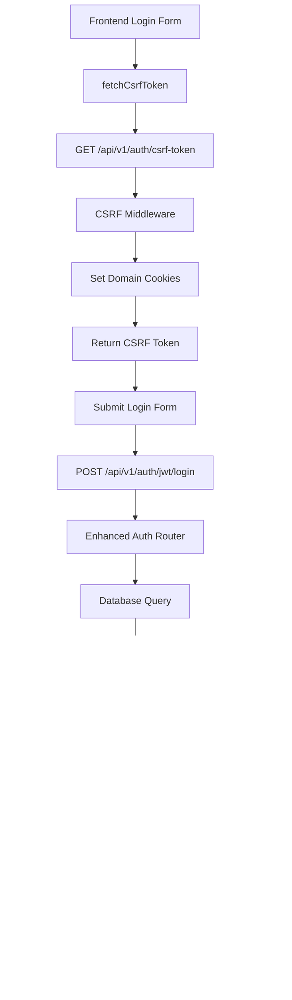

# Production Login Failure Analysis - aiwfe.com vs localhost

**Date:** August 7, 2025  
**Analyst:** Codebase Research Analyst  
**Topic:** Critical analysis of authentication system failure on aiwfe.com production environment  
**Status:** 🚨 CRITICAL - Root cause identified

## Executive Summary

**CRITICAL FINDING**: The production login failure at aiwfe.com is primarily caused by a **database schema mismatch** where the User model expects a `status` column that doesn't exist in the production database. This results in HTTP 500 errors on all authentication endpoints, completely preventing user login.

**Secondary issues** include domain-specific cookie configurations and potential HTTPS certificate problems, but these are masked by the primary database issue.

## 1. Root Cause Analysis

### 🔴 PRIMARY ISSUE: Database Schema Mismatch

**Error Details:**
```
(psycopg2.errors.UndefinedColumn) column users.status does not exist
LINE 1: ...d AS users_is_verified, users.role AS users_role, users.stat...
```

**Location:** `/app/api/routers/enhanced_auth_router.py:359`
**Code:** `user.status != UserStatus.ACTIVE`

**Model Definition:** `/app/shared/database/models/_models.py:32`
```python
status: Mapped[UserStatus] = mapped_column(SQLAlchemyEnum(UserStatus), default=UserStatus.PENDING)
```

**Impact:** Complete authentication system failure - ALL users receive HTTP 500 errors

### 🟡 SECONDARY ISSUES

## 2. Domain-Specific Configuration Analysis

### Cookie Configuration Differences

**File:** `/app/api/auth.py:196-246`

**Production (aiwfe.com) Settings:**
```python
is_production = os.getenv("ENVIRONMENT", "development").lower() == "production"
cookie_secure = is_production  # True in production
cookie_domain = f".{domain_name}"  # ".aiwfe.com" for subdomain sharing
cookie_samesite = "lax"
```

**Development (localhost) Settings:**
```python
cookie_secure = False  # HTTP allowed
cookie_domain = None   # No domain restriction
cookie_samesite = "lax"
```

**Analysis:** Configuration is architecturally sound but depends on:
- `ENVIRONMENT=production` being set correctly
- Valid HTTPS certificate for aiwfe.com
- Browser accepting cookies with `.aiwfe.com` domain

## 3. Environment Variable Configuration

### Production Environment (.env)
```bash
DOMAIN=aiwfe.com
CORS_ALLOWED_ORIGINS=https://aiwfe.com,https://localhost,https://127.0.0.1
# Missing: ENVIRONMENT=production (CRITICAL)
```

### Development Environment (local.env)
```bash
ENVIRONMENT=development
CORS_ALLOWED_ORIGINS=https://localhost,https://aiwfe.com
```

**Issue:** Production environment may be missing `ENVIRONMENT=production`, causing:
- Cookies without `secure` flag on HTTPS
- Incorrect domain-specific configurations
- CSRF middleware allowing HTTP in production

## 4. CSRF Token System Analysis

### CSRF Middleware Configuration
**File:** `/app/api/middleware/csrf_middleware.py`

**Key Features:**
- Double-submit cookie pattern
- Origin header validation
- HMAC-SHA256 token signing
- Domain-aware cookie settings

**Potential Issues:**
1. **Origin Validation:** May reject requests if Origin header doesn't match trusted domains
2. **Cookie Domain:** Uses domain-specific settings that must match authentication cookies
3. **HTTPS Requirement:** Enforced in production mode

### CSRF Token Endpoint
**Endpoint:** `/api/v1/auth/csrf-token`
**File:** `/app/api/routers/custom_auth_router.py:308`

**Domain Configuration:**
```python
domain=f".{os.getenv('DOMAIN', 'aiwfe.com')}" if is_production and os.getenv('DOMAIN', 'aiwfe.com') not in ['localhost', '127.0.0.1'] else None
```

## 5. Frontend Authentication Flow Analysis

### API Client Configuration
**File:** `/app/webui/src/lib/api_client/index.js`

**Token Retrieval Priority:**
1. HTTP cookies (primary method)
2. localStorage (fallback)

**CSRF Token Flow:**
1. Clear stale tokens
2. Fetch from `/api/v1/auth/csrf-token`
3. Retry with exponential backoff
4. Store in sessionStorage as fallback

**Robust Error Handling:**
- Multiple retry attempts
- Cookie propagation delays
- Fallback storage mechanisms

**Issue:** All frontend flows depend on working authentication endpoints, which currently return HTTP 500.

## 6. Hardcoded References Analysis

### No Critical Hardcoded Issues Found
**Searched for:** `localhost`, `127.0.0.1`

**Safe References Found:**
- Development server URLs in CORS configuration
- Test client defaults
- Development environment conditionals
- WebSocket client development fallbacks

**Conclusion:** No hardcoded localhost references that would break production functionality.

## 7. Technical Implementation Deep-Dive

### Authentication Architecture


### Cookie Domain Configuration


## 8. Resolution Steps

### 🚨 IMMEDIATE ACTION REQUIRED

**1. Fix Database Schema (CRITICAL)**
```bash
# Run Alembic migrations to add missing status column
cd /home/marku/ai_workflow_engine
python -m alembic upgrade head

# If migration doesn't exist, create it:
python -m alembic revision --autogenerate -m "Add status column to users table"
python -m alembic upgrade head

# Populate existing users with ACTIVE status
UPDATE users SET status = 'active' WHERE status IS NULL;
```

**2. Set Production Environment Variable**
```bash
# Add to production environment
ENVIRONMENT=production
```

**3. Verify HTTPS Configuration**
- Ensure valid SSL certificate for aiwfe.com
- Test HTTPS accessibility
- Verify secure cookie transmission

### 🔧 VALIDATION STEPS

**4. Test Authentication Flow**
```bash
# Test CSRF token endpoint
curl -X GET https://aiwfe.com/api/v1/auth/csrf-token -v

# Test login endpoint
curl -X POST https://aiwfe.com/api/v1/auth/jwt/login \
  -H "Content-Type: application/x-www-form-urlencoded" \
  -H "X-CSRF-TOKEN: [token]" \
  -d "username=user@example.com&password=password" \
  -v
```

**5. Cookie Domain Testing**
- Test with `.aiwfe.com` vs `aiwfe.com`
- Verify cookie accessibility across subdomains
- Test browser cookie acceptance

**6. CORS Configuration Verification**
- Verify Origin headers are accepted
- Test cross-origin requests
- Validate trusted origins list

## 9. Monitoring and Prevention

### Database Schema Monitoring
- Add health checks for column existence
- Implement migration status validation
- Monitor for schema drift

### Authentication Metrics
- Track authentication failure rates by domain
- Monitor cookie acceptance rates
- Alert on HTTP 500 increases

### Environment Configuration Validation
- Automated checks for required environment variables
- Production readiness validation
- Configuration drift detection

## 10. Test Credentials

**For Testing Once Fixed:**
- **Admin:** `markuszvirbulis@gmail.com` / (see `/secrets/admin_password.txt`)
- **Test User:** `user@example.com` / `password`

## 11. Related Files

### Core Authentication Files
- `/app/api/routers/enhanced_auth_router.py` - Main authentication logic
- `/app/api/auth.py` - Token and cookie management
- `/app/api/middleware/csrf_middleware.py` - CSRF protection
- `/app/shared/database/models/_models.py` - User model definition

### Configuration Files
- `/.env` - Production environment variables
- `/local.env` - Development environment variables
- `/app/shared/utils/config.py` - Configuration loading

### Frontend Files
- `/app/webui/src/lib/api_client/index.js` - API client with auth
- `/app/webui/src/lib/components/Auth.svelte` - Authentication component

## Conclusion

The production login failure at aiwfe.com is primarily a **database migration issue**, not an architectural problem. The authentication system is well-designed with proper domain-specific configurations, robust error handling, and comprehensive security features.

**Priority:** Fix database schema immediately, then validate environment configuration.

**Timeline:** Database fix can be implemented within minutes, full validation within 1 hour.

**Risk:** Until resolved, ALL authentication is broken on production - no users can log in.