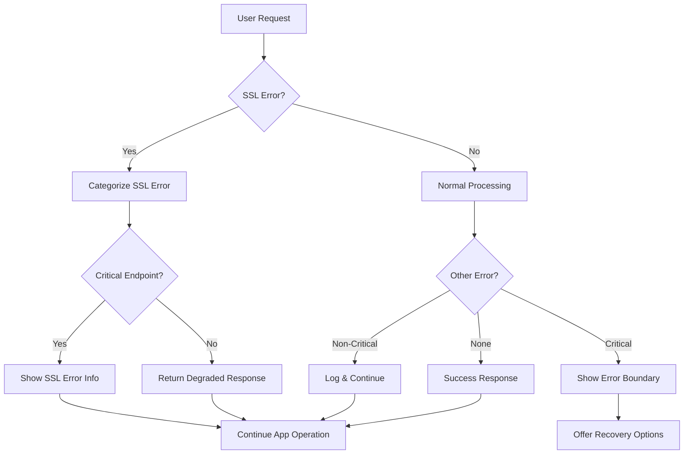

# Frontend Resilience Implementation

This document outlines the comprehensive frontend error handling and SSL certificate resilience system implemented to ensure users can access the authentication system even with SSL-related issues.

## 🎯 Implementation Overview

The frontend resilience system provides multiple layers of error handling and graceful degradation to prevent SSL certificate issues from blocking user access to the authentication system.

## 🏗️ Architecture Components

### 1. Enhanced ServiceWorker Registration (`app.html`)

**File**: `/app/webui/src/app.html`

**Key Features**:
- Comprehensive SSL error categorization and handling
- Retry mechanism with exponential backoff (3 attempts max)
- Timeout-based registration (10 second limit)
- Graceful degradation when ServiceWorker fails
- Enhanced user notifications with actionable guidance

**SSL Error Categories**:
- `ssl-certificate`: Certificate-related TLS handshake failures
- `network-timeout`: Network connectivity issues
- `secure-context`: HTTPS requirement violations
- `script-error`: ServiceWorker script loading failures

**Graceful Degradation Features**:
- Visual indicator for limited mode
- PWA feature disabling
- User-friendly notifications
- Continued app functionality without ServiceWorker

### 2. Robust Error Boundary Component

**File**: `/app/webui/src/lib/components/ui/ResilientErrorBoundary.svelte`

**Key Features**:
- SSL-aware error detection and handling
- Prevents SSL errors from crashing the entire application
- Automatic recovery mechanisms for retryable errors
- Comprehensive error categorization
- User-friendly error displays with recovery options

**Error Categories Handled**:
- SSL/Certificate errors (handled gracefully, don't crash app)
- Network errors (auto-retry with exponential backoff)
- Chunk loading errors (page reload recovery)
- Permission errors (authentication guidance)
- Application errors (user-friendly messages)

**Recovery Mechanisms**:
- Automatic retry for network/timeout errors (max 3 attempts)
- Page reload for chunk loading errors
- Graceful SSL error notifications (non-blocking)

### 3. Enhanced Certificate Utilities

**File**: `/app/webui/src/lib/utils/certificateUtils.js`

**Key Features**:
- Timeout-based certificate detection (5 second default)
- Multiple endpoint checking for reliability
- Comprehensive SSL error pattern recognition
- Caching for performance (5-minute cache duration)
- Fallback strategies for development environments

**Certificate Detection Process**:
1. Check multiple endpoints (`/api/v1/auth/certificate-check`, `/api/v1/health`, `/api/v1/status`)
2. Categorize errors (certificate vs network vs timeout)
3. Apply environment-specific fallback logic
4. Cache results to prevent repeated checks

**Enhanced Error Patterns**:
- Certificate authority validation failures
- Common name mismatches
- Date validation errors
- Network-level certificate errors

### 4. Resilient API Client

**File**: `/app/webui/src/lib/services/resilientApiClient.js`

**Key Features**:
- SSL error recovery patterns
- Automatic retry with exponential backoff
- Degraded mode for non-critical endpoints
- Comprehensive error categorization
- Request timeout handling (30 second default)

**SSL Recovery Patterns**:
- Certificate status re-checking on SSL errors
- Extended timeout retries for certificate issues
- Degraded responses for non-critical endpoints
- SSL error state tracking

**Degraded Mode Features**:
- Non-critical endpoints return limited functionality responses
- Critical endpoints (auth, login) maintain full error reporting
- Visual indicators for degraded operation

### 5. Enhanced Layout Error Handling

**File**: `/app/webui/src/routes/+layout.svelte`

**Key Features**:
- Global error listener with SSL awareness
- Non-blocking SSL error notifications
- Critical vs non-critical error differentiation
- ServiceWorker failure handling
- Degraded mode notification system

**Error Handling Strategy**:
- SSL errors: Graceful handling, continue app operation
- Critical errors: Show error boundary, maintain basic functionality
- Non-critical errors: Log only, don't interrupt user experience

## 🔧 Configuration Options

### ServiceWorker Registration Config
```javascript
// Default configuration in app.html
const maxAttempts = 3;
const timeout = 10000; // 10 seconds
const isSecureContext = window.isSecureContext || 
                       location.protocol === 'https:' || 
                       location.hostname === 'localhost' || 
                       location.hostname === '127.0.0.1';
```

### Certificate Detection Config
```javascript
// Default configuration in certificateUtils.js
const options = {
  timeout: 5000,        // 5 second timeout
  useCache: true,       // Enable 5-minute caching
  fallbackOnError: true // Return true on non-certificate errors
};
```

### Resilient API Client Config
```javascript
// Default configuration in resilientApiClient.js
const DEFAULT_CONFIG = {
  maxRetries: 3,
  baseRetryDelay: 1000,
  maxRetryDelay: 10000,
  timeout: 30000,
  sslRetryLimit: 1,
  enableSSLRecovery: true
};
```

## 🚀 Usage Examples

### Using the Resilient API Client
```javascript
import { callApiResilient } from '$lib/services/resilientApiClient.js';

// Basic usage with SSL resilience
try {
  const result = await callApiResilient('/api/v1/data', {
    method: 'GET'
  });
} catch (error) {
  if (error.category === 'ssl-certificate') {
    // SSL error handled gracefully, app continues
    console.log('SSL issue detected, but app continues');
  } else {
    // Handle other errors normally
    console.error('API call failed:', error);
  }
}

// Advanced usage with custom config
const result = await callApiResilient('/api/v1/critical-data', {
  method: 'POST',
  body: JSON.stringify(data)
}, {
  maxRetries: 5,
  timeout: 60000,
  enableSSLRecovery: true
});
```

### Using the Error Boundary Component
```svelte
<script>
  import ResilientErrorBoundary from '$lib/components/ui/ResilientErrorBoundary.svelte';
  
  function handleError(error, category, info) {
    console.log(`Error in category ${category}:`, error);
  }
</script>

<ResilientErrorBoundary onError={handleError}>
  <!-- Your app content here -->
  <MyAppComponent />
</ResilientErrorBoundary>
```

### Certificate Status Checking
```javascript
import { 
  hasClientCertificate, 
  shouldShowCertificateWarning,
  getCertificateStatus 
} from '$lib/utils/certificateUtils.js';

// Check certificate status
const hasCert = await hasClientCertificate({
  timeout: 3000,
  useCache: true,
  fallbackOnError: false
});

// Get debug information
const status = getCertificateStatus();
console.log('Certificate status:', status);
```

## 📊 Error Handling Flow



## 🎛️ Visual Indicators

### SSL Error Notifications
- **Location**: Bottom-right corner
- **Style**: Amber warning with certificate icon
- **Behavior**: Auto-dismiss after 8 seconds
- **Action**: Non-blocking, allows app continuation

### Degraded Mode Indicator
- **Location**: Top-center of screen
- **Style**: Yellow banner with warning icon
- **Behavior**: Auto-dismiss after 5 seconds
- **Message**: "SSL certificate issues detected. Some features may be limited."

### ServiceWorker Status
- **Success**: Console log only
- **Failure**: Graceful degradation with visual indicator
- **SSL Issues**: Integrated with overall SSL error handling

## 🧪 Testing Scenarios

### SSL Certificate Issues
1. **Self-signed certificates**: App continues with warnings
2. **Expired certificates**: Graceful degradation activated
3. **Certificate authority issues**: Error notifications shown
4. **Mixed content warnings**: ServiceWorker fails gracefully

### Network Conditions
1. **Slow connections**: Extended timeouts and retries
2. **Intermittent connectivity**: Automatic retry mechanisms
3. **Complete network failure**: Offline indicators and cached responses

### Error Recovery
1. **Page refresh recovery**: Chunk loading errors trigger reload
2. **Automatic retries**: Network errors retry with backoff
3. **Manual recovery**: User-initiated retry options

## 🔍 Debugging Tools

### Global App State
```javascript
// Check current app state
console.log(window.appState);
// Output: {
//   serviceWorkerEnabled: false,
//   sslIssueDetected: true,
//   gracefulDegradationActive: true,
//   errorRecoveryAttempts: 2
// }
```

### Resilient Client State
```javascript
import { getResilientClientState } from '$lib/services/resilientApiClient.js';

console.log(getResilientClientState());
// Output: SSL error counts, retry attempts, degraded mode status
```

### Certificate Status
```javascript
import { getCertificateStatus } from '$lib/utils/certificateUtils.js';

console.log(getCertificateStatus());
// Output: Certificate detection results, cache status, environment info
```

## 📈 Benefits

### User Experience
- **Uninterrupted Access**: Users can access authentication even with SSL issues
- **Clear Communication**: User-friendly error messages and guidance
- **Progressive Enhancement**: Full features when possible, basic functionality always

### Developer Experience
- **Comprehensive Logging**: Detailed error categorization and context
- **Debugging Tools**: Built-in state inspection and diagnostic functions
- **Flexible Configuration**: Customizable timeouts, retry limits, and behaviors

### System Reliability
- **Graceful Degradation**: No complete application failures
- **Automatic Recovery**: Self-healing for temporary issues
- **SSL Resilience**: Robust handling of certificate-related problems

## 🔄 Future Enhancements

### Potential Improvements
1. **Certificate Auto-Installation**: Automated certificate provisioning
2. **Advanced Retry Strategies**: Adaptive retry timing based on error patterns
3. **User Preference Storage**: Remember user choices for SSL warnings
4. **Health Check Integration**: Proactive certificate status monitoring
5. **Analytics Integration**: Error pattern analysis and reporting

### Monitoring Opportunities
1. **SSL Error Rates**: Track certificate-related failures
2. **Recovery Success Rates**: Monitor automatic retry effectiveness
3. **User Impact Metrics**: Measure degraded mode usage and duration
4. **Performance Impact**: Track overhead of resilience mechanisms

This comprehensive frontend resilience system ensures that SSL certificate issues never completely block user access to the authentication system, while providing clear feedback and maintaining application functionality wherever possible.