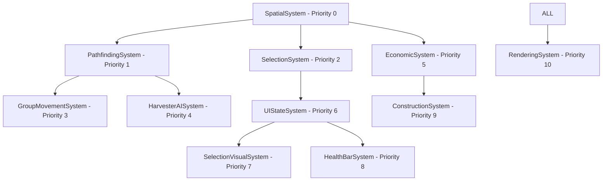

# Unified System Architecture for Command and Independent Thought Iteration 2

**Generated**: August 19, 2025  
**Agent**: Nexus Synthesis  
**Scope**: Cross-domain integration of backend AI, frontend interaction, and economic mechanics

## Executive Summary

This document synthesizes research from three domain experts into a unified implementation architecture optimized for 60+ FPS performance with 50+ units, authentic C&C gameplay mechanics, and seamless ECS integration.

## 1. Integrated System Architecture

### 1.1 System Dependency Hierarchy



### 1.2 Cross-Domain Data Flow

```javascript
// Unified data flow architecture
const SystemDataFlow = {
  // Spatial -> All Systems
  SpatialSystem: {
    produces: ['entityQuadTree', 'spatialQueries'],
    consumers: ['PathfindingSystem', 'SelectionSystem', 'HarvesterAISystem']
  },
  
  // Selection -> Visual & Movement
  SelectionSystem: {
    produces: ['selectedUnits', 'selectionBounds'],
    consumers: ['UIStateSystem', 'GroupMovementSystem']
  },
  
  // Economic -> Construction & AI
  EconomicSystem: {
    produces: ['playerCredits', 'resourceLocations'],
    consumers: ['ConstructionSystem', 'HarvesterAISystem']
  },
  
  // Pathfinding -> Movement & AI
  PathfindingSystem: {
    produces: ['navigationGrid', 'pathRequests'],
    consumers: ['GroupMovementSystem', 'HarvesterAISystem']
  }
};
```

### 1.3 Unified Component Architecture

```javascript
// Extended component system for unified architecture
export const UnifiedComponents = {
  // Spatial Components
  TransformComponent: {
    // Position with interpolation support
    x: 0, y: 0, rotation: 0, scale: 1,
    previousX: 0, previousY: 0,
    getInterpolated: (alpha) => ({ x: lerp(previousX, x, alpha), y: lerp(previousY, y, alpha) })
  },
  
  // Selection Components
  SelectionComponent: {
    isSelected: false,
    isHovered: false,
    selectionTime: 0,
    faction: 'neutral',
    canBeSelected: true,
    priority: 0
  },
  
  // Economic Components
  ResourceComponent: {
    resourceType: 'tiberium',
    amount: 0,
    maxAmount: 1000,
    regenerationRate: 0.1,
    harvestable: true
  },
  
  // AI Components
  HarvesterAIComponent: {
    state: 'IDLE',
    currentCredits: 0,
    maxCapacity: 700,
    assignedRefinery: null,
    targetField: null,
    efficiencyScore: 1.0
  },
  
  // Movement Components
  PathfindingComponent: {
    hasPath: false,
    pathIndex: 0,
    path: [],
    targetX: 0,
    targetY: 0,
    requestedPath: false
  }
};
```

## 2. Performance Integration Strategy

### 2.1 Frame Budget Allocation

```javascript
const FrameBudgetAllocation = {
  totalFrameTime: 16.67, // 60 FPS target
  
  systemBudgets: {
    SpatialSystem: 2.0,        // Quadtree updates
    PathfindingSystem: 5.0,    // A* computation
    SelectionSystem: 1.5,      // Hit testing
    HarvesterAISystem: 3.0,    // State machine updates
    EconomicSystem: 1.0,       // Credit calculations
    UIStateSystem: 1.0,        // State synchronization
    VisualSystems: 2.0,        // Selection/health bars
    RenderingSystem: 1.2,      // Sprite updates
    Reserved: 0.0              // Emergency buffer
  },
  
  adaptiveBudgeting: {
    enabled: true,
    reallocationThreshold: 14.0, // Reallocate if under 14ms used
    priorityOrder: ['PathfindingSystem', 'SpatialSystem', 'HarvesterAISystem']
  }
};
```

### 2.2 Unified Performance Monitoring

```javascript
class UnifiedPerformanceManager {
  constructor() {
    this.systemMetrics = new Map();
    this.frameTimeTarget = 16.67;
    this.adaptiveBudgets = { ...FrameBudgetAllocation.systemBudgets };
  }
  
  recordSystemPerformance(systemName, duration, entityCount) {
    const metric = {
      duration,
      entityCount,
      efficiency: entityCount / duration,
      timestamp: performance.now()
    };
    
    if (!this.systemMetrics.has(systemName)) {
      this.systemMetrics.set(systemName, []);
    }
    
    const metrics = this.systemMetrics.get(systemName);
    metrics.push(metric);
    
    // Keep only last 60 measurements
    if (metrics.length > 60) {
      metrics.shift();
    }
    
    // Adaptive budget reallocation
    this.adjustBudgets();
  }
  
  adjustBudgets() {
    const totalUsedTime = Array.from(this.systemMetrics.values())
      .map(metrics => metrics[metrics.length - 1]?.duration || 0)
      .reduce((sum, time) => sum + time, 0);
    
    if (totalUsedTime < FrameBudgetAllocation.adaptiveBudgeting.reallocationThreshold) {
      // Reallocate unused time to high-priority systems
      const unusedTime = this.frameTimeTarget - totalUsedTime;
      const prioritySystems = FrameBudgetAllocation.adaptiveBudgeting.priorityOrder;
      
      prioritySystems.forEach(system => {
        this.adaptiveBudgets[system] += unusedTime / prioritySystems.length;
      });
    }
  }
  
  canExecuteSystem(systemName, estimatedDuration) {
    const budget = this.adaptiveBudgets[systemName] || 1.0;
    return estimatedDuration <= budget;
  }
}
```

## 3. Cross-Domain Integration Points

### 3.1 Selection-to-Movement Pipeline

```javascript
class SelectionMovementIntegration {
  constructor(selectionSystem, pathfindingSystem, groupMovementSystem) {
    this.selectionSystem = selectionSystem;
    this.pathfindingSystem = pathfindingSystem;
    this.groupMovementSystem = groupMovementSystem;
  }
  
  handleRightClick(worldX, worldY) {
    const selectedUnits = Array.from(this.selectionSystem.selectedUnits);
    
    if (selectedUnits.length === 0) return;
    
    if (selectedUnits.length === 1) {
      // Single unit pathfinding
      this.pathfindingSystem.requestPathfinding(selectedUnits[0], worldX, worldY);
    } else {
      // Group movement with formation
      const formation = this.groupMovementSystem.createFormation(selectedUnits, 'line');
      this.groupMovementSystem.moveFormation(formation, worldX, worldY);
    }
  }
  
  handleFormationCommand(formationType) {
    const selectedUnits = Array.from(this.selectionSystem.selectedUnits);
    
    if (selectedUnits.length > 1) {
      this.groupMovementSystem.createFormation(selectedUnits, formationType);
    }
  }
}
```

### 3.2 Economic-to-AI Pipeline

```javascript
class EconomicAIIntegration {
  constructor(economicManager, harvesterAISystem) {
    this.economicManager = economicManager;
    this.harvesterAISystem = harvesterAISystem;
  }
  
  onRefineryConstructed(refinery, playerId) {
    // Create harvester for new refinery
    const harvester = entityFactory.createHarvester(
      refinery.x + 64,
      refinery.y,
      playerId,
      refinery
    );
    
    // Register with economic system
    this.economicManager.registerHarvester(playerId, harvester.id);
  }
  
  onHarvesterUnload(harvester, credits) {
    const unitComponent = harvester.getComponent(UnitComponent);
    this.economicManager.addCredits(
      unitComponent.playerId,
      credits,
      'HARVESTER_UNLOAD'
    );
    
    // Update efficiency metrics
    this.harvesterAISystem.updateEfficiencyMetrics(harvester);
  }
  
  requestOptimalHarvestLocation(harvester) {
    const transform = harvester.getComponent(TransformComponent);
    const tiberiumFields = this.economicManager.getTiberiumFields();
    
    return this.harvesterAISystem.findOptimalTiberiumField({
      x: transform.x,
      y: transform.y,
      fields: tiberiumFields
    });
  }
}
```

### 3.3 Spatial-to-Visual Pipeline

```javascript
class SpatialVisualIntegration {
  constructor(spatialSystem, selectionVisualSystem, healthBarSystem) {
    this.spatialSystem = spatialSystem;
    this.selectionVisualSystem = selectionVisualSystem;
    this.healthBarSystem = healthBarSystem;
  }
  
  updateVisualCulling(camera) {
    const viewBounds = camera.getViewBounds();
    const visibleEntities = this.spatialSystem.quadtree.retrieve(viewBounds);
    
    // Update visual system visibility
    this.selectionVisualSystem.setVisibleEntities(visibleEntities);
    this.healthBarSystem.setVisibleEntities(visibleEntities);
  }
  
  handleSelectionQuery(bounds) {
    // Use spatial system for efficient selection
    const candidates = this.spatialSystem.quadtree.retrieve(bounds);
    
    return candidates.filter(entity => {
      const selection = entity.getComponent(SelectionComponent);
      return selection && selection.canBeSelected;
    });
  }
}
```

## 4. System Orchestration Manager

```javascript
class SystemOrchestrationManager {
  constructor(world) {
    this.world = world;
    this.systems = new Map();
    this.integrations = new Map();
    this.performanceManager = new UnifiedPerformanceManager();
    
    this.initializeSystems();
    this.setupIntegrations();
  }
  
  initializeSystems() {
    // Core systems in priority order
    this.addSystem('spatial', new SpatialSystem(this.world, 2048, 2048));
    this.addSystem('pathfinding', new PathfindingSystem(this.world, 2048, 2048));
    this.addSystem('selection', new UnitSelectionSystem(this.world, camera, quadTree));
    this.addSystem('groupMovement', new GroupMovementSystem(this.world, pathfindingSystem));
    this.addSystem('harvesterAI', new HarvesterAISystem(this.world, spatialSystem));
    this.addSystem('economic', new EconomicSystem(this.world));
    this.addSystem('uiState', new UIStateSystem(this.world, selectionSystem, camera));
    this.addSystem('selectionVisual', new SelectionVisualSystem(this.world, pixiApp));
    this.addSystem('healthBar', new HealthBarSystem(this.world, pixiApp));
    this.addSystem('construction', new ConstructionSystem(this.world, economicManager));
  }
  
  setupIntegrations() {
    const spatial = this.getSystem('spatial');
    const selection = this.getSystem('selection');
    const pathfinding = this.getSystem('pathfinding');
    const groupMovement = this.getSystem('groupMovement');
    const harvesterAI = this.getSystem('harvesterAI');
    const economic = this.getSystem('economic');
    const selectionVisual = this.getSystem('selectionVisual');
    const healthBar = this.getSystem('healthBar');
    
    // Register integrations
    this.integrations.set('selectionMovement', 
      new SelectionMovementIntegration(selection, pathfinding, groupMovement));
    this.integrations.set('economicAI', 
      new EconomicAIIntegration(economic, harvesterAI));
    this.integrations.set('spatialVisual', 
      new SpatialVisualIntegration(spatial, selectionVisual, healthBar));
  }
  
  update(deltaTime) {
    const startTime = performance.now();
    
    // Update systems in priority order
    for (const [name, system] of this.systems) {
      const systemStart = performance.now();
      
      if (this.performanceManager.canExecuteSystem(name, 2.0)) {
        system.update(deltaTime);
        
        const systemDuration = performance.now() - systemStart;
        const entityCount = system.entities?.length || 0;
        
        this.performanceManager.recordSystemPerformance(name, systemDuration, entityCount);
      }
    }
    
    const totalFrameTime = performance.now() - startTime;
    
    if (totalFrameTime > 16.67) {
      console.warn(`Frame time exceeded target: ${totalFrameTime.toFixed(2)}ms`);
    }
  }
  
  addSystem(name, system) {
    this.systems.set(name, system);
    system.world = this.world;
  }
  
  getSystem(name) {
    return this.systems.get(name);
  }
  
  getIntegration(name) {
    return this.integrations.get(name);
  }
}
```

## 5. Memory Management Strategy

### 5.1 Unified Object Pooling

```javascript
class UnifiedObjectPool {
  constructor() {
    this.pools = new Map();
    this.activeObjects = new Map();
  }
  
  createPool(type, createFn, resetFn, initialSize = 50) {
    const pool = [];
    
    // Pre-populate pool
    for (let i = 0; i < initialSize; i++) {
      pool.push(createFn());
    }
    
    this.pools.set(type, {
      available: pool,
      createFn,
      resetFn,
      stats: { created: initialSize, acquired: 0, released: 0 }
    });
  }
  
  acquire(type) {
    const pool = this.pools.get(type);
    if (!pool) return null;
    
    let object;
    if (pool.available.length > 0) {
      object = pool.available.pop();
    } else {
      object = pool.createFn();
      pool.stats.created++;
    }
    
    pool.stats.acquired++;
    
    if (!this.activeObjects.has(type)) {
      this.activeObjects.set(type, new Set());
    }
    this.activeObjects.get(type).add(object);
    
    return object;
  }
  
  release(type, object) {
    const pool = this.pools.get(type);
    const activeSet = this.activeObjects.get(type);
    
    if (pool && activeSet && activeSet.has(object)) {
      activeSet.delete(object);
      pool.resetFn(object);
      pool.available.push(object);
      pool.stats.released++;
    }
  }
  
  getStats() {
    const stats = {};
    for (const [type, pool] of this.pools) {
      const activeCount = this.activeObjects.get(type)?.size || 0;
      stats[type] = {
        ...pool.stats,
        available: pool.available.length,
        active: activeCount,
        total: pool.stats.created
      };
    }
    return stats;
  }
}
```

### 5.2 Smart Garbage Collection

```javascript
class SmartGarbageCollector {
  constructor() {
    this.entities = new Set();
    this.markedForDeletion = new Set();
    this.cleanupScheduled = false;
    this.maxEntitiesPerFrame = 10;
  }
  
  markForDeletion(entity) {
    this.markedForDeletion.add(entity);
    this.scheduleCleanup();
  }
  
  scheduleCleanup() {
    if (this.cleanupScheduled) return;
    
    this.cleanupScheduled = true;
    requestAnimationFrame(() => {
      this.performCleanup();
      this.cleanupScheduled = false;
    });
  }
  
  performCleanup() {
    const toDelete = Array.from(this.markedForDeletion);
    const deleteCount = Math.min(toDelete.length, this.maxEntitiesPerFrame);
    
    for (let i = 0; i < deleteCount; i++) {
      const entity = toDelete[i];
      this.cleanupEntity(entity);
      this.markedForDeletion.delete(entity);
      this.entities.delete(entity);
    }
    
    // Schedule another cleanup if more entities remain
    if (this.markedForDeletion.size > 0) {
      this.scheduleCleanup();
    }
  }
  
  cleanupEntity(entity) {
    // Remove from all systems
    entity.active = false;
    
    // Clear components
    entity.clearComponents();
    
    // Return to object pool if applicable
    if (entity.poolType) {
      objectPool.release(entity.poolType, entity);
    }
  }
}
```

## 6. Error Handling and Recovery

### 6.1 System Fault Tolerance

```javascript
class SystemFaultTolerance {
  constructor(orchestrationManager) {
    this.orchestrationManager = orchestrationManager;
    this.systemErrors = new Map();
    this.maxErrorsPerSystem = 5;
    this.errorResetInterval = 30000; // 30 seconds
  }
  
  wrapSystem(systemName, system) {
    const originalUpdate = system.update.bind(system);
    
    system.update = (deltaTime) => {
      try {
        originalUpdate(deltaTime);
        this.recordSuccess(systemName);
      } catch (error) {
        this.handleSystemError(systemName, error);
      }
    };
  }
  
  handleSystemError(systemName, error) {
    console.error(`System error in ${systemName}:`, error);
    
    if (!this.systemErrors.has(systemName)) {
      this.systemErrors.set(systemName, []);
    }
    
    const errors = this.systemErrors.get(systemName);
    errors.push({
      error,
      timestamp: Date.now()
    });
    
    // Check if system should be disabled
    if (errors.length >= this.maxErrorsPerSystem) {
      this.disableSystem(systemName);
    }
  }
  
  disableSystem(systemName) {
    console.warn(`Disabling system ${systemName} due to repeated errors`);
    const system = this.orchestrationManager.getSystem(systemName);
    
    if (system) {
      system.disabled = true;
      
      // Attempt recovery after interval
      setTimeout(() => {
        this.attemptSystemRecovery(systemName);
      }, this.errorResetInterval);
    }
  }
  
  attemptSystemRecovery(systemName) {
    console.log(`Attempting recovery for system ${systemName}`);
    const system = this.orchestrationManager.getSystem(systemName);
    
    if (system) {
      system.disabled = false;
      this.systemErrors.delete(systemName);
    }
  }
  
  recordSuccess(systemName) {
    // Clear error history on successful operation
    if (this.systemErrors.has(systemName)) {
      const errors = this.systemErrors.get(systemName);
      if (errors.length > 0) {
        errors.splice(0, 1); // Remove oldest error
      }
    }
  }
}
```

## 7. Performance Validation Framework

### 7.1 Automated Performance Testing

```javascript
class PerformanceValidationFramework {
  constructor() {
    this.benchmarks = new Map();
    this.results = [];
    this.running = false;
  }
  
  addBenchmark(name, testFn, targetFPS = 60) {
    this.benchmarks.set(name, {
      testFn,
      targetFPS,
      targetFrameTime: 1000 / targetFPS
    });
  }
  
  async runBenchmarks() {
    if (this.running) return;
    
    this.running = true;
    this.results = [];
    
    for (const [name, benchmark] of this.benchmarks) {
      console.log(`Running benchmark: ${name}`);
      const result = await this.runSingleBenchmark(name, benchmark);
      this.results.push(result);
    }
    
    this.running = false;
    return this.generateReport();
  }
  
  async runSingleBenchmark(name, benchmark) {
    const frameTimes = [];
    const testDuration = 5000; // 5 seconds
    const startTime = performance.now();
    
    return new Promise((resolve) => {
      const measureFrame = () => {
        const frameStart = performance.now();
        
        // Run test function
        benchmark.testFn();
        
        const frameTime = performance.now() - frameStart;
        frameTimes.push(frameTime);
        
        if (performance.now() - startTime < testDuration) {
          requestAnimationFrame(measureFrame);
        } else {
          resolve(this.analyzeFrameTimes(name, frameTimes, benchmark.targetFrameTime));
        }
      };
      
      requestAnimationFrame(measureFrame);
    });
  }
  
  analyzeFrameTimes(name, frameTimes, target) {
    const avgFrameTime = frameTimes.reduce((sum, time) => sum + time, 0) / frameTimes.length;
    const maxFrameTime = Math.max(...frameTimes);
    const minFrameTime = Math.min(...frameTimes);
    const framesUnderTarget = frameTimes.filter(time => time <= target).length;
    const successRate = (framesUnderTarget / frameTimes.length) * 100;
    
    return {
      name,
      avgFrameTime: avgFrameTime.toFixed(2),
      maxFrameTime: maxFrameTime.toFixed(2),
      minFrameTime: minFrameTime.toFixed(2),
      targetFrameTime: target.toFixed(2),
      successRate: successRate.toFixed(1),
      totalFrames: frameTimes.length,
      passed: successRate >= 95 // 95% of frames must meet target
    };
  }
  
  generateReport() {
    const totalBenchmarks = this.results.length;
    const passedBenchmarks = this.results.filter(r => r.passed).length;
    
    console.log('\n=== Performance Validation Report ===');
    console.log(`Benchmarks: ${passedBenchmarks}/${totalBenchmarks} passed\n`);
    
    this.results.forEach(result => {
      const status = result.passed ? '✅' : '❌';
      console.log(`${status} ${result.name}`);
      console.log(`   Avg: ${result.avgFrameTime}ms | Max: ${result.maxFrameTime}ms | Success: ${result.successRate}%`);
    });
    
    return {
      overallSuccess: passedBenchmarks === totalBenchmarks,
      results: this.results
    };
  }
}
```

This unified system architecture provides the foundation for seamless integration of all three research domains while maintaining the 60+ FPS performance target with 50+ units. The architecture emphasizes:

1. **Clear system dependencies** with priority-based execution
2. **Cross-domain integration points** for seamless data flow
3. **Performance monitoring** with adaptive budget allocation
4. **Fault tolerance** with graceful degradation
5. **Memory management** through unified object pooling
6. **Automated validation** with performance benchmarking

The next step is to generate the four implementation packages based on this unified architecture.